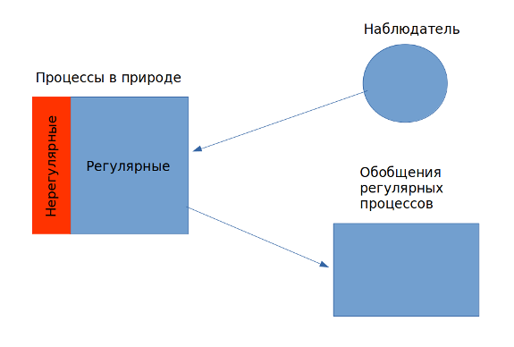

## Чудо.

О конкретном событии мы судим на основании накопленного опыта (наблюдение за повторяющимися событиями, причинно-следственными связями). То что соответствует нашему опыту мы называем естественным, а то что противоречит, или превосходит его --- неестественным и сверхъестественным.

Когда мы говорим о чуде, мы говорим об уникальном или редком событии (но не обязательно справедливо обратное). Если чудеса происходят на регулярной основе, сразу возникает сомнение в их сверхъестественном статусе[^won0031]. Это можно проиллюстрировать известной шуткой:

>Если пономарь упал с колокольни и не разбился, --- это чудо.  
>Если, упав во второй раз, он вновь не пострадал, --- это странное совпадение.  
>Если то же произошло в третий раз,  --- это закономерность.  

Чудо, сверхъестественное событие, также обычно связывают с нарушением "законов природы", но многое зависит от того, что мы понимаем под этими законами. Если речь идет о нарушении самих природных процессов, то мы получаем сильное определение:

> Чудо --- сверхъестественное исключение из естественного порядка мира, которое происходит по воле Бога.

Если же мы задумаемся о том, что известные нам законы природы это всего лишь человеческие обобщения реальных процессов, то получим слабое определение:

> Чудо --- событие, происходящее по воле Бога, которое нарушает человеческие представления о природных процессах.

Или, словами блаженного Августина:

>"Чудо не противоречит природе, но противоречит нашему знанию природы"[^won0002].

Достоинством слабого определения является устойчивость такого понимания чуда перед критикой. Например, снимается обвинение в антинаучности религиозного мировоззрения, так как наука не может претендовать на исчерпывающее знание всех *возможных* природных процессов, а религия не настаивает на том, что чудеса это нарушение естественного порядка в природе.

В пользу слабого определения чуда обычно выдвигается такой аргумент: для чего Богу нарушать тот порядок, который Он Сам и установил? Очевидно, что у Бога всегда достаточно средств совершить чудо, не прибегая к нарушению естественного порядка в мире[^won0024].

Недостаток слабого определения, --- конечно же, в его слабости. Например, очевидно, что такое чудо обладает меньшей убедительностью, если речь идет, например, о доказательстве бытия Божия.

Сильное определение чуда является традиционным. Его достоинство в том, что оно подчеркивает суверенность, могущество Бога, Который не ограничен никакими природными законами и процессами. Если существует Бог теистов, Он способен приостановить, или отменить обычный порядок вещей. Недостаток сильного определения --- в том, что оно представляет критикам больше возможностей для атаки.

### Существование Бога и чудес.

В теистическом понимании Бога уже присутствует вывод о возможности чуда. Всемогущий Бог в состоянии как нарушить законы природы, так и использовать уже существующие необычные явления и особенности природы в Своих целях. И наоборот: признание события чудом указывает на Всемогущего Бога, как Причину этого события.

> Если есть Бог, то чудеса возможны. Если есть чудеса, то, скорее всего, существует Бог (или иная сверхъестественная сила).

Соответственно, отрицание существования Бога подразумевает отрицание чудес (в мире, где нет личностного Бога, нет причин для нарушения естественного порядка вещей).

{width=20 height=20} Утверждая, или отрицая существование Бога, мы принимаем определенное объяснение того, как устроен мир (в том числе, наличие, или отсутствие в нем чудес).

К этому следует добавить, что для христианства особенно важна реальность чудес, в том числе, их историчность. Центральное место занимают чудеса Воплощения и Воскресения: "если Христос не воскрес, тщетна вера ваша" (1 Кор. 15:17). 

Поэтому мы должны прилагать усилия для защиты реальности чудес перед лицом критики.

### Критика чудес.

Энтони Флю (Antony Flew):

{width=20 height=20} Мы гораздо чаще имеем дело с подтверждениями регулярных, повторяемых событий, чем с подтверждениями уникальных событий, таких как чудеса. Следовательно свидетельство в пользу обычного объяснения всегда больше, чем в пользу чудесного. *Достаточного свидетельства* в пользу чудес просто не может быть. Поэтому разумные люди не говорят, что чудеса вовсе *не могут произойти*, они просто не верят, что чудеса происходят *на самом деле*.

(1) Чудеса по природе --- частные и неповторяемые.
(2) Естественные события по природе --- общие и повторяемые.
(3) На практике свидетельство в пользу общего и повторяемого всегда больше, чем в пользу частного и неповторяемого.
(4) Следовательно, на практике всегда будет большим то свидетельство, которое против чуда, а не в его пользу.
(5) Разумные люди всегда основывают веру на бóльшем свидетельстве.
(6) Следовательно, разумные люди не должны верить в чудеса.

{width=20 height=20}  Ответ:

* В 1772 году комиссия Французской академии наук в составе ученых Фужеро, Каде и Лавуазье опубликовала доклад, в котором отрицалась возможность падения камней с неба. Свидетельства крестьян, говоривших о таких фактах, комиссия посчитала суеверием, в том числе, потому, что крестьяне говорили: эти камни бросает Бог.

    Сегодня мы знаем, что метеориты (камни, "падающие с неба") существуют. Наблюдения стали регулярными, наука смогла сделать правильные выводы из накопившихся фактов и их сопоставления с другими регулярными явлениями природы (наблюдение "болидов").

    Из этого можно извлечь первый урок: не всякое утверждение, слабо подтвержденное фактами, является ложным. Некоторые события являются столь редкими, или столь сложными для наблюдения, что отрицать их существование на основании того, что *"обычно все бывает иначе"* совершенно неверно. Данный случай с метеоритами приводится не для того, чтобы бросить тень на методы науки, но для того, чтобы показать, что рассуждение Юма и Флю доводят эти методы до абсурда.

    Несмотря на постоянно расширяющиеся возможности наблюдения, наука никогда не сможет исследовать достаточно существенную часть реальности, чтобы априори делать выводы о том, что бывает, а чего "не может быть никогда". Это контрпродуктивно для самой науки: в конце концов, усилиями французской комиссии, о которой говорилось выше, исследование метеоритов было отложено на тридцать лет.

    Второй урок из этой истории предназначен христианам: не всякое уникальное или редкое событие является чудом. В данном случае развитие науки показало, что событие, ранее считавшееся чудесным, имеет естественное происхождение. Поэтому нам нужно попытаться уточнить, как мы отличаем чудеса от уникальных и редких событий в природе.

* Согласно Юму и Флю мы всегда должны верить тому, что наиболее вероятно. Но на самом деле мы оцениваем сами факты, а не вероятности. Иногда шансы против события высоки, однако свидетельства в пользу события очень серьезны (например, основаны на текущем наблюдении). В результате мы принимаем маловероятное событие как реальность. 

    *Иллюстрация: "Лотерейный сюрприз"*[^won0007].

    Шанс выиграть главный приз в лотерею в США составляет приблизительно 1:100.000.000.  Изначально вероятность, что некто Генри Плюшботтом из Канзаса выиграет, очень низка. Но включив телевизор, Генри вдруг слышит сообщение о том, что именно он выиграл главный приз. После этого вероятность выигрыша резко возрастает[^won0008].

    Конечно, если у нас есть причины считать, что на самом деле Генри не выиграл, это может перевесить силу свидетельства. Однако "Лотерейный сюрприз" говорит о другом: *единичное свидетельство способно изменить изначальную невероятность события*, и мы постоянно сталкиваемся с этим явлением.

    Все это имеет прямое отношение к чуду. Например, наличие убедительных Евангельских свидетельств о Воскресении Христа многократно увеличивает вероятность события, которое даже самым близким Его ученикам прежде казалось совершенно невероятным.

* Представление о том, что в природе имеют место только повторяемые и предсказуемые процессы, опровергается существованием уникальных явлений природы. Например, возникновение нашего мира --- уникальное событие. Уникальными, по всей видимости, являются также события возникновения жизни и человеческого разума.

    Все это стараются оспорить натуралисты, предлагая гипотезы, не имеющие на сегодняшний день достаточных подтверждений (например, о мультивселенной, о самопроизвольном зарождении жизни, и порой даже о существовании разума за пределами Солнечной системы). Таким образом, позиция натуралистов подвержена той же критике, которую они обрушивают на христиан: их выводы подразумевают предпосылку, включенную в эти выводы. Если принять, что в природе существуют только повторяемые, регулярные явления, то чудеса невозможны.
    
    Но у нас нет априорного знания законов природы, а есть лишь обобщение наблюдений за ней. Такие обобщения могут оказаться ложными (возможность фальсификации, т.е. опровержения). Например обобщение, утверждающее "все вóроны --- черные" опровергается демонстрацией белого ворона. Однако опровержение *обобщения* не опровергает подлинного *закона*, проявляющегося в существовании птиц разного цвета. Другими словами, в отличие от человеческих обобщений, подлинные законы природы нефальсифицируемы.

    Подлинный закон природы не гарантирует, что не существует ничего вне обычного (наблюдаемого нами) порядка вещей, а следовательно не гарантирует и того, что никогда не будет исключений. Следовательно, закон природы не подразумевает истинности соответствующего универсального обобщения.

    {width=400 height=295} 

    Итак, уникальные события (к числу которых относятся и важнейшие для христианства чудеса) просто не входят в круг исследуемых учеными явлений. Думаю, именно поэтому многие крупные ученые считали и считают себя христианами и верят, например, в чудо Воскресения, без ущерба для своей научной работы.

* Наконец, критик, считающий, что следует принимать только те свидетельства, которые соответствуют регулярным паттернам, с тем же успехом мог бы заявить, что, к примеру, Наполеона Бонапарта никогда не существовало. Поскольку деяния Наполеона были столь фантастическими, столь необычными, ни одна разумная личность не должна верить, что эти события когда-либо происходили на самом деле. Одним словом, если правы Юм и Флю, мы не можем верить в историчность любого неповторимого события в прошлом.

---------

{width=20 height=20}     Диалог. "Наука доказала, что чудес не бывает".

{width=20 height=20}   Постоянно расширяя область познания, ученые объясняют те явления, которые прежде казались чудесными. Например, полет шмеля долгое время считался необъяснимым с точки зрения естественных законов. Однако, принцип полета прояснился с открытием энергетических резервов в митохондриях, которые дают возможность насекомому совершать очень быстрые движения крыльями.

{width=20 height=20}  Полет шмеля по-прежнему остается чудом с точки зрения "дизайна" этого маленького существа.

{width=20 height=20} Главное --- в том, что полет шмеля не является больше необъяснимым. Нарушения законов природы не происходит, --- следовательно и чуда нет! Итак, если нам кажется, что происходит исключение из закона природы, это доказывает только то, это не настоящий закон, поскольку он не действует всегда и во всех случаях. Необходимо просто найти подлинный закон природы: уточнить теорию, или выдвинуть новую, как это уже не раз случалось. Что и произошло в истории со шмелем и во многих других случаях.

{width=20 height=20} Подлинный закон природы найти невозможно, так как мы не можем постигать реальность непосредственно. Мы можем лишь обобщать свои наблюдения за повторяющимися явлениями. Но кто доказал, к примеру, что все, что происходит в мире это только повторяющиеся вещи? Подлинный закон природы не гарантирует, что нарушение наших *представлений* о природе не произойдет в любой момент. А именно такие поразительные события мы и называем чудом.

{width=20 height=20} Если речь идет о представлении, то чудо --- это Ваше (неверное) представление о необычном природном явлении. Наука постоянно подтверждает свои представления экспериментально, все утверждения проверяемы и фальсифицируемы. Верующие же просто заполняют оставшееся, неисследованное пространство "чудесами".

{width=20 height=20} Не соглашусь. Чудеса --- это явление более высокого порядка, чем природные явления, потому что причиной сверхъестественного является Личность. Например, работа двигателя внутреннего сгорания объясняется законами природы. Но появление такого двигателя не является необходимым результатом действия этих законов. Появление ДВС --- прямой результат интеллектуальной деятельности человека и его свободного решения. Недаром существует выражение "чудо техники" (на самом деле имеется в виду "чудо человека", ведь именно человек --- источник необычных явлений и устройств, отсутствующих в природе). Чудо Божие отличается тем, что Бог непосредственно знает всю реальность, а не какую-то ее часть. Бог --- Программист, а не хакер. То, что нам кажется "взломом" реальности, для Бога --- "недокументированные возможности".

{width=20 height=20} Значит чудо Воскресения, на котором строится здание христианства, это всего лишь недокументированные возможности человеческой природы?

{width=20 height=20} Я думаю, Воскресение Господа Иисуса --- особое событие. Его уникальность в том, что Бог принял в нем непосредственное участие. Как бы мы ни смотрели на первозданное состояние природы[^mdr0001], Бог не просто делает человеческую природу бессмертной, но одновременно соединяет нас с Собой, духовно обновляя. Обожение действительно превосходит естественный порядок вещей. Но, мне кажется, большинство чудес Библии все же нарушают наши представления о законах природы, а не сами законы.

{width=20 height=20}  Но как тогда отличить чудо от природного явления? Если этого нельзя сделать научным способом, то высказывание типа "данное явление --- чудо" --- исключительно субъективно и зависит только от того, кто интерпретирует событие. Например, я, став свидетелем такого "чуда", скажу, что это совпадение, необычное взаимодействие природных процессов, для которого наука пока еще не нашла объяснения, но обязательно найдет. Итак, "чудеса" не работают как доказательство существования Бога.
 
{width=20 height=20} Я соглашусь, но лишь отчасти. Наши рациональные суждения основываются на обобщении повседневного, обыденного опыта, а чудо (с точки зрения человека) --- взлом повседневности и обыденности, поэтому чудо не работает на уровне рационального доказательства. С другой стороны, человек способен распознать чудо на *личностном* уровне, то есть субъективно. В чудесах проявляется Личность Бога, в них прослеживается связь с Его характером. Отсюда, настоящее чудо не может быть безнравственным, фундаментально злым событием, оно также не может быть бессмысленным "шоу", но должно оставлять серьезный след в душе человека. Вот, по крайней мере, два критерия истинного чуда[^mrd0002].

Для того, чтобы человек сподобился стать свидетелем чуда, существует ряд условий (искренность, любовь к истине, доброта, вероятно, какие-то еще свойства, приближающие человека к Богу)[^mdr0003]. Но это не означает, что чудо способно убедить любого. В Библии есть много противоположных примеров.

[^mdr0001]: Мы не знаем точно, сотворил Бог именно этот энтропийный мир, или тленность и смертность в мире --- следствие грехопадения. Второе объяснение, с учетом масштабов вселенной и энтропийных процессов, превращает Адама и Еву в каких-то демиургов, а грехопадение приобретает совершенно титанические масштабы. Первое объяснение является непривычным для традиционного христианства, к тому же это подразумевает, что Бог сотворил смерть.
[^mrd0002]: В этом существенное отличие "апокрифических" чудес от тех, что описаны в канонических Евангелиях и Деяниях апостолов.
[^mdr0003]: Например, явление Господа Иисуса Савлу на пути в Дамаск --- пример чуда, полностью изменившего жизнь человека. 
[^won0002]: "Portentum ergo fit non contra naturam, sed contra quam est nota natura". S. Aurelius Augustinus, De Civitate Dei, 21.8.
[^won0007]: See: George I. Mavrodes, Miracles // @OxRel, p.315.
 [^won0008]: Оба события (выигрыш и объявление в новостях) имеют одинаково низкую вероятность. Но взятые вместе они поддерживают друг друга таким образом, что производят серьезную позитивную вероятность. Если Генри действительно победитель, тогда вероятно, что он будет назван в таком сообщении, а если он не является реальным победителем, тогда фантастически невероятно, что его по ошибке назовут в новостях. Таким образом, то, что Генри Плюшботтома назвали победителем, делает весьма вероятным то, что он действительно победил.
[^won0024]: Простая аналогия: Бога скорее можно сравнить с программистом, хорошо знающим "незадокументированные возможности" своего творения, чем с хакером, который взламывает обычные процессы, заставляя их выполнять несвойственные им задачи. Последнее противоречило бы представлению о суверенности, самосущии (aseity) Бога, ведь в этом случае Ему приходится считаться с законами природы и заставлять их работать иначе, вместо того, чтобы пользоваться уже созданными возможностями.
[^won0031]: Впрочем, это еще не означает автоматически, что все чудеса уникальны, или крайне редки, а всего лишь указывает на человеческую интуицию, связанную с понятием чуда, как *удивительного* события. В этом смысле и регулярные природные процессы можно назвать чудом, хотя в этом случае возникает вопрос о том, чем, собственно, чудо отличается от других процессов и событий.

\newpage
