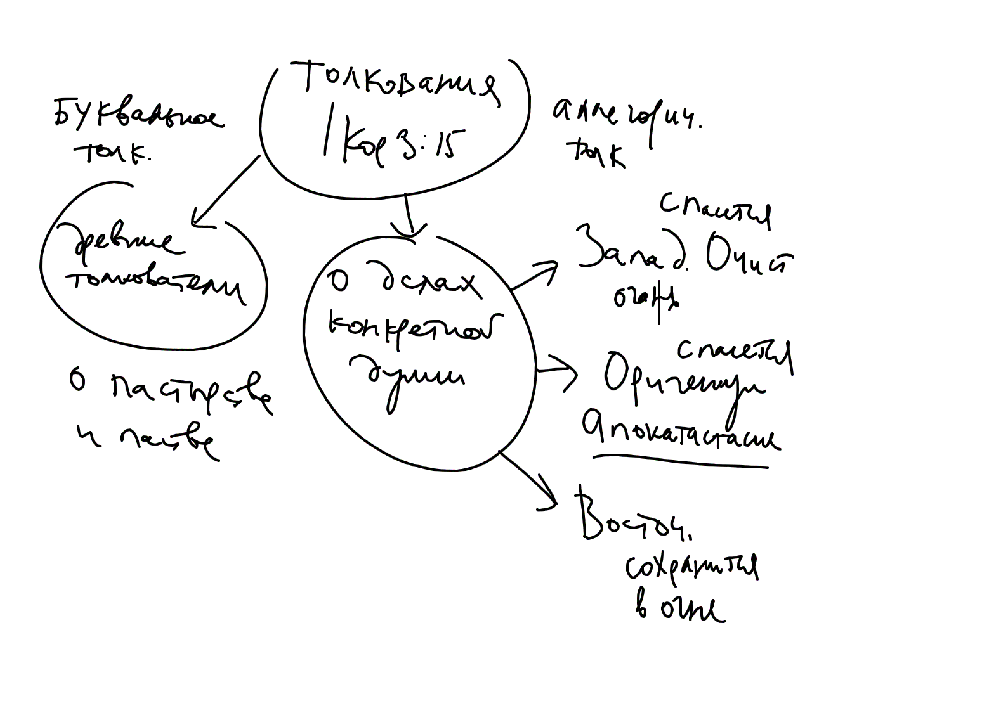
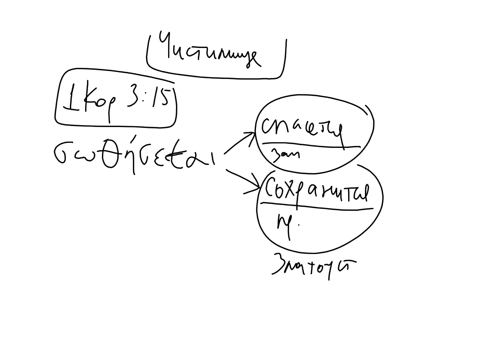

# Очистительный огонь

<!--Sources on cleansing fire: Q 3:16, Luke 12:49-50, Gos. Thom. 82, 1 Cor 3:10-15, 1 Pet 1:7, 4:12, 2 Pet 3:10-->

Христианское представление о Суде Божием подразумевает два исхода: праведники отправляются в жизнь вечную, а грешники - в муку вечную (Мф. 25:46). Однако, в таком случае возникает следующая трудность: что будет с душой, которая имеет как добрые, так и злые дела? Такую душу несправделиво было бы отправить в муку вместе с теми, кто всецело обратился к злу, но и в Царствие Божие не войдет ничто нечистое (Откр 21:27).

Одним из ответов на этот вопрос явилось учение об очистительном огне (ОО), который выжигая злые дела, освобождает душу от нечистоты, и она становится способной войти в Рай.

Споры о существовании (или не существовании) очистительного огня коренятся в различных толкованиях следующих слов ап. Павла:[^nf01]

>Я, по данной мне от Бога благодати, как мудрый строитель, положил основание, а другой строит на нем; но каждый смотри, как строит.  Ибо никто не может положить другого основания, кроме положенного, которое есть Иисус Христос. Строит ли кто на этом основании из золота, серебра, драгоценных камней, дерева, сена, соломы, — каждого дело обнаружится; ибо день покажет, потому что в огне открывается, и **огонь испытает дело каждого**, каково оно есть. У кого дело, которое он строил, устоит, тот получит награду. **А у кого дело сгорит, тот потерпит урон; впрочем сам спасется, но так, как бы из огня**(1 Кор 3:11-15).

Можно выделить два подхода к пониманию этих слов апостола:

* "Пастырское" толкование. Древнейшие комментаторы следуют более широкому контексту, где ап. Павел говорит о строительстве Церкви, общины верующих (см. стих 10й). Паства и рассматривается толкователями как дело, которое будет испытано. Если паства не слушается здравого учения и живет нечестиво, то погибает. При этом сам пастырь (глава общины) спасется "как бы из огня".
* "Частное" толкование. Фрагмент о испытании огнем рассматривается как отдельный образ, относящийся к каждой душе после разлучения ее от тела, к испытанию ее дел и посмертной участи. Дела, испытываемые огнем - плоды человеческой жизни. Комментаторы считают, что этот огонь имеет одно из двух свойств:
    * Очищения. Последователи Оригена, а также западные и некоторые восточные отцы говорят об очистительном огне, который сжигает грехи.
    * Сохранения. Восточные отцы (св. Иоанн Златоуст и вся последующая православная традиция) говорят о "сохранении" души грешника в огне. Душа не разрушится, но будет вечно пребывать в муке.

\newpage

{width=400 height=300}

Различное толкование основывается на двух вариантах перевода слова, использованного ап. Павлом:

*σωθήσεται* (от др. греч. σώζω):

* "спасется" (оригенисты, западные отцы)
* "сохранится" (восточные отцы)

<!--{width=400 height=300}-->

Первый вариант толкования (*σωθήσεται* как "спасется") приводит к следующим последствиям:

* Учение об "Апокатастасисе", автором которого считается Ориген. Суть - в восстановлении всех душ (в том числе и демонов) в "первоначальном достоинстве" - т.е. такими, какими они были сотворены. Это учение осужденно Александрийским поместным собором 399 года, V Вселенским Собором (в этом есть сомнения), осуждение закреплено VI и VII соборами.
<!--ссылка на Болотова-->
* Учение о "Чистилище". Православная Церковь не приняла это изобретение латинских богословов. На Ферраро-Флорентийском соборе св. Марк Эфесский и его единомышленники выдвинули ряд серьезных возражений против этого учения.

Общий недостаток этих учений:

*Учение об очистительном огне приводит к нежелательным последствиям в области нравственности: это понимание апостольских слов оказывает расслабляющее действие на душу христианина* (об этом говорит, напр. св. Марк Эфесский)

### Вопрос о смысле молитвы за усопших

На ФФ соборе латиняне выдвинули ряд аргументов, среди которых есть и такой: (4) и греки, и латиняне молятся о усопших, и "...если бы не было положено очищение после смерти, молитва была бы совершенно бесцельной, поскольку она напрасно возносилась бы за тех, которые или уже -- в славе, или же -- в аду"[^mm1]

Логика в этом есть: 

* Протестанты так и думают: молитва за усопших -- бессмысленна, так как воля усопшего не может быть изменена после смерти, а его дела не имеют значения (спасает только вера во Христа, как Сына Божия).
* Если дела усопшего имеют значение для его посмертной участи:
    * Латиняне: Ад - место мучения, а не исправления. Чтобы исправить дела (сжечь всю нечистоту), необходим очистительный огонь (и Чистилище, как место, где он действует).

Однако, православные участники ФФ предложили свой ответ, который не совпадает ни с мнением протестантов, ни с позицией латинян: Ад - темница (по крайней мере, до Страшного Суда). Молитва Церкви помогает избавиться от "недостатка добрых дел" (каким образом это происходит не очень ясно, высказывались разные мнения, например об очистительном страхе, о том, что Сам Христос прощает малые грехи).

С другой стороны есть православное учение о различии даров и наказаний, но оно не отвечает на вопрос, как молитва Церкви помогает душам усопших. Тут речь идет о том, что Чистилище не нужно для решения вопроса о "среднем состоянии" душ - методом "сортировки". 

## Цитатник: высказывания святых отцов, поддерживающие учение об очистительном огне:

### Западные:

#### Блаженный Августин (ок. 389 г.):

Этот святой признает очистительный огонь существующим [^nf02]

>"Есть многие, которые плохо понимая эти слова, обманывают себя ложной безопасностью, веря, что если на основании Христа они созиждут даже тяжкие грехи, то и эти грехи они возмогут очистить прохождением через огонь, а затем и они могут достичь вечной славы. Такое понимание, возлюбленные братия, должно быть исправлено, ибо сами себя обольщают те, которые льстят себя этой надеждой. Ибо прохождением чрез тот огонь, о котором говорит Апостоле: "сам же спасется, такожде якоже огнем", — не тягчайшие, но меньшие грехи очищаются"[^aug1]

>"Но даже если, обратившись, грешник будет жить, и не умрет, все же мы не обещаем, что он избежит всякого мучения: ибо тот, кто в прошлом веке не принес плода обращения, прежде должен быть очщен очистительным огнем; и хотя тот огонь не будет вечным, однако я поражаюсь, до какой степени он будет тяжек, ибо превзойдет всякое мучение, которое когда либо кому случалось переносить в этой жизни"[^aug2]

>"человек, не выполнивший здесь своего долга, «после сей жизни получит либо огонь очищения (purgationis), либо вечную кару (poenam)"[^aug3]

>"Из временных наказаний — некоторые терпятся только в этой жизни, некоторые — после смерти, а некоторые — и ныне и тогда, но только они терпятся до того строжайшего и последнего Суда. Не все из числа тех, которые после смерти переносят временные мучения, придут в вечные муки. Ибо некоторым то, что не отпустится в этом веке, будет отпущено в будущем, т.е. как мы выше сказали, они не будут мучиться вечным мучением в будущем веке"[^aug4]

>В толковании на псалом 6-ой св. Августин говорит: "В день Суда осуждаются все, кто не имеют основания, которое есть Христос: исправляются же, т.е. очищаются (purgantur) те, кто на этом основании строят из дерева, сена, соломы; они потерпят урон, но спасутся как через огонь (Кор 3,11). О чем же молится тот, который не хочет быть упрекаем во гневе Господа, т. е. (желает) исправиться? О чем, если не о том, чтобы ему выздороветь? Ибо где здоровье, там нечего опасаться смерти, нижè прижигающей или режущей руки врача"[^aug5]

>На псалом 37-ой. Слова: "не во гневе Твоем наказывай меня" св. Августин поясняет так: "чтобы Ты очистил (purges) меня в этой жизни и сделал меня таким, для которого уже не требуется исправительного (emendatorio) огня, на пользу тех, которые спасутся, так, однако, как чрез огонь. Ибо... они построили из золота серебра... и обеспечены от того и другого огня, не только от того, вечного, который во веки веков будет мучить нечестивых, но и от того, который исправит тех, кои спасутся огнем"[^aug6]

#### Св. Амвросий Медиоланский

Объясняя изречение: "сам же спасется, такожде якоже огнем", святитель говорит: 

>"Спасется, но не без страдания (или наказания, "poena"). Этим он говорит, что сам тот спасется, но пройдет чрез страдание огня, дабы быв очищен огнем, он спасся и не мучился непрестанно, как - неверные в вечном огне, ибо до некоторой степени ему поможет то, что он веровал во Христа"[^amb1]

#### Св. Григорий Великий

В "Диалогах" находится следующее рассуждение:[^fur1]

>"Что касается легких согрешений, надлежит веровать, что существует до (Страшного) суда очистительный огонь (purgatorius ignis)"; это вытекает из слов Спасителя, что хула на Духа Святого не простится ни в сей жизни, ни в будущей [^grig1]

>Он рассказывает о смерти одного монаха в его монастыре. Монах незаконно хранил три монеты; только на смертном одре он, со слов родного брата, понял греховность поступка. В назидание братии св. Григорий распорядился похоронить его отдельно. Через 30 дней жалость к покойному охватила его: он установил служить 30 дней сряду обедню по нем, ибо "давно уже покойный в огне мучится; мы должны приложить некоторое милосердие и насколько можем помочь, чтобы он был исторгнут (из огня)". Через некоторое время покойный явился брату своему (не знавшему, что по нем служат обедни) и сказал, что он очень страдал, но что с сегодняшнего дня ему хорошо. Оказалось, что это был день 30-й обедни [^grig2]

### Восточные:

####св. Григорий Нисский

>“как очистительным огнем уничтожается негодная материя, так точно необходимо, чтобы душа, которая соединилась со скверной, была бы в огне до тех пор, пока совершенно не истребится огнем внесенная скверна”.

#### Св. Василий Великий

<!--В молитвах его, читаемых коленопреклоненно в день Пятидесятницы, имеются о Боге следующие выражения: «низводяй во ад и возводяй»; «сподобивый (и в этот великий праздник) приимати» молитвы **«о иже в аде держимых»;** пусть «не мертвии восхвалят Тя, ниже сущии во аде исповедание дерзнут принести Тебе; но мы живии... **очистительныя молитвы приносим Тебе о душах их»**; «и упокой рабов Твоих, прежде усопших отец и братий наших». -->

* В толковании на пророчество Исаии говорится:

>"Потом Пророк присовокупляет, что "за ярость гнева Господня сгоре вся земля". Чем показывает, что земное предается карательному огню в благодеяние душе, как и Сам Господь дает разуметь, говоря: "огня приидох воврещи на землю, и хотел бы видеть, аще уже возгореся (Лк. 12:49). "И будут людие, яко огнем пожженный человек". **Не уничтожением угрожает, но разумеет очищение, по сказанному у Апостола: "а егоже дело сгорит, отщетится: сам же спасется, такожде, якоже огнем" (1 Кор. 3, 15)**

* Строки прор. Исаии о "троскоте", который "пояден будет огнем, и разгорится в чащах" также, по-видимому понимались автором толкования как указание на очистительный огонь. Покаяние делает траву (злые дела) сухой и ее легко сжигает очистительный огонь. А если грех не очищен покаянием, то он "сырой" и не сгорает.[^bas1]

>"Но сия угроза ("не отвратится ярость Его, ... рука Его высока") имеет некоторый вид благодеяния: потому что разгорится беззаконие яко огнь. Ибо Благий Владыка, благодетельствуя людям, устрояет, что уготованное беззаконием вещество предается уничтожению. И "яко троскот сухий"[^nf03], говорит Пророк, "пояден будет огнем, и разгорится в чащах" (один грех рождается от другого, как семена, злаки "троскот", -- И.П.). Посему, если обнажим грех исповедию, то сделаем его сухим троскотом, достойнфм того, чтобы пояден был _очистительным огнем_" (сырой, "дубравной чащей" в отличие от сухого "троскота", -- И.П.). Пророк называет дубравой людей притворных, имеющих ум скрытный, в тайне сердца своего соблюдающих много злаго.

При том, что в толковании на пророчество Исаии, очевидно, в нескольких местах говорится об очистительном огне, существует вероятность, что св. Василий не был его автором[^isa1]

#### св. Григорий Богослов

Говоря о еретиках-новацианах, святитель предполагает: 

>"Может быть, они будут там крещены огнем - этим последним крещением, самым трудным и продолжительным, которое поядает вещество как сено и потребляет легковесность всякого греха"[^grN1]

Итоги: 

* Нужно признать, что в Церкви (особенно на Западе) существовала традиция, признававшая возможность очищения грешников с помощью особого огня, на который ссылается и 1 Кор 3:10-15.
* Несмотря на это само учение о Чистилище - позднее (XII в.) и является чисто католической разработкой этой темы.
* Восточная Православная Церковь отказалась от учения об очистительном огне, несмотря на то, что некоторые отцы Церкви ранее поддерживали эту мысль.

\newpage

[^nf01]: Есть ряд других мест Нового Завета, допускающих истолкование в контексте ОО: Мк 9:49, Лк 12:49-50, 1 Пет 1:7, 4:12, 2 Пет 3:10.
[^mm1]: @MarkEth, С. 52
[^nf02]: Блаж. Августин назывался в древности греками "священным" (ἱερός), как и св. Василий.
[^aug1]: Augustine Sermo 41 De Sanctis, actio tertia. Mansi t. IX с. 20-22, PL 39, 1946
[^aug2]: PL 40, 1127
[^aug3]: "De Genesi", contra Manich, l. II. с. 20; Ml 34, 212
[^aug4]: PL 41, 728
[^aug5]: Ml. 36, 92
[^aug6]: Ml 36, 397
[^bas1]: См. @Basil2, С. 263-264; MI 30, 520-521
[^grN1]: @GrigNaz1, С.543
[^fur1]: В последнее време высказывались сомнения в авторстве св. Григория Великого. Возможно Диалоги написал ирландский монах Fursey (ок. 650г.), а до нас они дошли в версии, составленной около 670г. См. Marilyn Dunn. Gregory the Great, the Vision of Fursey, and the origins of purgatory, pp. 238-254
[^amb1]: PL 17,200
[^grig1]: "Dialog." l. 14, c. 39; Ml 77, 396, A-C
[^grig2]: Id. c. 55; Ml 77, 420 s.
[^isa1]: Отметим существующую проблему атрибуции толкования на книгу прор. Исаии: издатели-бенедиктинцы (Migne, PG) поместили это толкование в приложение к первому тому трудов св. Василия как Spuria (сомнительное авторство): Four of the homilies on the psalms... as well as the Commentary on Isaia, are placed by the Benedictine editors in the Appendix of Volume 1 of St. Basil's works, Patrologia Graeca, Vol. 30, as doubtful or clearly spurious works of St. Basil. Saint Basil Exegetic Homilies. Translated by sister Agnes Clare Way, C.D.P.// The fathers of the Church. A new translation. The Catholic University of America Press. Washington 17, D.C., 1963. p. vii. Сомнения в правильности атрибутирования высказал и Rudberg 1981 P. 51.
[^nf03]: Троскот (греч. ἄγρωστις) -- кормовая трава.

\newpage
