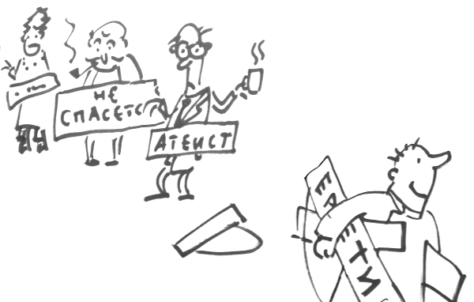

# Введение 

Дорогой читатель! Представьте себе: Вы встретили собеседника, который сомневается в истинности христианской веры, даже называет себя атеистом. Какой подход избрать в отношении такого человека?

Самая распространенная ошибка апологета: наклейка ярлыка. Ваше первое задание: пожалуйста, не вешайте мысленно на своего оппонента заранее заготовленную табличку. 

{width=350 height=300}

Во-первых, мы не знаем судов Божиих и путей, которыми Господь ведет людей к Себе. Во-вторых, может выясниться, что, на самом деле **Ваш собеседник - вовсе не атеист** в полном смысле слова. Возможно, на пути ко Христу ему встретилось препятствие, о которое он споткнулся, - например, какая-то антихристианская мысль из книжки или из телепередачи. В этом случае Ваш долг - помочь "пострадавшему": устранить препятствие и помочь сделать первые шаги ко спасению. 

Не бойтесь! Даже если Вы столкнулись с убежденным (и подкованным) атеистом, вполне вероятно, разговор с ним принесет некоторую пользу. Это возможно в том случае, если Вы не будете относиться к нему враждебно (**агрессия - проявление страха**). Вооружитесь не выпадами и обвинениями, а любовью, молитвой и... знанием Основного богословия!

Нужно помнить, что в основе нашей веры лежит не цепь логических рассуждений, а личный опыт общения с Богом. Рассуждения нам нужны, чтобы "дать отчет о своем уповании". Даже если атеисту удастся Вас переспорить, ему не под силу перечеркнуть Ваш опыт молитвы и богообщения (это можете сделать только Вы сами, и религиозные споры не имеют к этому никакого отношения). Христианин должен бояться только греха.

Итак, наш "швейцарский нож": Основное богословие предоставляет апологету ряд инструментов, с помощью которых он может показать внутреннюю непротиворечивость христианства и опровергнуть построения критиков. Даже если Вам будет казаться, что в некоторых вопросах христианские аргументы выглядят слабо, не расстраивайтесь. Возможно, именно Вам суждено написать недостающие строки в защиту нашей веры.

* О названии: наш предмет рассказывает о положениях, составляющих основу христианства (учении о Боге, о Христе как Сыне Божием, о спасении человека и других). Эти положения связаны друг с другом и составляют систему знаний, которая получила название "Основное богословие" (ОБ).
* Ближайшие "соседи": Основное богословие находится на пересечении Философии религии (теория) и христианской Апологетики (прикладные задачи).

<!-- _Примечание_: На самом деле, я, честно говоря, сам не знаю, чем этот курс отличается от курса Апологетики. Разве что здесь больше философии (чем следовало бы). -->

* О методе:
    * Каждый раз, предлагая атеисту аргумент из Священного Писания, или Предания, **Вы рискуете увидеть свой бисер растоптанным**. К сожалению, для неверующего или сомневающегося Слово Божие - пустой звук. Поэтому в этом курсе мы будем обращаться в основном _не_ к авторитету Священного Писания и Предания, но к человеческому разуму, доводам логики, и источникам, авторитетным для неверующих. Только поколебав уверенность критика в правильности его рассуждений, мы можем прибегнуть к авторитетам, признанным Церковью, для закрепления результатов.
    * Впрочем, большинство сложных вопросов, которые рассматриваются Основным богословием, все же имеют в своей основе трудности понимания некоторых мест Священного Писания. Мы обязаны как следует изучить православное толкование этих спорных мест.

<!-- * Важная мысль: объяснение - главная функция науки, которая всегда стремится отыскать причины того, или иного явления. Если невозможно получить хотя бы косвенные опытные данные, указывающие на правильность одной из гипотез, в науке используется прицип **лучшего объяснения**. (пример хрустальных сфер Аристотеля и объяснение Коперника - не подходит). -->
<!-- * "слишком сильное лекарство" - пациент умирает в результате лечения (а оппонент, желающий отвергнуть какую-то мысль должен вместе с тем отвергнуть и другую мысль, которой не отрицает ни одна разумная личность. И наоборот, утверждая нечто, оппонент вынужден принять и другую мысль, с которой не согласится ни один разумный человек. Такие логические "вилки" встречаются в этом тексте. Для того, чтобы подчеркнуть важность этих ловушек, мы разместили возле них пиктограмму с таблеткой. -->
<!-- * принцип достаточного основания -->
<!-- * Аргументация атеистов во многом остается неизменной со времен Лапласа и Юма. Наука шагнула далеко вперед, предоставив массу материала для апологии. Эти материалы мы постараемся использовать. -->
<!-- *  -->
<!--  -->
<!-- TODO: Здесь должны быть подробности, некоторые мысли можно взять из презентации -->
<!--  -->
В силу вышеуказанных причин в центре наших рассуждений часто оказывается человек со своими ограниченными представлениями и шаткой логикой. Так видит мир неверующий человек. Мы не хотим исключить Бога из нашего объяснения религии, но мы вынуждены взглянуть на наши отношения с Ним со стороны, чтобы объяснить свой опыт человеку, который его лишен.

Например, говоря об основах теизма, мы применяем суждение о Боге, как о **Существе, достойном поклонения**. Эта мысль является следствием подхода, который ставит в центр человека с его критериями и оценками. Можно подумать, что человек сам "конструирует" божество по своему вкусу, признавая одни "характеристики" и отвергая другие! Все это может вызвать некоторый дискомфорт у читателя: наши представления о Боге есть некая "данность", и сама мысль о том, что можно их оценивать иначе нам кажется странной и даже кощунственной.

Но для неверующего это отнюдь не так. Если Ваш собеседник в принципе признает **возможность** существование Бога, он вовсе не обязательно согласится с тем, что Бог именно таков, каким Его описываете Вы. Предложенный метод (рассматривающий человека, как отправную точку суждения о Боге) помогает взглянуть на проблему со стороны и показать внутреннюю логику, присущую христианству.

* Задача курса: с помощью логических рассуждений и привлечения данных науки и философии показать **состоятельность** христианства как системы мысли, **серьезность вклада** христианства в разных областях человеческой жизни (т.е. его непреходящую ценность) и **опровергнуть ложные мнения**, бытующие среди нехристиан о предмете нашей веры.
<!-- * Некоторые вопросы, которые будут рассматриваться в этом курсе оказались недостаточно разработанными на Востоке, но привлекли пристальное внимание западных богословов, начиная с блаж. Августина. Причина - в характере ересей, с которыми велась борьба на Западе (особенно это касается пелагианства) и в рационалистическом подходе, который принят в западной богословской традиции. Атеизм расцвел пышным цветом именно на Западе, пользуется методами западного рационализма, поэтому и средства, подходящие для борьбы с ним мы часто находим именно в трудах западных апологетов. -->

* Литература:
    * Осипов А. И. Путь разума в поисках истины. — М., 2008.
    * Эванс К. С. Мэнис Р. З.. Философия религии. Размышления о вере, — М. ПСТГУ, 2011
    * Зеньковский В. прот. Апологетика. — Париж, 1957. Рига, 1992.
    * Кураев А. диак. Дары и анафемы. Что христианство принесло в мир? — М., 2009
    * Кураев А. диак., В. Гинзбург, А. Рубинов, Диспут с атеистом, — М., 2007
    * Robert N. Bellah. Religion in human evolution. From the paleolithic to the axial age. Cambridge, Massachusetts. London, England, 2011.
    * Кудрявцев-Платонов В.Д., Философия религии, - М., 2008.

<!-- К особенностям курса относится то, что в нем изучается, прежде всего, классический теизм. То, что в рамках других предметов обсуждается с чисто богословских позиций, в данном курсе исследуется с рациональной точки зрения. Поэтому  -->

* Пиктограммы, встречающиеся в тексте:

{width=20 height=20}   Критика христианства атеистами и агностиками
                                              
{width=20 height=20}      Апология христианства

{width=20 height=20} Важный материал. Запомни!

{width=20 height=20}     Учебный диалог  
                                              
{width=20 height=20}    Сложный материал

{width=20 height=20}      Логическая "вилка". ("Слишком сильное лекарство")

