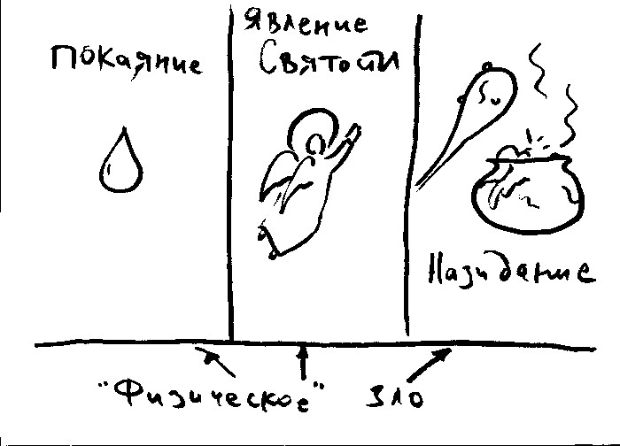

# Проблема зла 

<!-- === В общем виде: === -->
{width=20 height=20}      Формулировки проблемы зла атеистами: 

* Логическая форма:
    * Существование всеблагого, всеведущего и всемогущего Бога
    * Существование зла
    * Несовместимость этих понятий.
* Вероятностная форма
    * Существование всеблагого, всеведущего и всемогущего Бога
    * (Допустим) у Бога есть причины допускать существование зла
    * Но количество и характер существующего в мире зла делает существование Бога неправдоподобным и маловероятным.

{width=20 height=20}              Ответ теиста:  

* Классический теизм:
    * Теодицея (оправдание Бога) - Лейбниц (ответ на 1й тип критики).
        * Бог имеет оправдания для допущения зла
        * Этому есть причины, изложение причин, доказательство их весомости. 
    * Защита (ответ на 2й тип критики).
        * У Бога есть причины допущения зла, которые мы не знаем и не можем знать 
        * может представлять возможные причины (не заявляя, что они необходимы для Бога), по которым допускается сущестование зла,
* Отклонения от классического теизма: 
    * зло - иллюзия (пантеизм, панентеизм)
    * ограниченность Бога в силе, знании, благе (или во всех трех) - теология процесса.
<!--     * неподатливый материал -->
<!--    * проблема в "характере Бога" -->

### Логическая формулировка "доказательства небытия Бога" (подробный ответ) 

{width=20 height=20}              Выявим скрытые посылки рассуждения атеистов:  

   {width=20 height=20}     Доказательство: 

* благая Сущность всегда устраняет зло настолько, насколько это возможно
* для всемогущей Сущности нет пределов того, что Она может сделать
* благая, всемогущая Сущность устраняет зло полностью
* существование благой всемогущей Сущности и существование зла несовместимы
* зло несомненно существует
* Бог не существует.

<!--   (Mackie J.L. Evil and Omnipotence P. 173) -->
{width=20 height=20} {width=20 hight=20}   **Опровержение** обычно направлено против положения "благая сущность всегда устраняет зло насколько это возможно".  

>    **Пример**: солдат закрывает своим телом вражескую гранату. Совершается зло - смерть солдата, но предотвращается большее зло - смерть товарищей.

* благая Сущность всегда устраняет зло, если:
    * не теряется большее благо (greater good). На этом строится большинство современных теодицей (отсюда и удивительная ненависть к термину и желание его очернить со стороны атеистов). 
><!--  Напр. в фильме "Hot Fuzz" (Типа крутые легавые) преступная клика, состоящая из именитых горожан-убийц, одетых в черные балахоны, скандирует "For greater good, for greater good!" (т.е. "ради большего блага"!). -->
    * не допускается худшее зло

{width=20 height=20}     Возражение атеистов: но этот принцип применим только к ограниченным существам (Всемогущий может сделать так, чтобы граната не взорвалась, или исцелить всех пострадавших)    

{width=20 height=20}     Всемогущество Бога - это не способность сделать _все что угодно_. Например, Бог не делает того, что логически невозможно (2+2=5) - такие состояния вещей не являются **действительно возможными**.    

{width=20 height=20}     **Воспитательная теодицея**    

>    **Благо второго порядка** - благо, которое было бы логически невозможно без существования некоторого количества зла. 

Например: смелость непредставима без возможности претерпеть вред, сочувствие - без страданий других людей.
<!--     * Можно привести пример прпмуч. Ефрема, который в ответ на просьбу исцеленной помочь и другим женщинам сказал: "Как же они покажут свою любовь ко Христу?"  -->

* возможно большая часть зла в мире (особенно естественного, физ зла) необходима для того, чтобы люди могли взращивать свои нравственные добродетели (блага второго порядка) 
* эти добродетели обладают настолько большой ценностью, что оправдывают сущ-е зла.
* мiр - как среда, делающая возможным и способствующая нравственному и духовному развитию человека.

{width=20 height=20}     Проблемы воспитательной теодицеи:  

* не все виды естественного зла способствуют большему благу (страдания животных: молния попадает в олененка, который долго и мучительно умирает, все происходит без свидетелей). Кажется, что большее благо, которое оправдывало бы такое зло, не существует.
* из существования зла, кроме блага второго порядка, происходит зло второго порядка (трусость и злобность как результат существования боли и страданий)

отсюда вытекает необходимость дополнительных объяснений ↓

{width=20 height=20}     Теодицея свободы воли (объяснение зла второго порядка): зло - результат неверного использования человеком свободной воли, результат человеческой порочности 

{width=20 height=20}     но почему Бог дал свободу воли, и позволил столь злонамеренно ей воспользоваься?      

>Возьмем пример отца, который дал пистолет сыну, про которого известно, что он склонен к (само)убийству. Вина за случившуюся трагедию ложится и на отца. В этой аналогии отец - Бог, сын - человек, пистолет - свободная воля, а самоубийство - грехопадение.

{width=20 height=20}     Апологет: 

* свобода воли является очень значительным благом, которое перевешивает возможность зла
* если нет свободы воли, получается робот (который не может нарушить заданную программу)
* отсюда - серьезный риск, но и великое благо - появление свободного существа, способного добровольно любить и служить Богу.

{width=20 height=20}     Существует логическая возможность: 

* Перед Богом не стоял выбор создания робота, или существа, способного иногда творить зло, а иногда - добро, Бог мог сотворить существа подлинно свободные, но которые всегда творили бы добро.
* Т.е. Бог мог создать любой мир, напр. мир в котором есть подлинно свободные существа, но нет зла.

{width=20 height=20}     Апология Альвина Плантинги[^5]: 

Логически возможно существование в одном мире Всеведущего, Всемогущего, Всеблагого Существа и, при этом, существование нравственного зла.

* Две важные мысли:
    * Есть потенциально возможные миры, которые не может актуализировать даже Всемогущее Существо. (срав. камень, который нельзя поднять)
        * Лейбниц (а так же современные критики христианства) считал, что Всемогущее Существо должно быть в состоянии сотворить любой мир, который можно себе представить, но сотворил "лучший из (возможных) миров".
    * Мир с нравственно свободными творениями, поступающими только нравственно - один из таких миров. (вероятно также невозможен мир, где нет процессов, где не действуют никакие законы...)
<!--     * важно, что мы можем неправильно понимать свободу воли: -->
<!--        * свободная воля по своей сути предполагает, что для того чтобы была возможна добродетель, необходима актуальная возможность греха. "Иная" свобода воли в принципе невозможна (Всемогущество, понятое как возможность сделать круглый квадрат, камень, который невозможно поднять...). -->

* Можно предположить, что мир, задуманный Богом еще не раскрылся, не актуализировался во всей полноте (Царствие Будущего века).
<!-- * Невозможно создать существо, обладающее свободной волей и не имеющего возможности сделать неправильный выбор -->
<!--     * робот (нет свободы воли) -->
<!--     * существо, всегда выбирающее правильно (Бог актуализирует такой из миров, где все всегда выбирают правильно). -->
<!-- {{{  -->
<!-- КМК - противовес кальвинизму с его предопределением.  -->
<!-- Если Бог создал мир с существами, часть из которых совершат неправильный выбор,  -->
<!-- то почему Он не создал мир, в котором все люди предопределены к совершению правильного выбора?  -->
<!-- }}} -->
<!-- Пример Плантинги: -->
<!-- Взятка в 20т. долларов. Карл может взять, а может не взять (30 бы взял) -->
<!-- Если истинно первое (взял), то существование второго - невозможно. -->

**Трансмирная порочность** (transworld depravity): возможно, что все существа, которые Бог может актуализировать, злоупотребляют своей свободой в то, или иное время.

<!-- {width=20 height=20}              Защита, не теодицея (оправдание):   -->
<!-- Можно смоделировать "возможное состояние дел", которое, если актуально, могло бы сделать совместимым существование Бога и зла. Концепция зла как результата действия свободного, разумного, погрешимого (fallible) человеческого существа позволяет это. -->

Есть вещи которые Всемогущий Бог не мог сделать, все же оставаясь Всемогущим. Например, если Всемогущий Бог имеет **необходимое бытие**, он не мог бы создать мир, в котором Он не существует.
Поэтому Бог не мог создать любую Вселенную, которую можно себе представить (как предложил Лейбниц). 

{width=20 height=20}     Интересная мысль: даже в мире, где люди обладают свободной волей их действия могут быть так предсказуемы, что Бог не мог создать мир, где они бы совершили нечто непредсказуемое.  

Наконец, если каждый "нравственный агент" свободно совершает хотя бы один дурной нравственный выбор, в любой возможной вселенной, Бог не может создать вселенную, где есть человеческая свобода и нет зла. 
>Плантинга доказал, что существование Всемогущего, Всеблагого Бога и существование зла не взаимноисключающи, а одновременное существование Бога и зла - возможны.

<!-- === Три варианта объяснения естественного зла === -->
<!--  -->
<!-- # Объединение, напр. с воспитательной теодицеей (остается проблема некоторых видов зла - напр смерть животных, не связанных со свободной волей человека -->
<!-- # Естественное зло - результат деятельности Сатаны и демонов. -->
<!-- # Естественное зло - следствие морального зла. (вар. - Божественный приговор человеческому роду)  -->

## Вероятностная форма атеистического "доказательства" 

{width=20 height=20}     Признается, что существование Бога и зла в одном мире не является логически противоречивым, но при существовании некоторых видов зла и с учетом его количестве в мире существование Бога представляется невероятным.    

На самом деле это высказывание - ответ на концепцию "большего блага" (greater good). Атеисты считают, что существующее в мире зло **бессмысленно**, оно не ведет ни к какому "большему благу":

* Если Бог существует, Он не допускает существование никакого бессмысленного зла
* Вероятно в мире существует определенное бессмысленное зло
* Следовательно, Бог, вероятно, не существует.

{width=20 height=20}              Важное замечание Апологета: нам **кажется**, что существует **бессмысленное** зло. На основании этого впечатления человек делает вывод о несуществовании Бога.

* **Возражение 1** (защита от человеческой ограниченности познания):

Человек заходит в гараж, включает свет и заявляет: кажется, собак в гараже нет (оправданное заявление). Но если он говорит: кажется, мух в гараже нет - неоправданно (недостаточно только поверхностного осмотра)

Вывод: заявление "кажется нет никаких N" является неоправданным, если есть основания считать, что человек в данном когнитивном состоянии не был бы способен заметить какие-то N, если бы они присутствовали. 

* Отсюда:
    * Бог всеведущ, обладает огромным объемом знания о зле и его отношении к добру. 
    * В случае любого предположительно бессмысленного зла, если бы у Бога было объяснение для допущения этого зла, мы скорее всего не смогли бы его воспринять (Знаменитое "Антоний, внимай себе!")

* **Возражение 2** (перевернутая "вероятностная форма" атеистов)
    * Если Бог существует, Он не допускает существования никакого бессмысленного зла
    * Вероятно Бог существует
    * Следовательно, вероятно, в мире нет бессмысленного зла

--------------

В целом для теиста существование зла является затруднением (мы не вполне понимаем, почему Бог допускает его существование), но это затруднение не является решающим.

Если человек осознал Бога как любящее и благое Существо - при помощи религиозного опыта, или через Откровение - у него есть серьезные основания считать, что у Бога есть основания допускать существование зла, даже если у человека нет никакого представления об этих основаниях.

Существование зла может считаться испытанием веры человека в Бога.

[^5]: Подробнее см. Plantinga, Alvin; Sennett, James (1998) The analytic theist: an Alinv Plantinga reader. Wm.B.Eerdamns Publishing.

## Св. Василий Великий о проблеме зла 

<!-- TODO: перенести сюда материалы из соотв. раздела лекций -->

См. работу св. Василия "О том, что Бог не виновник зла".

\newpage
