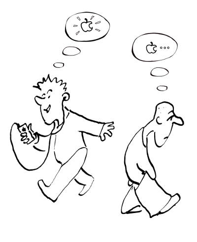

## Онтологическое доказательство бытия Божия (ОД)

Автором его считается латинский богослов Ансельм Кентерберийский. 

Доказательство имеет две формы:

{width=20 height=20}     {width=20 height=20}     Первая форма: доказательство из существования как свойства: 

1. Бог по определению — самая **величественная** сущность из всего, что можно себе представить.
2. **Величественней** существовать в реальности, чем существовать только в представлениях.
3. Следовательно, Бог должен существовать в реальности. Если бы Он не существовал, Он бы не был **величайшей возможной сущностью**.

{width=20 height=20}     Возражение Канта (против второй посылки): 

**Существование не является свойством**, предикатом, которым может обладать, или не обладать определенная сущность, причем обладать в разной мере. Говорить о том, что некая вещь существует - не то же, что говорить, что эта вещь обладает неким свойством вроде "красноты". Напротив, это значит говорить, что понятие со всеми его свойствами было представлено чем-то в реальности. Если существование не является свойством, то оно не может добавлять Богу величия (п. 2 доказательства). Поэтому можно помыслить Бога не обладающим бытием. 

Кант приводит в качестве примера 100 талеров, мыслимые как не существующие. Если помыслить их существующими, это ничего не прибавит к идее талеров - их не станет, например, больше.

{width=20 height=20}          Можно согласиться с тем, что бытие не является **обычным** свойством. 

Проф. В.Д. Кудрявцев------Платонов не соглашался с Кантом и считал, что бытие все же является свойством, хоть и необычным. Нужно различать существование как "положение в уме" и существование как реальное бытие. Второе может рассматриваться как свойство объекта. Есть разница между высказываниями: "дерево есть действительно существующее" (или "дерево существует", подразумевая реальное бытие) и "дерево существует в моем мышлении".

Итак, есть разница между воображаемой концепцией и концепцией, существующей в сознании, но **имеющей серьезные логические основания**. Очевидно, что воображаемые 100 талеров и талеры, которые мы мыслим на основании логических предпосылок (например, они лежат в кармане) - не одно и то же. **В этом смысле существование можно рассматривать как существенное свойство**. Ведь каждый согласится, что 100 существующих в сознании талеров (причем, существующих в связи с серьезными основаниями) **лучше**, чем несуществующие (воображаемые).

{width=250 height=350}

{width=20 height=20} {width=20 hight=20}   **Диалог 1:** 

{width=20 height=20}     Все, что Вы наговорили про "действительное мышление" - ерунда! Мы по-прежнему приписываем реальное существование предмету только **в мысли**. Другими словами, мы воображаем реальное бытие. Это воображаемое реальное бытие не отличается по ценности от просто мыслимого, или возможного бытия. Вы воображаете Бога существующим и выводите из этого воображения Его реальное бытие!  

{width=20 height=20}     Это было бы так, если мы _произвольно_ представляли бы предмет то существующим, то нет. Но в **действительном мышлении** (в отличие от воображения) все определяется достаточными основаниями. Сравните две мысли: "есть пицца (в принципе существует)" и "пицца существует, потому что я ее ем". Так что разница, безусловно, есть. 

{width=20 height=20}     Но я могу помыслить Бога несуществующим! Я атеист! 

{width=20 height=20}     Тем самым Вы разрушаете понятие о Боге, мыслите Его неправильно. Ведь Бог по определению - Необходимое Существо, а значит должен существовать! Если Вы мыслите Бога несуществующим, то Вы мыслите не Бога. Итак, мы можем _правильно_ мыслить Бога только существующим. А на этой мысли и строится ОД. 

----------------------------

{width=20 height=20}     Критика И. Канта (третьего пункта): Переход от концептуального к актуальному (т.е. от мысли к реальности) - незаконен.    

{width=20 height=20}     Это зависит от того, каково наше отношение к познанию: 

* Кант считал, что человек не может познавать реальные сущности ("вещи в себе") непосредственно, но только через "явления". Если придерживаться этого крайне скептического взгляда на познание, переход от мысли к действительности - незаконен. 
* Если же, напротив, мы принимаем, что **необходимым понятиям нашего разума соответствует действительность**[^16], то такой переход возможен. Итак, онтологическое доказательство "основано на доверии к силе и истине нашего мышления"[^17].

---------------

**Дополнительный материал:**

Суждение о необходимых понятиях разума восходит к известному и древнему спору об **универсалиях**. Существуют ли идеи и категории в реальности, или они - лишь средства, с помощью которых человеческий разум познает реальность?

Пример:
:    Перед нами несколько чашек: они разного цвета, формы, некоторые лишены ручки... То, что объединяет эти чашки можно назвать "чашностью" (чаша должна иметь углубление для жидкости и, вероятно, основание, чтобы жидкость не проливалась). Остальные свойства-акциденции (цвет, форма емкости и т.д.) - не важны для определения сущности чаши. Существует ли "чашность" объективно (реальность универсалий), или это - всего лишь абстракция, конструкция человеческого мышления? 

Многие святые отцы (особенно те, кто тяготел к платоновской философии) склонялись к мнению о реальности мира идей. Так у прп Максима Исповедника Логос, Бог-Слово, творит мир из логосов (идей).
<!-- Мистагория V, 196-207: "В этом Логосе, как в Творце и Создателе сущих, единообразно пребывают и *существуют* (εἰσὶ καὶ ὑφεστήκασιν) ... все логосы сущих". (прим 32, С. 140. Максим Исповедник: Онтология и метод в византийской философии VII в. Петров В.В. Москва 2007

Такое бытие-в-причинах по отношению к существованию в пространстве и времени может быть названо предсуществованием, ср. Главы о богословии и о домостроительстве воплощения Сына Божuя П, 4: «все предсуществующие (προϋφεστῶτας) В Боге логосы тварных вещей»; ВО XL, 127-130: «логосы возникновения [сущих] ... единовидно предсуществующие в Боге (μονοειδῶς προόντας)».
 --> 

Другие отцы (особенно на Западе) считали, что идеи существуют в качестве "мыслей Бога".
<!--- (что больше похоже на позицию Аристотеля). --->

Итак, занимая позицию реалистов (в отношении универсалий), мы можем говорить о том, что понятие Бога относится к тем идеям, которые имеют необходимый характер. Как пишет Кудрявцев-Платонов, "самое существование их в нашем разуме ручается за их реальную истину"[^18]. 

-------------------------------------------

{width=20 height=20}     Вторая форма ОД: доказательство из идеи Необходимого Существа: 

>Во второй форме мы сосредотачиваем внимание на понятии **Необходимого Существа**. Это понятие играет важную роль и в космологическом доказательстве. Все существа лишь возможны в своем бытии, могли бы не существовать. Только Необходимое Существо не может не существовать.

<!---     Декарт и Лейбниц говорят о том, что необходимое существо не может быть внутренне противоречивым.  --->

<!--- Если во Всереальном будет недостатавать одной реальности: бытия, а во Всесовершенном - одного совершенства, то это "понятие о всереальном и всесовершенном не будет уже понятием о совокупности всех реальностей или всех совершенств; такое понятие будет заключать в себе противоречие, разрушит само себя. Избавиться от этого противоречия мы можем только тогда, когда включим в это понятие признак реального бытия, как существенный и неотделимый от него". (К-П., С.417) --->

Еще в древности прозвучала следующая критика первой формы ОД: Идее Всесовершенного Существа соответствует "остров, больше которого помыслить невозможно" (мы всегда можем помыслить еще больший остров и т.о. нашей мысли никогда не будет соответствовать окончательная реальность). 

Ансельм Кентерберийский отвечал на это тем, что понятие Бога является особенным, в отличие от островов и иных конечных предметов Он является **необходимым Существом**. Итак, какой бы остров мы ни помыслили, всегда можно помыслить еще больший остров. Но необходимое Существо не подчиняется этому правилу, так как является наибольшим и совершеннейшим.

{width=20 height=20}     Отсюда - корректировка первоначальной формы ОД. Например, в версии Кудрявцева-Платонова: 

1. **Необходимым понятиям** нашего разума соответствует действительность. 
2. Но понятие о Боге (в которое, как существенный признак, входит предикат реального бытия) есть понятие необходимое. 
3. Следовательно понятию о Боге соответствует реальный предмет (то есть мыслимое нами Божество реально существует)[^19]. 

>"... возражения Канта против этого доказательства или сохраняют всю свою неопровержимую силу, или исчезают сами собой, судя по тому, признаем ли мы, или нет это предположение (соответствие мышления действительному бытию - и.П.)"[^20].

<!--- # Бог по определению — Необходимое Существо. --->
<!--- # (Логически необходимо утверждать то, что необходимо в концепции Необходимого Существа). --->
<!--- # Существование логически необходимо в концепции Необходимого Существа. --->
<!--- # Следовательно, Необходимое Существо (то есть, Бог) с необходимостью существует. --->

#### Современный вариант ОД 

{width=20 height=20} {width=20 hight=20}  **Доказательство Малькольма**. 

В этой формулировке важную роль также играет понятие необходимого Существа. Все существа лишь возможны в своем бытии, могли бы не существовать. Только необходимое существо не может не существовать. Малькольм обратил внимание на то, что **необходимое существо либо существует с необходимостью, либо оно невозможно**. Дело в том, что Необходимое Существо не может быть просто "возможным". Если Необходимое Существо вообще существует, то Оно должно существовать с необходимостью. По-другому Оно существовать не может. 

<!--- НС могло бы существовать - этой опции нет, так как НС - не является вероятностным. --->
<!--- Понятие необходимого существа перечеркивает всякую **вероятность** - и положительную, и отрицательную. --->
<!--- Если оно существует, то с необходимостью (никаких вариантов "вероятно"). --->
<!--- Если не существует по факту, то вероятность все равно не существует. --->
<!--- Если НС нет, то  --->
<!--- (   ()   ) --->
<!--- Оно либо есть, либо его нет. --->

<!--- НС существует → не может не существовать (вытекает из определения НС) --->
<!--- НС не существует → не может существовать  --->

1. Если Бог существует, Его существование необходимо.
2. Если Бог не существует, Его существование невозможно. 
3. Бог либо существует, либо не существует.
4. Существование Бога либо необходимо, либо невозможно.
5. Существование Бога возможно (не невозможно)
6. Следовательно, существование Бога необходимо (Бог существует с необходимостью).

Проблемы этой формулировки: атеист может заявить, что существование Бога невозможно. Хотя это очень серьезное заявление - не всякий безбожник решится на него.

Ясно, что проблемным является утверждение о возможности существования (не существования) Необходимого Существа. Это принятие, или отвержение этого суждения зависит от позиции человека. Как-то обосновать возможность существования (несуществования) Необходимого Существа не представляется возможным (не выводя эту возможность из самого понятия Необходимого Существа).

Размышление об ОД углубляет наше понимание Бога как Необходимого Существа.

---------------------------------------------------

КМК:

Кант мыслит предикаты первичными с т.зр. определения сущности. Но с точки зрения Творца первично бытие. Как аналогию можно предложить контейнер и содержимое. 
Программист сначала объявляет переменную (контейнер в физической памяти компьютера), а потом задает свойства (биты информации, записываемые электрическими зарядами).

Мир появляется как некий зародыш пространства-времени, происходящий как частное бытие от абсолютного бытия. Затем это бытие постепенно наполняется разнообразными предикатами: появляются микрочастицы со своими характеристиками, разные виды взаимодействия.

"Если для нас возможно познание действительного бытия, то эта возможность осуществима не иначе, как при предположении, что те основные и необходимые понятия, которые лежат в основе всего нашего познания и условливают самую его возможность (категории и идеи) имеют не только  субъективное, но и объективное значение, что, поэтому, самое существование их в нашем разуме ручается за их реальную истину"[^21].

<!---  Диалог --->
>
<!--- {width=20 height=20}    Необходимое Существо и Бог - не одно и то же.  --->
>
<!--- Согласимся, что понятие Всесовершенного Существа (как в первой форме Ансельма) - ближе к цели, чем понятие Необходимого Существа. --->

<!---             * C.D. Broad. Одни атрибуты величия несовместимы с другими. Поэтому самое великое существо содержит внутреннее противоречие и не может существовать. Ответ: атрибуты величия - положительные, им могут противоречить только отрицательные. --->

<!---   ++          * Дэвид Юм: ничто не может существовать с необходимостью. --->
<!---             * Небытие Бога мыслимо, поскольку есть атеисты. Ответ: Мы не можем мыслить в категориях отрицания. Отсутствие чего-либо становится очевидно только тогда, когда мы знаем, что именно должно было существовать в данном месте, времени. Чтобы высказать суждение о небытии Бога, надо сначала иметь представление о том, что Он **есть** и уже это отрицать. "Семихвостый пятикрыл" не является примером мышления несуществующего - это случайный набор предикатов, позаимствованных у реально существующих существ. --->

{width=20 height=20}     **Диалог 1:** 

{width=20 height=20}     У атеистов есть свои доказательства. Вот Вам "доказательство небытия Бога": 

1. Если Бог существует, Его существование необходимо
2. **Возможно**, что Бог не существует
3. Существование Бога не необходимо
4. Бог не существует.

{width=20 height=20}     Возражу: 

Во втором пункте скрыто утверждение: "возможно не существует Необходимое Существо". Но такой возможности нет, потому что в самом понятии Бога, как Необходимого Существа заложена необходимость бытия Бога и. Мы мыслим Бога, как Необходимое Существо, следовательно, Он существует.  

(используем форму Кудрявцева-Платонова).

{width=20 height=20}     А я мыслю шестихвостого пятокрыла! Следовательно существует пятокрыл! 

{width=20 height=20}     Это всего лишь случайный набор свойств, взятых у разных животных. Идея Бога в корне отличается от Вашей выдумки, так как это уникальная идея Необходимого Существа. Например, Бог является объяснением возникновения вселенной и всех случайных сущих, так как все в мире - случайно, а Бог - нет.  

(используем вероятностную форму космологического доказательства)   

{width=20 height=20}     Все равно! Еще Кант говорил, что переход от понятия к реальности незаконен! 

{width=20 height=20}          С Кантом не обязательно соглашаться. Я считаю, что идеи (необходимые понятия) соответствуют реальностям. Необходимым понятиям нашего мышления соответствуют реальные сущности. Мы мыслим Бога, как Необходимое Существо. Бог есть.

{width=20 height=20}     Существование не является свойством, качеством!

{width=20 height=20}          Я считаю, что существование все же является свойством. Мысль о сотовом телефоне, если это просто фантазия, отличается от той же мысли, но, подтвержденной реальностью: телефон - у меня в кармане. И этот телефон гораздо лучше воображаемого. 

{width=20 height=20}     Другой пример: отец получает известие о смерти сына. Свойство бытия, существования здесь имеет решающее значение (все остальные качества отходят на второй план). Особенно, когда отцу сообщают о том, что произошла ошибка и его сын на самом деле **живой**, существующий. 

<!--- {width=20 height=20}     Онтологическое доказательство говорит нам только о том, чем был бы Бог, если бы Он существовал. Оно не может определить соответствует ли понятию Бога что-либо в действительном мире.   --->
 
[^16]: Кудрявцев-Платонов называет это "метафизической теорией познания".
[^17]: @KudrPl, С. 416. 
[^18]: @KudrPl С. 415.
[^19]: @KudrPl С. 415-416.
[^20]: @KudrPl С. 416.
[^21]: @KudrPl С 415.

\newpage
