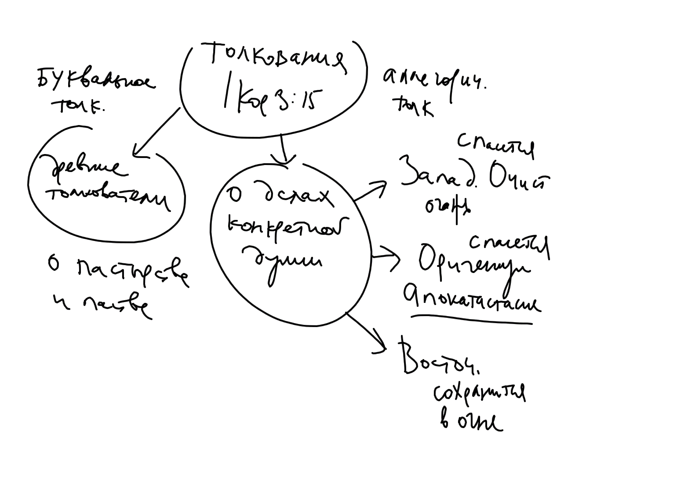
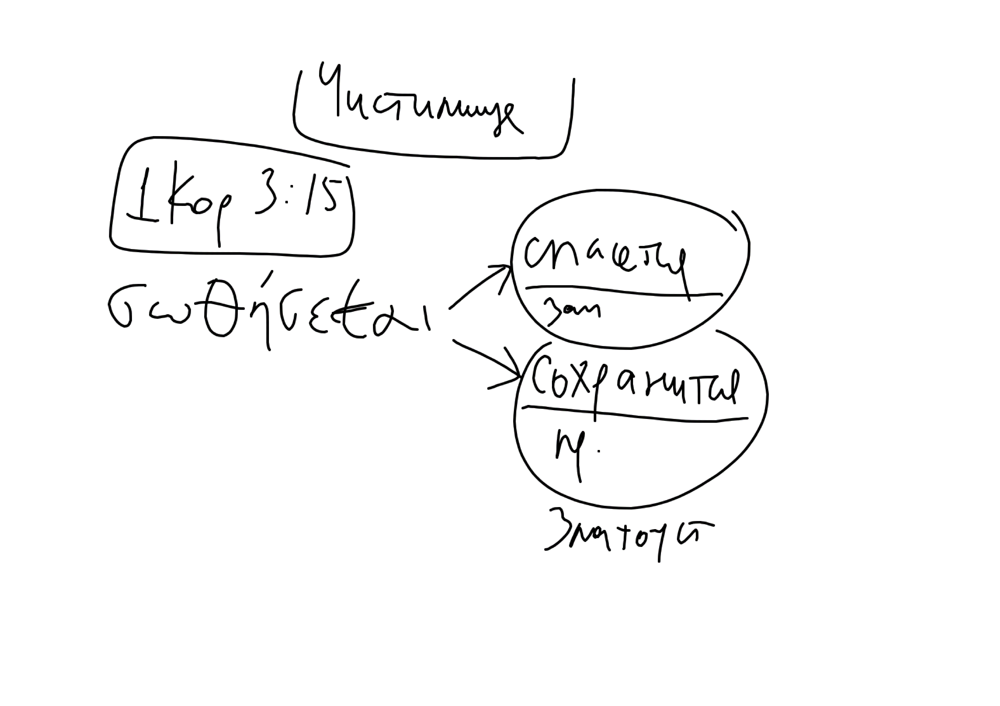
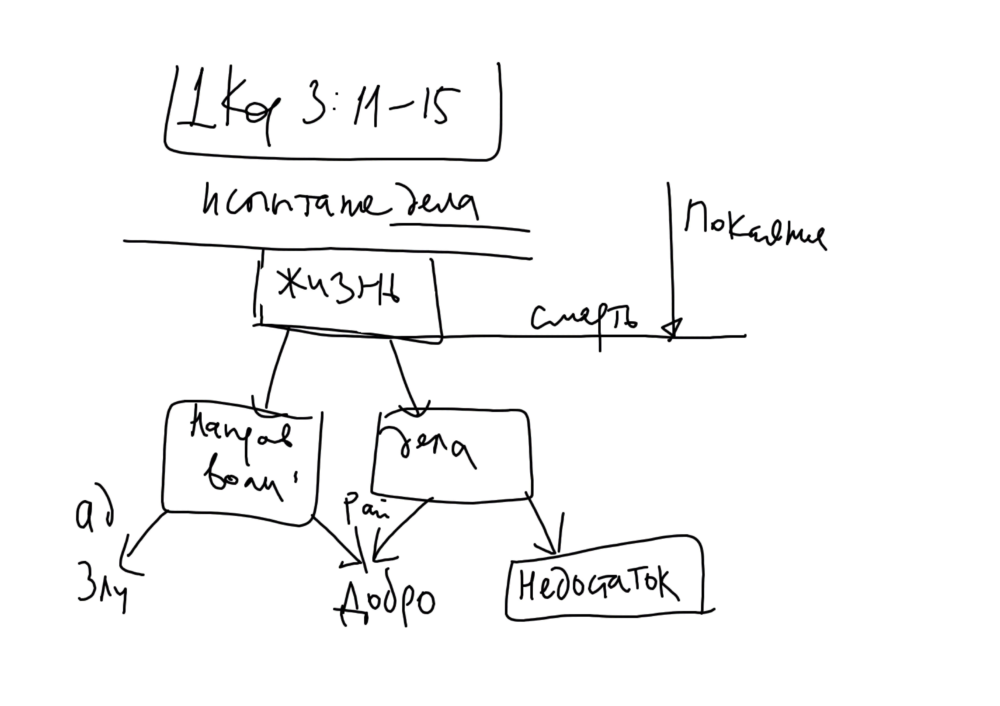

## Очистительный огонь (ОО)

<!--Sources on cleansing fire: Q 3:16, Luke 12:49-50, Gos. Thom. 82, 1 Cor 3:10-15, 1 Pet 1:7, 4:12, 2 Pet 3:10-->

Христианское представление о Суде Божием подразумевает два исхода: праведники отправляются в жизнь вечную, а грешники - в муку вечную (Мф. 25:46). Однако, в таком случае возникает следующая трудность: что будет с душой, которая имеет как добрые, так и злые дела? Такую душу несправделиво было бы отправить в муку вместе с теми, кто всецело обратился к злу, но и в Царствие Божие не войдет ничто нечистое (Откр 21:27).

Одним из ответов на этот вопрос явилось учение об очистительном огне (ОО), который выжигая злые дела, освобождает душу от нечистоты, и она становится способной войти в Рай.

Споры о существовании (или не существовании) очистительного огня коренятся в различных толкованиях следующих слов ап. Павла:[^nf01]

>Я, по данной мне от Бога благодати, как мудрый строитель, положил основание, а другой строит на нем; но каждый смотри, как строит.  Ибо никто не может положить другого основания, кроме положенного, которое есть Иисус Христос. Строит ли кто на этом основании из золота, серебра, драгоценных камней, дерева, сена, соломы, — каждого дело обнаружится; ибо день покажет, потому что в огне открывается, и **огонь испытает дело каждого**, каково оно есть. У кого дело, которое он строил, устоит, тот получит награду. **А у кого дело сгорит, тот потерпит урон; впрочем сам спасется, но так, как бы из огня**(1 Кор 3:11-15).

Можно выделить два подхода к пониманию этих слов апостола:

* "Пастырское" толкование. Некоторые комментаторы следуют более широкому контексту, где ап. Павел говорит о строительстве Церкви, общины верующих (см. стих 10й). Паства и рассматривается толкователями как дело, которое будет испытано. Если паства не слушается здравого учения и живет нечестиво, то погибает. При этом сам пастырь (глава общины) спасется "как бы из огня"[^ff1].
* "Частное" толкование. Фрагмент о испытании огнем рассматривается как отдельный образ, относящийся к каждой душе после разлучения ее от тела, к испытанию ее дел и посмертной участи. Дела, испытываемые огнем - плоды человеческой жизни. В этом случае "спасение из огня" относится не к судьбе пастыря, но к участи конкретной души, чьи дела сгорели. Комментаторы считают, что этот огонь имеет одно из двух свойств:
    * Очищения. Последователи Оригена, а также западные и некоторые восточные отцы говорят об очистительном огне, который сжигает грехи.
    * Сохранения. Восточные отцы (св. Иоанн Златоуст и вся последующая православная традиция) говорят о "сохранении" души грешника в огне. Душа не разрушится, но будет вечно пребывать в муке.

{width=400 height=300}

Различное толкование основывается на двух вариантах перевода слова, использованного ап. Павлом:

*σωθήσεται* (от др. греч. σώζω):

* "спасется" (оригенисты, западные отцы)
* "сохранится" (восточные отцы)

<!--{width=400 height=300}-->

Первый вариант толкования (*σωθήσεται* как "спасется") приводит к следующим последствиям:

* Учение об "Апокатастасисе", автором которого считается Ориген. Суть - в восстановлении всех душ (в том числе и демонов) в "первоначальном достоинстве" - т.е. такими, какими они были сотворены. Это учение осужденно Александрийским поместным собором 399 года, V Вселенским Собором (в этом есть сомнения), осуждение закреплено VI и VII соборами.
<!--ссылка на Болотова-->
* Учение о "Чистилище". Православная Церковь не приняла это изобретение латинских богословов. На Ферраро-Флорентийском соборе св. Марк Эфесский и его единомышленники выдвинули ряд серьезных возражений против этого учения.

Общий недостаток этих учений:

*Учение об очистительном огне приводит к нежелательным последствиям в области нравственности: это понимание апостольских слов оказывает расслабляющее действие на душу христианина* (об этом говорит, напр. св. Марк Эфесский)

### Вопрос о смысле молитвы за усопших

На ФФ соборе католики выдвинули ряд аргументов в пользу ОО, среди которых есть и такой: (4) и греки, и латиняне молятся о усопших, и "...если бы не было положено очищение после смерти, молитва была бы совершенно бесцельной, поскольку она напрасно возносилась бы за тех, которые или уже -- в славе, или же -- в аду"[^mm1]

Логика в этом есть: 

* С одной стороны, протестанты решают этот вопрос именно так: молитва за усопших -- бессмысленна, так как их воля не может быть изменена после смерти, а дела не имеют значения (спасает только вера во Христа, как Сына Божия).
* Но если дела усопших имеют значение для их посмертной участи, то следует вывод, к которому пришли католики: поскольку Ад - место мучения, а не исправления, для того, чтобы исправить дела (уничтожить всю нечистоту), необходим очистительный огонь (и Чистилище, как место, где он действует).

Однако, православные дают ответ, который не совпадает ни с мнением протестантов, ни с позицией католиков: Ад - темница (по крайней мере, до Страшного Суда)[^note53]. Молитва Церкви помогает душам усопших восполнить "недостаток добрых дел". Впрочем, каким образом это происходит -- не очень ясно. Высказывались разные мнения, например об *очистительном страхе*, или о том, что Сам Христос прощает малые грехи.

С другой стороны есть православное учение о различии даров и наказаний, но оно не отвечает на вопрос, как молитва Церкви помогает душам усопших. Однако, это учение делает излишней доктрину Чистилища, показывая, что нет необходимости в некоем месте для душ, находящихся в "среднем состоянии".

В этой связи интересно упомянуть мнение св. Григория Нисского, который считал, что существуют три "класса" душ. Первые -- праведники, получившие венцы, вторые -- не награжденные, но и не мучимые (получившие прощение) и третьи -- наказываемые за свои прегрешения.
<!--
Gregorius Nyssenus Theol., De iis qui baptismum differunt (2017: 060); MPG 46.
Volume 46, page 429, line 2

Φεύγετε τοίνυν, ἄνδρες Χριστιανοὶ, κλήσεως ἐπου-
46.429.10
ρανίου μέτοχοι, πᾶσαν ἔννοιαν τοιαύτην λῃστῶν καὶ 
κακούργων ἀξίαν, μηδὲ τοῦτο μακαριστὸν ἡγήσησθε 
τὸ φεύγειν τιμωρίαν, ἀλλ' ἐράσθητε δωρεῶν καὶ 
στεφάνων· οὓς ὁ Θεὸς τοῖς ἀθληταῖς τῆς δικαιοσύνης 
ηὐτρέπισεν·
-->

***

Серьезное рассмотрение вопроса об очистительном огне было предпринято в XV веке православными участниками Ферраро-Флорентийского собора, когда латинская сторона потребовала от восточных принять учение о Чистилище. Самым большим авторитетом среди восточных отцов пользовался св. Марк Эфесский, благодаря которому был дан отпор униональной политике Рима, и были сформулированы четкие ответы на вопросы, поставленные латинскими богословами. В своих суждениях святитель опирается на святоотеческую экзегезу.

### Аргументы св. Марка Эфесского

В отношении слов ап. Павла об ОО святитель Марк придерживается мнения св. Иоанна Златоуста: ¨σωθήσεται¨ в смысле "сохранится в огне".

>Огонь просветит праведников, "Грешников же, приносящих с собою зло, охватив, как удобный материал для этого огня, он немедленно зажжет, и "дело" их, то есть злое расположение или действование (энергию) сожжет и до конца уничтожит, и лишит их того, что они принесли с собою, то есть лишит их злого груза, однако самих их "спасет", то-есть на веки будет сохранять и соблюдать, дабы они не подверглись уничтожению, вместе со своим злом"[^m17]

Критика св. Марком позиции латинян, видевших в 1 Кор. 3:15 указание на очистительный огонь:

1. Здесь апостол называет огонь не очистительным, а испытательным: "и каждого дело, каково оно есть, огонь его **испытает**" (1 Кор. 3:13)[^pur1].
2. Через огонь должны пройти не только злые, но и добрые дела, не нуждающиеся в очищении.
3. Те, у кого дела сгорят, - "потерпят урон", а очищаемые наоборот -- только приобретают. 
4. Все это произойдет в день Суда и Будущего века ("ибо День покажет")[^pur2]. После конечного приговора не может быть очищения.

Святитель считает, что место очистительного огня в православном богословии занимает - "довлеющее человеколюбие Божие" [^m1]

В этом отношении святитель основывается на словах св Дионисия Ареопагита: "И знает он из богопреданного слова, что праведно пожившим воздается по заслуге, определяемой **праведнейшими весами**, светоноснейшая и божественная жизнь, а прибывшую им по человеческой немощи нечистоту богоначальное Человеколюбие по благости своей презирает, потому что никто, как говорит слово Божие, не чист от скверны". [^m9]

По св. Марку очищение от грехов происходит не очистительным огнем, а тремя способами:

1. Через страх при исходе от тела
2. Через страх по исходе, но до поклонения Престолу Божию[^note54].
3. Если требуется больший срок очищения — заключаются во ад, но не на мучения, а "под стражу". Там возможно очищение из-за мучений совести и ужаса перед Божественной славой и неизвестностью будущего.

>"Если же души отошли из этой жизни в вере и любви, однако унося с собою известные вины, будь то — малые и в которых они вообще не каялись, или будь то — большие, о которых они хотя и каялись, но не предприняли явить плоды покаяния, такие души, мы веруем, должны очиститься от такового рода грехов, но не неким очистительным огнем или определенным в некоем месте наказанием (ибо сего, как мы сказали, отнюдь не было предано нам); но **одни должны будут очиститься в самом исходе от тела, благодаря только страху, как это дословно являет святый Григорий Двоеслов; в то время как другие должны будут очиститься после исхода из тела, или еще пребывая в том же земном месте, прежде чем придут на поклонение Богу и удостоятся блаженных уделов; или, если грехи их были более тяжкими и связующими на более длительный срок, то и они содержатся в аду, но не для того, чтобы навсегда находиться в огне и мучении, а — как бы в тюрьме и заключении под стражу**"[^m6].

св. Марк подытоживает сказанное:

>"одних очищает страх, а других угрызение совести пожирает мучительнее всякого огня, а иных очищает самый только ужас перед Божественной славой и неизвестность будущего, каково оно будет". [^m7]

Итак, св. Марк предлагает еще один ответ на проблему "среднего состояния души": очищение страхом. В результате появляется возможность рассматривать слова ап. Павла об очищающем огне в качестве аллегории (под огнем имеется в виду страх будущего наказания, терзание совести о соделанном)[^m11].

Дополнительные аргументы св. Марка против ОО:

* Добрые дела - отличие тех, кто оказались совершенными от тех, кто имел доброе намерение. Значит эти души будут иметь обители, отличные от обителей совершенных. Если же страданием (в Чистилище) восполняется недостаток добрых дел, то такая душа когда-нибудь "уравняется с совершенной душею, восполняя страданием то, что недоставало, то, таким образом, все в равной мере будут созерцать Бога; что, как нелепость, отвергается"[^m4]. Если существует очистительный огонь, то "чистый от чистого ничем не отличается" [^m2]. Следовательно, у них нет различия в блаженстве. Но Церковь учит о многих обителях праведников (Ин. 14:2). Следовательно, учение об ОО противоречит Св. Писанию.
* Для блаженства главным образом требуется благое расположение воли. У находящихся в Чистилище воля неподвижна. Чистилище ничего не дает в этом смысле, не имеет никакой цели. Но Бог ничего не создал напрасно. Значит Чистилища не существует. Незачем душам находится в огне, так как их воля неизменна[^m3].
* Покаяние приводит к безгрешности, о чем свидетельствует Священное Писание: "Рех: исповем на мя беззаконие мое Господеви, и Ты оставил еси нечестие сердца моего" (Пс.31:5). И еще: "Рцы первый беззакония твоя, яко да оправдишися". В случае, когда у человека есть покаяние, но есть недостаток добрых дел, получается, что в Чистилище мучаются безгрешные и "совершенно незаслуженно несут наказание"[^m5].

Два последних аргумента ставят вопрос о смысле молитв за усопших. Если принять излагаемую здесь точку зрения (покаяние тождественно безгрешности), высказанную св. Марком в полемическом противоборстве с учением о Чистилище, то позиция православных сближается с протестантизмом. Однако Православное Предание содержит учение о плодах покаяния. Оно не оформлено догматически и не связано с юридизмом католической доктрины о "заслугах". Мы не можем согласится с термином "удовлетворение за грех", но не можем и свести покаяние исключительно к исповеданию греха и его прощению. "Метания" должна приводить к изменению образа жизни покаявшегося. Смысл притчи о 10 девах сводится к необходимости добрых дел (елея в светильнике). Недостаток добрых дел приводит к невозможности войти на брачный пир Жениха.  TODO: толкование!

Итак, попытка отбросить Чистилище ценой отказа от представления о необходимости добрых дел для спасения неприемлемо для Православия.

Вывод: малое зло не приведет к наказанию, как и малое добро (в совершивших великие грехи) не получит награды. Напротив, малое зло в праведниках приведет к различие в награде, малое добро в грешниках -- к различию в наказании.

Важен и такой аргумент св. Марка: до всеобщего воскресения души усопших пребывают в разлучении с телами. По этой причине никакой материальный огонь не может воздействовать на их состояние. Следовательно, апостол в 1 Кор 3:15 говорит не о материальном, чистилищном огне, а об огне Страшного Суда.

<!--
Приводит мнение св. Иоанна Златоуста (Chrysost. hom. IX in Epist. I ad Cor. P. G. t. 61. c. 75-82.) , св. Василия Великого (Basil. Magn. hom. in Psalmum 28 P. G. t. 29. c. 297 на Глас Господа, пресецающий пламень огня).
-->

По мысли св. Марка, у огня есть только две "функции": просвещающая праведных и карающая грешных. Он подтверждает это словами св. Василия Великого:

>"Огонь, уготованный для мучения диаволу и ангелам его, рассекается гласом Господа, дабы, за сим в нем было две силы: одна - попаляющая, а другая - просвещающая; мучающая и карательная сила того огня сохранена для достойных мучения; а просвещающая и осиявающая предназначена для осияния ликующих. Итак, для того - глас Господа, разсечающего и разделяющего пламень огня, чтобы мрачная часть была огнем мучения, а неопаляющая пребывала светом наслаждения."[^bs44] 

### Православная альтернатива учению об очистительном огне.

Отвергнув учение об очистительном огне, св. Марк и его единомышленники на основании Священного Писания и Предания формулируют православную позицию. Центральную роль в этой формулировке играет учение о различии наград и наказаний, наряду с учением о том, что Христос своей царской властью прощает малые прегрешения праведных.

Наглядным образом, отражающим содержание этого учения являются весы, на которых взвешиваются добрые и злые дела, совершенные человеком при жизни. Этот образ встречается, например, у св. Григория Богослова[^m16].

{width=400 height=300}

Итоги: 

* Нужно признать, что в Церкви (особенно на Западе) существовала традиция, признававшая возможность очищения грешников с помощью особого огня, на который ссылается и 1 Кор 3:10-15.
* Несмотря на это само учение о Чистилище - позднее (XII в.) и является чисто католической разработкой этой темы.
* Восточная Православная Церковь отказалась от учения об очистительном огне, несмотря на то, что некоторые отцы Церкви ранее поддерживали эту мысль.

\newpage

[^nf01]: Есть ряд других мест Нового Завета, допускающих истолкование в контексте ОО: Мк 9:49, Лк 12:49-50, 1 Пет 1:7, 4:12, 2 Пет 3:10.
[^ff1]: См. напр. цитату из блаж. Феодорита в главе "Очистительный огонь. Источники".
[^mm1]: @MarkEth, С. 52
[^nf02]: Блаж. Августин назывался в древности греками "священным" (ἱερός), как и св. Василий.
[^m16]: Например, у св. Григорий Богослова читаем: "какой вымышленный предлог, какое ложное извинение, какая хитро придуманная вероятность, какая клевета на истину обманет судилище и превратит суд правый, где у всякого кладется **на весы** все – и дело, и слово, и мысль, где взвешивается худое с добрым, чтобы тому, что перевесит, и иметь верх и с тем, чего больше, соображаться приговору" - (Григорий Богослов, свт. Слово 15, говоренное в присутствии отца, который безмолвствовал от скорби, после того как град опустошил поля. @GrigNaz1, С. 236
[^pur1]: перевод вл. Кассиана (Безобразова). Греч. оригинал: καὶ ἑκάστου τὸ ἔργον ὁποῖόν ἐστιν τὸ πῦρ αὐτὸ **δοκιμάσει**
[^pur2]: (греч.) ἡ γὰρ ἡμέρα δηλώσει. Wallace считает, что артикль ἡ подразумевает здесь использование категории Par excellence, "наиболее выдающийся в классе". Т.е. здесь слово означает "День Суда, великий День", см. @WallG, p. 222
[^m1]: @MarkEth, С. 165
[^m9]: Ibid., col. 561, d.
[^m6]: @MarkEth, С. 59-60
[^m7]: @MarkEth, С. 60
[^m11]: Эта мысль св. Марка парадоксальным образом сближает позицию православных с учением об очищающем огне, понятом более широко. Мысль об очищении страхом является компромиссом, уклонением от жесткого противостояния учению об ОО.
[^m2]: @MarkEth, С. 165
[^m3]: Кажется, не очень удачный аргумент. Ведь в этом случае встает вопрос о смысле молитвы за усопших.
[^m4]: @MarkEth, С. 166
[^m5]: @MarkEth, С. 167
[^note53]: В связи с этим можно различать употребление слова "Ад" в трех разных смыслах: как "шеол" (до Воскресения Христова это место, где пребывали все души усопших). Ад, как темница (место, где находятся души, не прошедшие воздушные препятствия, до Страшного Суда). Геенна (вечный огонь и неусыпающий червь) -- огненное мучение еще не началось. Хилиазм раннего периода христианства видел во Аде два "отделения", в одном из которых души мучаются от страха будущих мучений, а в другом -- предвкушают будущие наслаждения Царства. Так, у Тертуллиана в Рай попали сразу после смерти только мученики, все остальные праведники находятся в части Ада, которая называется "Лоно Авраамово", ожидая Царствия Божия.
[^note54]: Вероятно, речь идет о "воздушных препятствиях", см. главы о Мытарствах в этом курсе.
[^m17]: @MarkEth, С. 64
[^bs44]: Св. Василий Великий. Беседа на Пс. 28. Homiliae super Psalmos. TLG 2040/018, PG 29.297
