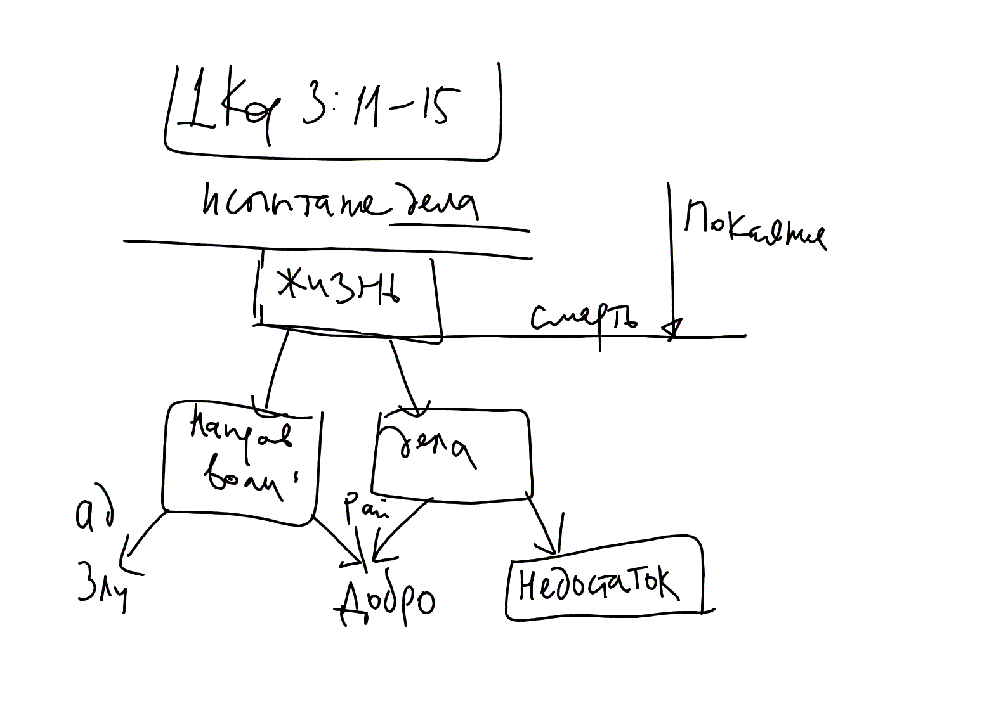

# Высказывания против очистительного огня

Серьезное рассмотрение вопроса об очистительном огне было предпринято в XV веке православными участниками Ферраро-Флорентийского собора, когда латинская сторона потребовала от восточных принять учение о Чистилище. Самым большим авторитетом среди восточных отцов пользовался св. Марк Эфесский, благодаря которому был дан отпор униональной политике Рима, и были сформулированы четкие ответы на вопросы, поставленные латинскими богословами.

В своих суждениях святитель опирается на святоотеческую экзегезу, особенно на труды св. Иоанна Златоуста, св. Григория Богослова и св. Василия Великого.

## Аргументы св. Марка Эфесского

<!--* Один видит славу Божию более совершенно, чем другой. 
* Понятие "быть более очищенным" вводит понятие "быть менее очищенным".
* Тот, кто совершил некие малые грехи тоже увидит Бога.
-->

Латинские богословы утверждали, что в послании к Коринфянам (1Кор. 3:10-15) ап. Павел говорит именно об очистительном огне, на что святитель возразил следующее:

1. Здесь апостол называет огонь не очистительным, а испытательным: "и каждого дело, каково оно есть, огонь его **испытает**" (1 Кор. 3:13)[^pur1].
2. Через огонь должны пройти не только злые, но и добрые дела, не нуждающиеся в очищении.
3. Те, у кого дела сгорят, - "потерпят урон", а очищаемые наоборот -- только приобретают. 
4. Все это произойдет в день Суда и Будущего века ("ибо День покажет")[^pur2]. После конечного приговора не может быть очищения.

В целом, в отношении слов ап. Павла об ОО святитель Марк придерживается мнения св. Иоанна Златоуста:

>"Огонь просветит праведников, «Грешников же, приносящих с собою зло, охватив, как удобный материал для этого огня, он немедленно зажжет, и "дело" их, то есть злое расположение или действование (энергию) сожжет и до конца уничтожит, и лишит их того, что они принесли с собою, то есть лишит их злого груза, однако самих их "спасет", то-есть на веки будет сохранять и соблюдать, дабы они не подверглись уничтожению, вместе со своим злом», -- по слову св. Иоанна Златоуста".

>"Итак, как видится, это рассечение и разделение того огня будет тогда, когда всем равно проходящим чрез него светлые и сияющие дела явятся еще более светлыми, и принесшие их станут наследниками света и восприимут оную вечную награду, а принесшие дурные и удобосгараемые, наказуемые лишением их, вечно пребывая в огне, наследуют спасение, которое хуже гибели, ибо это-то, собственно говоря, и обозначает выражение "спастись", дабы не случилось им уничтожительной силой огня и самим также полностью быть уничтоженными". 

Святитель считает, что место очистительного огня в православном богословии занимает - "довлеющее человеколюбие Божие" [^m1]

В этом отношении святитель основывается на словах св Дионисия Ареопагита: "И знает он из богопреданного слова, что праведно пожившим воздается по заслуге, определяемой **праведнейшими весами**, светоноснейшая и божественная жизнь, а прибывшую им по человеческой немощи нечистоту богоначальное Человеколюбие по благости своей презирает, потому что никто, как говорит слово Божие, не чист от скверны". [^m9]

Дополнительные аргументы св. Марка против ОО:

* Если существует очистительный огонь, то "чистый от чистого ничем не отличается" [^m2]. Следовательно, у них нет различия в блаженстве. Но Церковь учит о многих обителях праведников (Ин. 14:2). Итак, ОО противоречит Св. Писанию.
    * Те кто имеют недостаток добрых дел проходят чистилище и достигают очищения. Те, у кого есть добрые дела, тоже очищены. Т.о. две эти группы объединяет общее - очищение. Разницы в блаженстве нет.
    * "Необходимо, чтобы очищение имело нужду в результате, который выражается в освобождении от зла" [^m3] Несовершенство происходит по причине недостатка, которого больше нет (очищение в чистилище). Тот же результат - нет разницы в блаженстве.
    * Добрые дела - отличие тех, кто оказались совершенными от тех, кто имел доброе намерение. Значит эти души будут иметь обители, отличные от обителей совершенных. Если же страданием (в Чистилище) восполняется недостаток добрых дел, то такая душа когда-нибудь "уравняется с совершенной душею, восполняя страданием то, что недоставало, то, таким образом, все в равной мере будут созерцать Бога; что, как нелепость, отвергается".  [^m4]
* Для блаженства главным образом требуется благое расположение воли. У находящихся в чистилище воля неподвижна. Чистилище ничего не дает в этом смысле, не имеет никакой цели. Но Бог ничего не создал напрасно. Значит чистилища не существует. Незачем душам находится в огне, так как их воля неизменна.
* Покаяние приводит к безгрешности, о чем свидетельствует Священное Писание: "Рех: исповем на мя беззаконие мое Господеви, и Ты оставил еси нечестие сердца моего" (Пс.31:5). И еще: "Рцы первый беззакония твоя, яко да оправдишися". В случае, когда у человека есть покаяние, но есть недостаток добрых дел, получается, что в чистилище мучаются безгрешные и "совершенно незаслуженно несут наказание". [^m5]

Вывод: малое зло не приведет к наказанию, как и малое добро (в совершивших великие грехи) не получит награды. Напротив, малое зло в праведниках приведет к различие в награде, малое добро в грешниках -- к различию в наказании.

Важен и такой аргумент св. Марка: до всеобщего воскресения души усопших пребывают в разлучении с телами. По этой причине никакой материальный огонь не может воздействовать на их состояние. Следовательно, апостол в 1 Кор 3:15 говорит не о материальном, чистилищном огне, а об огне Страшного Суда.

### Православная позиция в отношении "среднего состояния души" и "недостатка добрых дел"

Отвергнув учение об очистительном огне, св. Марк и его единомышленники на основании Священного Писания и Предания формулируют православную позицию. Центральную роль в этой формулировке играет учение о различии наград и наказаний, наряду с учением о том, что Христос своей царской властью прощает малые прегрешения праведных.

Наглядным образом, отражающим содержание этого учения являются весы, на которых взвешиваются добрые и злые дела, соделанные человеком при жизни. Этот образ встречается у многих отцов[^m16].

{width=400 height=300}

>"Если же души отошли из этой жизни в вере и любви, однако унося с собою известные вины, будь то — малые и в которых они вообще не каялись, или будь то — большие, о которых они хотя и каялись, но не предприняли явить плоды покаяния, такие души, мы веруем, должны очиститься от такового рода грехов, но не неким очистительным огнем или определенным в некоем месте наказанием (ибо сего, как мы сказали, отнюдь не было предано нам); но **одни должны будут очиститься в самом исходе от тела, благодаря только страху, как это дословно являет святый Григорий Двоеслов; в то время как другие должны будут очиститься после исхода из тела, или еще пребывая в том же земном месте, прежде чем придут на поклонение Богу и удостоятся блаженных уделов; или, если грехи их были более тяжкими и связующими на более длительный срок, то и они содержатся в аду, но не для того, чтобы навсегда находиться в огне и мучении, а — как бы в тюрьме и заключении под стражу**". [^m6]

св. Марк подытоживает сказанное:

>"одних очищает страх, а других угрызение совести пожирает мучительнее всякого огня, а иных очищает самый только ужас перед Божественной славой и неизвестность будущего, каково оно будет". [^m7]

Итак, по св. Марку очищение от грехов происходит не очистительным огнем, а тремя способами:

1. Через страх при исходе от тела
2. Через страх по исходе, но до поклонения Престолу Божию (вероятно, речь идет о мытарствах)
3. Если требуется больший срок очищения — заключаются во ад, но не на мучения, а "под стражу". Там возможно очищение из-за мучений совести и ужаса перед Божественной славой и неизвестностью будущего.

Итак, св. Марк предлагает еще один ответ на проблему "среднего состояния души": очищение страхом. В результате появляется возможность рассматривать слова ап. Павла об очищающем огне в качестве аллегории (под огнем имеется в виду страх будущего наказания, терзание совести о соделанном)[^m11]. 

<!--
Приводит мнение св. Иоанна Златоуста (Chrysost. hom. IX in Epist. I ad Cor. P. G. t. 61. c. 75-82.) , св. Василия Великого (Basil. Magn. hom. in Psalmum 28 P. G. t. 29. c. 297 на Глас Господа, пресецающий пламень огня).
-->

### Молитва о усопших

В связи с проблемой "среднего состояния душ" важным представляется учение о поминовении усопших, как о имеющем большое значение для облегчения их состояния и даже для изведения душ из адской темницы

>"Всем таковым, мы утверждаем, помогают совершаемые за них молитвы и литургии, при содействии сему Божественной благостыни и человеколюбия, которое одни согрешения, сделанные по человеческой немощи, сразу же презрит и отпустит, как говорит Дионисий Великий в "Размышлениях о тайне священноусопших"; а другие грехи после известного времени праведными судами или также разрешает и прощает, и то — совершенно, или облегчает ответственность за них до конечного того Суда". [^m8]

Показательна речь св. Амвросия Медиоланского над гробом имп. Феодосия (в 375 г.): 

>"Я любил его – мужа милосердного, смиренного среди власти, чистого сердцем». Добродетели высокие. Что же? Не находится ли по мнению св. Амвросия душа его уже в раю? Нет еще: «Я любил его и потому я буду сопровождать его (моими молитвами) в царство жизни: не покину его до тех пор, пока моими моленьями и мольбами он» не достигнет той святой горы, «где вечная жизнь, где нет скверны, ни воздыхания, ни страдания, ни какого-либо общения с мертвыми (осужденными)... Даруй рабу Твоему Феодосию совершенный покой, уготованный Тобой святым Твоим"[^m10] 

В одном из слов прп. Иоанна Дамаскина [^m12] используется термин: ἀναπλήροσις ὑστερημάτων, что можно перевести как "восполнение недостатка (добрых дел)". 

>"Каждый человек, имевший в себе малую закваску добродетелей, но не успевший превратить ее в хлеб (поелику, не взирая на свое желание, не мог сделать сего и сверх чаяния был застигнут кончиною), не будет забыт праведным Судиею, но Господь по смерти его возбудит сродников и друзей его и преклонит души их к оказанию помощи почившему, к вознаграждению опущений умершего. А тому, кто вел жизнь порочную, ни мало не заботясь о душе и в таковом состоянии был застигнут кончиною, — тому никто не прострет руки помощи — ни родственники, ни друзья: поелику Бог не призрит на него. Потому-то благоглаголивый Златоуст поучает: «если ты в жизни не успел благоустроить всего касательно спасения души твоей, то по крайней мере при кончине заповедуй твоим родственникам, чтобы они по смерти препроводили к тебе твое, имение и оказали тебе помощь добрыми делами, т. е. милостынями и приношениями. Таким образом ты уже и здесь примиришься с Искупителем"[^m13]

>"Но кто-либо скажет о странных и бедных, не имеющих у себя родственников, которые после позаботились бы о них, и не могущих оставить части на совершение литургии и милостыни: "что же (скажет) должны делать эти? ужели за то, что они бедны, презренны и не имеют таких, которые попеклись бы о них, они лишатся спасения? ужели Бог будет столь неправосуден, что имеющему даст, а неимущему не даст ничего"? Да умолкнет всякий, делающий такое несправедливое заключение. Правосуден Владыка или, лучше и правильнее сказать, Он-то и есть сама правда, мудрость, благость, сила. Посему, как праведный, Он воздаст неимущему с избытком; как премудрый, Он доставит способы к **вознаграждению опущений**;[^m14] как всемогущий, Он сокрушит крепкого и укрепит бессильное: как благой, Он спасет создание рук Своих, исключая только тех, которые явно принадлежат к числу отверженных, поправших правую веру"[^m15]. 

Цитатник:

Блаж. Феодорит Кирский понимает весь отрывок (1 Кор. 3:13-14) в контексте пастырства, как и некоторые другие толкователи. Однако, говорит и о испытании дел обучаемых добродетели:

"Строит ли кто на этом основании из золота, серебра, драгоценных камней, дерева, сена, соломы, — каждого дело обнаружится"(1 Кор. 3:13-14)[^info1];

>"Некоторые говорят, что это сказано апостолом о догматах (веры)
Я же думаю, что он сказал это о добрых и злых делах
и заранее приготовил осуждение против соблудившего. Причем золотом
и серебром и драгоценными камнями называет виды добродетели. А деревом
и сеном и соломой - то, что противоположно добродетели, чему уготован геенский огонь.

>Но это связано не с негодностью учителей, но со свободной волей учеников.
Потому что одни (учителя) предлагают божественные наставления,
а из слушающих одни собирают себе золото, 
другие -- серебро, третьи -- драгоценные камни, усердно внимая тому,
что говорится. Другие же, в свою очередь, препоясавшись леностью,
подражают удобосжигаемости дерева и сена и соломы, избрав зло. А различие вещества (апостол) обличит не к настоящая жизнь, но к будущая. Ибо сказал следущее: "ибо День покажет" вместо "День суда"".

"потому что он в огне открывается, и каждого дело, каково оно есть, огонь его испытает".
(14, 15) "Если чье дело пребудет, - то, которое он на нем построил, - он получит награду:
если чье дело будет сожжено, он потерпит ущерб, сам же будет спасён, но так, как бы сквозь огонь".

>Божественные учителя наставляют, а слушающие согласно собственной склонности избирают то, что дóлжно делать. Но в день явления Спасителя будет допрос и строгое исследование, 
и тех, кто хорошо жил, огонь покажет светлейшими, как золото и серебро, а делателей злых истребит осуждением дерева, сена и соломы. Однако, все же с учителя, наставлявшего подобающим вещам, не взыщется ответа, и он будет удостоен спасения.

>Ибо (апостол) говорит: "Сам же спасется", -- то есть, учитель, -- а "дело будет сожжено", -- то есть, (будут сожжены) сами себя сделавшие злыми (построившие из себя злое дело).
Именно так прочитав, найдем точный смысл Писания "если чье дело будет сожжено, он потерпит ущерб, сам же будет спасён, но так, как бы сквозь огонь" -- сожжено огнем будет его дело, -- "сам же спасется", -- то есть учитель. Потому что он не виноват в их обращении к худшему: ведь сам он предложил подобающее учение.

>Если же кто хочет применить (выражение) "как бы сквозь огонь" не к делам, но к учителю, пусть так мыслит, что за тех (погибших) ответ не взыщется, сам же он спасется, испытываемый огнем, действительно ли имеет жизнь, соответствующую учению[^feod1].

<!-- см. также Мефодий (олимп? symp.II p. 135.13 M.18.212B), Злат (stat.5.2(2.62E)), Кирилл Ал (Glaph. Gen2.(1.42A), Кримент Рим? (CG Cl 1.28(Corinth, saec. v) -->

Итоги:

Православное понимание 1 Кор 3:10-15 подразумевает не очистительный огонь, а огонь Страшного Суда (об этом говорят св. Иоанн Златоуст и блаж. Феодорит Киррский). Спасение из огня по толкованию Златоуста означает вечное сохранение души в огне. Это толкование стало общераспространенным в восточной традиции (см. напр. толкование св. Феофана Затворника).

С другой стороны, молитва Церкви о усопших не бессмысленна и души, находящиеся во аде до Страшного Суда, как в некоей темнице, получают пользу от:

* Заупокойной молитвы (прежде всего, церковной). Святые отцы особо выделяют пользу поминовения усопших на Божественной Литургии.
* Милостыни, подаваемой в память о них

Души, в которых при наличии добрых дел нашлись и грехи, будут избавлены из темницы ада благодаря:

* Прощению царской властью Христа
* Страху и угрызениям совести, испытываемым душами усопших 
* Церковной и частной молитве и милостыне

\newpage

[^pur1]: перевод вл. Кассиана (Безобразова). Греч. оригинал: καὶ ἑκάστου τὸ ἔργον ὁποῖόν ἐστιν τὸ πῦρ αὐτὸ **δοκιμάσει**

[^pur2]: (греч.) ἡ γὰρ ἡμέρα δηλώσει. Wallace считает, что артикль ἡ подразумевает здесь использование категории Par excellence, "наиболее выдающийся в классе". Т.е. здесь слово означает "День Суда, великий День", см. @WallG, p. 222

[^m1]: @MarkEth, С. 165

[^m2]: @MarkEth, С. 165

[^m3]: @MarkEth, С. 165

[^m4]: @MarkEth, С. 166

[^m5]: @MarkEth, С. 167

[^m6]: @MarkEth, С. 59-60

[^m7]: @MarkEth, С. 60

[^m8]: @MarkEth, С. 60, @DionisArPG, col. 561

[^m9]: @DionisArPG, col. 561, d.

[^m10]: Ml 16, 1396 s.

[^m11]: Эта мысль св. Марка парадоксальным образом сближает позицию православных с учением об очищающем огне, понятом более широко. Мысль об очищении страхом является компромиссом, уклонением от жесткой позиции противостояния существованию очистительного огня. Это и неудивительно, поскольку сам св. Марк ссылается здесь на св. Григория Великого, который был сторонником идеи ОО.

[^m12]: Слово об усопших в вере, о том, какую пользу приносят им совершаемые о них литургии и раздаваемые милостыни. Издатели Патрологии Миня отнесли эту работу к Spuria (сомнительное авторство).

[^m13]: καὶ σπεύσουσι κινηθέντες θεόθεν, καὶ ἀψαμένου τοῦ Δεσπότου τῶν καρδιῶν αὐτῶν, **ἀναπληρῶσα τοῦ οἰχηθέντος ὑστερήματα** — "восполняющая недостаток (добродетели) усопшего"

[^m14]: Это выражение используется в тексте несколько раз.

[^m15]: @DamasFide 

[^m16]: Например, у св. Григорий Богослова читаем: "какой вымышленный предлог, какое ложное извинение, какая хитро придуманная вероятность, какая клевета на истину обманет судилище и превратит суд правый, где у всякого кладется **на весы** все – и дело, и слово, и мысль, где взвешивается худое с добрым, чтобы тому, что перевесит, и иметь верх и с тем, чего больше, соображаться приговору" - (Григорий Богослов, свт. Слово 15, говоренное в присутствии отца, который безмолвствовал от скорби, после того как град опустошил поля. URL: http://www.odinblago.ru/sv_grigoriy_t1/15)

[^info1]: Здесь и ниже текст Св. Писания -- в переводе вл. Кассиана Безобразова.

[^feod1]: PG, 82.249.10 -- 82.252.5 (перевод -- им. П.)

