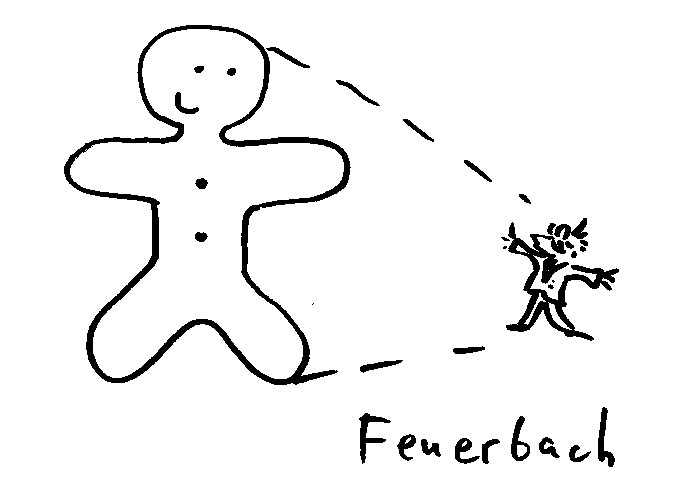

## Гипотезы происхождения религии 

<!-- TODO: поискать в сети материал по натуралистич. и анимистич., социальн (как сделал с Фейербахом) -->

### Христианская точка зрения.

<!--TODO: консервативный и либеральный подходы-->

{width=20 height=20}      Книга Бытия говорит нам о первом опыте богопознания. Адам и Ева в Эдеме общались с Богом непосредственно. Знание о Боге было передано многочисленному потомству первых людей. Из уст 900 летнего Адама его пра-пра...правнуки cлышали рассказ о Боге, о Рае и о грехопадении. 

>    * Насколько стойким было древнее знание, передаваемое из поколения в поколение? История языческих религий дает ответ на этот вопрос. Религиозные представления разных народов о божественном часто разительно отличаются друг от друга. Поскольку Библия говорит о едином источнике богопочитания, такое многообразие может объясняться только серьезными искажениями древней перворелигии. Поэтому если бы единственным источником вероучения был рассказ Адама и Евы, то оно было бы полностью утеряно последующими поколениями. 
>    * Одной из причин, по которой даже некоторые язычники приближались к правильному пониманию Божества - в том, что человеку дано врожденное ощущение Бога и божественного, которое не было уничтожено грехопадением.
>    * Еще одним важнейшим источником представления о Боге является окружающая природа и сам человек (естественное откровение).
>    * Сверхъестественное откровение. Для сохранения и умножения в человечестве истинного богопочитания Господь изводит от Авраама свой народ, Израиль. В нем Бог воздвиг праведников, судей, пророков, даровал Закон, для поддержания богооткровенного знания. А "в последок дней сих" явился и Сам Сын Божий, Господь Иисус Христос, показав в Себе Самом Отца Небесного всем верующим.

>* На всем протяжении человеческой истории происходили искажения и повреждения веры в Единого Бога.

>    * Языческие культы, связанные с почитанием душ усопших, других духов (леса, воды и проч.), антропоморфных богов произошли путем искажений первоначального знания. 

>По мысли св. Григория Богослова, люди, отличавшиеся особой чувствительностью и оплакивавшие смерть своих родственников, ставили им памятники, почитая память усопших. Со временем памятники особенно славных предков стали почитаться очень далекими потомками этих людей и, таким образом, потерялась связь с реальным человеком. Другие люди стали почитать какие-то человеческие качества (силу, хитрость и т.д.), а самые сластолюбивые обожествили страсти (Слово о богословии 2е)

>Да и теперь часто случается, что люди, забывшие истинного Бога, выдумывают самые дикие суеверия и обычаи (хотя считают себя неверующими).

>    * После рождения Христовой Церкви практически сразу начинают появляться ереси. Причины этого явления точно такие же, как и у появления язычества. Гностические секты получили свое продолжение у павликиан, затем на сцену выходят богомилы, которых сменяют кафары и альбигойцы, на смену им приходят европейские секты унитарианистов и русских жидовствующих. Последние передали семена ереси хлыстам и духоборам. Наконец, в новое время возникает целый ряд ересей (виссарионовцы, богородичный центр, ивановцы), как две капли воды напоминающих первые гностические секты. Главное, что объединяет их - искажение Евангелия, почитание основателя секты вместо Христа.

В смене этих сект прослеживается определенная преемственность. У богомилов, хлыстов, современных "богородичников" есть свои "христы" и "богородицы", "апостолы". Даже обряды имеют некоторые сходство с христианскими.

Подтверждением этой мысли о деградации религиозных представлений является мифология многих древних народов. В древнейшем слое мифа часто содержатся сведение о божестве, сотворившем мир, но затем отошедшем в сторону (так в мифах Угарита, индийских Ведах).

По некоторым сведениям, африканские бушмены ("сэн") сохранили сведения о Боге-отце только в традиции жрецов ("лаикам" запрещается раскрывать эзотерические сведения, они знают только поклонение духам пустыни, охоты и проч.)

* Отметим, что некоторые христиане соглашаются с идеей "прогресса" религиозных представлений человечества. Имеется в виду переход от более примитивных форм - шаманизма (поклонения духам) и многобожия к монотеизму и пантеизму. Эта позиция обладает следующими недостатками:
    * не согласуется с библейским повествованием о первых людях (например о Каине и Авеле), служивших единому Богу.
    * Необоснованно переносит концепцию эволюции и вертикального прогресса на религиозную сферу. 

>В новейшее время критиками традиционных взглядов было придумано несколько "естественных" объяснений происхождения религии.

### Натуралистическая гипотеза 

>От слова "natura" = природа.

{width=20 height=20}      Страх перед суровыми явлениями природы привел к изобретению человеком первых богов и первобытной религии. 

{width=250 height=300}

{width=20 height=20}     Критика: 

* Явление, внушающее страх, вызывает желание уклониться от него, а не поклоняться. Человек многого боялся, но не все обоготворял (часто - безобидные предметы - камень, дерево и подоб)
* Первобытный человек субъективно ощущал свои познания вполне достаточными для объяснения окружающего мира (пример с дикарем в лесу - племя кубу с о. Суматра).
* С развитием науки человек научился объяснять окружающие явления с большой точностью. Тем не менее, религия не перестала существаовть. (Верующие ученые: Паскаль, Декарт, Мендель, Павлов)

> Напротив: при существующем религиозном чувстве, человек способен "обоготворять" даже неодушевленные предметы.

### Анимистическая гипотеза 

>От слова "anima" = душа.

{width=20 height=20}      Источник человеческой религиозности - измененное состояние сознания вроде сна, комы (или сходные вещи). 

{width=250 height=300}

{width=20 height=20}     критика: 

* Аргументы А.И. Осипова:
    * все человечество сошло с ума, спутав сон с реальностью?
    * эта неразвитость сознания (не отличает сна от реальности) способна дойти до абстрактной идеи бытия Божия и твердо ее удерживать на протяж всей истории
    * принятие сна (грез) за реальность и религиозное отношение к нему - разные вещи.
    * человеку присуще недоверие к снам (снится, что наелся, а проснувшись по-прежнему голоден)
    * всеобщность религии в человечестве.
* опыт говорит о реальности потустороннего мира
  В этом случае шаманизм и другие формы контакта с этим миром - вовсе не причина появления религии, а обстоятельства, послужившие _оформлению_ религиозности. 

* это может быть и ложный опыт, связанный с особенностями измененного сознания, но объяснять этим происхождение религии неразумно.

{width=20 height=20}      Последние исследования деятельности мозга (например, связь трех ступеней измененного сознания в шаманизме бушменов с наскальными изображениями, имеющими религиозный характер) вроде бы подтверждают эту гипотезу. 

{width=20 height=20}      То, что волны мозга меняют частоту (а религиозные практики, напр. чтение мантры могут быть с этим связаны) не опровергает того, что человек может взаимодействовать с иным миром (ведь бывают случаи, когда такому воздействию подвергается нерелигиожный человек). Алкоголики видят бесов, тяжелобольные и умирающие видят "усопших родственников", становятся свидетелями других видений. Все это признаки истончения преграды, отделяющей человека от иного мира. Одним словом, есть факты, а есть интерпретации. Мы имеем право не соглашаться с атеистическим объяснением. 

### Гипотеза Фейербаха 

{width=20 height=20}      Бог - проекция человеческих желаний. Религия - поклонение человека самому себе. 

{width=350 height=400}

{width=20 height=20}      Концепция: 

* Бог как существо, удовлетворяющее все наши желания и мечты.
* Желание → фантазия (проекция) → ложные представления (иллюзии)

Мы желаем такого существа, и оно нами придумывается. Например: учение о Воскресении - отражение желания человека быть непосредственно уверенным в собственном бессмертии. Получается Библия "наоборот": "человек создал Бога по своему образу и подобию".  Бог - человеческое желание, исполненное и поддерживаемое иллюзией, а религия - отражение в сознании самого сознания и всей действительности.

{width=20 height=20}      Критика: 

* Контекст идей Фейербаха - идеи Шлейермахера: его богословская система строится на анализе человеческого опыта, (особенно опыта зависимости). Шлейермахер ставит реальность Бога в зависимость от религиозного опыта верующего.
* Подход Фейербаха - критика идей Шлейермахера (как будто богословие сводится только к этим идеям):
    * Шлейермахер: Бытие Бога коренится в человеческом опыте (переживаниях, чувствах).
    * Фейербах: Но это может быть опыт не внешний, а опыт, переживание **нас самих**. Мы можем сами проецировать свой опыт и называть это "богом", в то время как на самом деле "переживаем" свою собственную человеческую природу.
        * однако традиционное богословие говорит о том, что вера, религия - ответ не на человеческий опыт, переживания, а на реальное взаимодействие с Богом. Карл Барт показал слабость позиции Шлейермахера. 
        * Прежде радости искупления и воскресения необходимо пройти через покаяние, осознание греха. Проекция человеческих желаний, как объяснение всего религиозного опыта не вяжется прежде всего с этим аспектом религии.
        * Фейербах странным образом вообще "проглядел" религиозную идею греха (если Бог - только фантазия, то откуда у человека идея греха (вины) перед этим выдуманным существом). Фрейд придумал, как выйти из положения (Эдипов комплекс, см. ниже).
* Фейербах обобщает все религии. Но, напр. Тхеравада, старейшая форма буддизма вообще не признает бытия какого-либо бога. Как же объясняется происхождение этой религии? 
* Это всего лишь гипотеза, не подтвержденная научными данными, серия догматических утверждений. Нефальсифицируема (ее невозможно опровергнуть в принципе), т.е. ненаучна. Фрейд попытался создать научную опору для этой гипотезы, но потерпел неудачу.
* По Фейербаху получается, что **Атеизм можно считать проекцией человеческих желаний** (надежд). Надзиратель в концлагере Треблинка, вероятно, желал бы, чтобы никакого бога не было (и ему не пришлось бы отвечать за содеянное).
* Основа гипотезы Фейербаха - порочная логика:
    * Не все, чего мы желаем, существует
    * Бог - то, чего мы желаем (представляем, фантазируем)
    * Бог не существует.
* Однако:
    * То, чего мы желаем может и существовать. Например из-за того, что человек создан по образу и подобию Божию, он тянется к Источнику своего бытия, желает с Ним соединиться.
    * Надсмотрщик в концлагере желает, чтобы Бог не существовал. (Получается, что атеизм - религиозный феномен по Фейербаху).
<!--     * Друга форма: -->
<!--         * У человека много желаний -->
<!--         * Некоторые вещи, которых мы желаем, неосуществимы (напр. стать бесконечно сильным) -->
<!--             * они неосуществимы для человека! Принципиально может существовать бесконечно сильное существо, или параллельная вселенная. -->
<!--         * Бог - проекция наших **неосуществимых** стремлений, желаний  -->
<!--             * Не доказано. Наоборот, наличие в человеке неосуществимых желаний можно рассматривать как доказательство существования Бога. -->
<!--             * Сотворение человека по образу и подобию Божию => неосуществимое для человека желание совершенства. -->

* Критика из книги А.И. Осипова:
    * обвинение всего человечества в сумасшествии ("человек вымысел фантазии считает реально существующим предметом и постоянно вплетает его во все отношения своей жизни" Кудрявцев-Пл
    * создание абстракций и вера в их существование - две разные вещи 
    * Гипотеза годится для объяснения деградации религии, а не ее возникновения

#### Версия Фрейда 

Идеи Фейербаха в наши дни больше известны в интерпретации Фрейда.

{width=20 height=20}      Для Фрейда религиозные идеи - "иллюзии, исполнение древнейших, сильнеших и наиболее сильных желаний человечества". 
<!-- (цитата?)  -->

По Фрейду сны - сильные желания, подавленные сознанием и перемещенные в подсознание
"Психогенезис религии". Религия - искаженная форма обсессивного невроза. (Поведение некоторых пациентов напоминало некоторые религиозные обряды).

Фрейд выделяет два слоя религии: 
* общественный
    * Древняя история: фигура отца, доминирующего над всеми самками. Убийство отца - сыновья становятся носителями этой гнетущей тайны и вины, которое передалось потомкам (эдипов комплекс)
    * Религия имеет в своей основе эту вину, а обряды и ритуалы - способ сгладить ее.
    * Это выглядит неубедительным, поэтому атеисты в основном апеллируют ко второму слою:
* индивидуальный (личный)
    * Личный Бог - фигура отца, только преувеличенная 
        * док-во видят в том, что религиозная вера молодых людей часто разрушается с падением авторитета отца. 
        * в детстве человек, переживая страх наказания со стороны отца, отвечает почитанием, ассоциирует себя с ним (хочу быть сильным, как папа!) и проецирует то, что он знает о воле отца как супер-эго, сверхволю.
        * религия - незрелый ответ на трудности жизни, подсознательное обращение к детсткому опыту (папа меня защитит)

{width=20 height=20}      Критика: 

* несомненное влияние на Фрейда работ Smith'а[^3], который говорил о том, что сущность религии - не в учениях и догмах, а в сакральных действиях, обрядах, культе. **В настоящее время такие взгляды заброшены учеными, как непригодные.** Т.о. Фрейд строит свои рассуждения в связи с гипотезой, которая более не признается верной.
* Его теория психогенезиса религии предшествует его исследованиям религии. Биограф Фрейда, Эрнст Джонс выделяет письмо, в котором Фрейд ворчит по поводу того, что ему приходится читать массу литературы по религии. Он замечает, что это довольно бессмысленно, поскольку он уже инстинктивно знает ответ. "Я читаю книги, не испытывая к ним реального интереса, поскольку я уже знаю результат; мой инстинкт говорит мне об этом". (Jones Sigmund Freud, Vol.2, p.123.)

>Т.о. **атеистические взгляды Фрейда предшествуют его исследованию религии**, а не являются его результатом.

* гипотеза Фрейда нефальсифицируема (ее невозможно опровергнуть в принципе) → ненаучна. Фрейд не дал гипотезе Фейербаха доказательную базу. В редких случаях, когда гипотезу можно проверить, в общем считается, что она неправильна. Например, перекрывание понятий Бог и отец происходит только в том случае, если отец - предпочитаемый родитель, в то время как большинство людей "моделируют" представления о Боге по матери[^4]. 

>Итак, вопросы атеисту:

* откуда произошли взгляды Фрейда: из научных фактов, или из его атеистических предрассудков?
* где историческое доказательство того, что христианство происходит от эдипова комплекса? (Фрейд помещает "отцеубийство" в доисторическую эпоху, никаких материальных следов этого найти невозможно). Кстати, в этом есть сэксизм: женщины подчиняются давлению мужчин (ведь эта "вина" - мужская, а религиозными становятся и женщины).
* почему христианам нужно оставить свою веру в ответ на взгляды, основанные на логической ошибке?

### Социальная гипотеза 

Эта гипотеза - эклектическая (смешанная): Натуралистическая + Фейербаха + Марксистская теория общественных отношений.

{width=20 height=20}      Религия - не изначальное явление в человеческом обществе, возникла лишь на определенной ступени разивития, сформировалась благодаря классовым отношениям 

* Возникновение религии обусловлено:
* социальным фактором: в первобытном обществе - чувством бессилия человека в борьбе с природой, в классовых обществах — чувством бессилия перед социальным гнетом
    * гносеологическим фактором: способность человека к абстрактному мышлению → возникновение в сознании _фантастических отражений реальной действительности_

{width=350 height=400}

{width=20 height=20}      Критика: 

* Религия древнéе социального гнета. История классового общества исчисляется максимально 6 тыс. лет.
* Наука не знает никакого "дорелигиозного" состояния человека. Возраст неандертальцев согласно научным данным - не старше 150 тыс. лет, а Homo sapiens - 30-40 тыс. лет. Согласно данным археологии неандертальцы уже обладали зачатками религиозного сознания (украшение могилы цветами), а религиозность кроманьонцев (наши непосредственные предки) ни у кого из ученых сомнений не вызывает.
    * Отсутствие религии, например, у австралопитеков не должно вызывать удивления, так как вопрос о их "человечности" по-прежнему открыт. Точно также неудивительно отсутствие религии у современных шимпанзе и горилл.
* Бессилие и страх человека перед силами природы - миф, созданный кабинетными учеными. Эта часть аргументации разобрана в разделе "Натуралистическая гипотеза".
* Возникновение фантастических отражений в сознании человека, обусловленная способностью его к абстрактному мышлению - повторение гипотезы Фейербаха (см. критику в соответствующей части курса). Дополнительные соображения: 
    * "Ночь тысячелетий" - наука ничего не может сказать о состоянии психики человека в древнейший период истории. Предположения Фейербаха - фантазии.
    * Религия, по всей видимости, древнее развитого абстрактного мышления человека. Даже некоторые современные племена не имеют развитых абстрактных понятий (напр., есть слова, обозначающие укусы разных животных, но нет слова, означающего "укус" вообще), но им (как и древним людям) известны такие понятия, как "Бог", "дух", "душа", "ангел". 
    * Социальная гипотеза содержит противоречие: либо первобытный человек - примитивный дикарь, не имеющий абстрактного мышления, боящийся суровых явлений природы, либо он - "философ со смелым, оригинальным умом" (см. Осипов), способный осмысливать и создавать весьма отвлеченные понятия.

### "Инопланетная" гипотеза  

{width=20 height=20}      Согласно этому представлению, непосредственный контакт с "пришельцами" стал источником представлений о "божественных" существах. 

{width=350 height=400}

{width=20 height=20}     критика (по сравнению с теистическим представлением): 

* эта гипотеза вторична - объяснение позаимствовано у (поли)теистов. 
* не объясняет происхождение мира 
* не объясняет происхождение человека
    * свобода воли
    * стремление к совершенству
* не предъявляет нравственных требований к человечеству 

Следует отметить, что образ "пришельцев", созданный средствами масс-медиа очень напоминает богов политеизма. Они не могут претендовать на всемогущество, они чаще руководствуются своими собственными эгоистическими интересами. Потенциально представляют даже угрозу для человека. Все это вновь подтверждает ту мысль, что представление о религии со временем "мельчает" и, искажаясь, приобретает формы, понятные (и приятные) современникам. Всем этим пользуются враги человеческого рода. Самыми характерными чертами современного человечества являются, пожалуй, эгоизм (гордыня) и техническое, механистическое видение мира. Именно такие черты приобретает и новая религия: "пришельцы" не лезут к человеку со своими принципами, а с другой стороны, восхищают своими техническими достижениями, заставляя подражать им (или соревноваться).

* Критика вытекает из самого статуса языческой религии. Приниженное представление о божественном, по сравнению с теизмом. Религия становится "религией страстей": страстные, человекообразные "боги-пришельцы" не имеют права требовать от человека соблюдения нравственных правил. Это, с одной стороны, является еще более низким падением религиозных представлений человека (ведь боги язычников все-таки наказывали за безнравственные поступки), а с другой, показывает, что даже в век технического прогресса человек по-прежнему нуждается в религии. Отвергая традиционную религиозность, он создает новую, которая на поверку оказывается повторением старых языческих мифов в новой обложке.

* Факты, которые представляют сторонники этой гипотезы (мегалитические конструкции, полигональная кладка и т.п.) могут действительно говорить о некоем вторичном воздействии. Допотопное человечество, очевидно, очень плотно общалось с миром падших духов (в числе прочих мерзостей - человеческие жертвоприношения). Те "достижения", которые современный человек склонен относить к дарам "технически продвинутых" богов-пришельцев, скорее всего относятся к деятельности "воздушных князей".

<!--  todo: Выводы по инопланет гип и общие -->

[^3]: См. @RobRel
[^4]: См. @Spilka

\newpage
