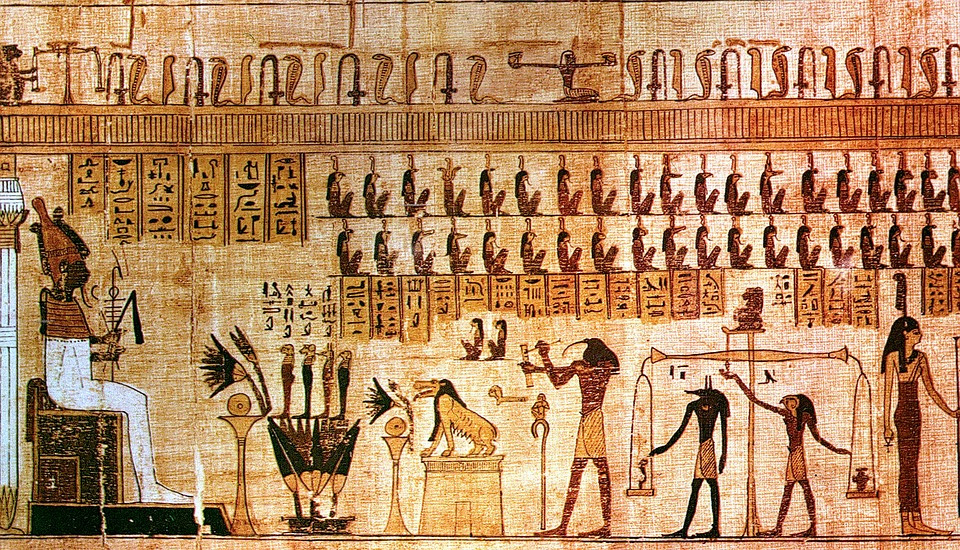
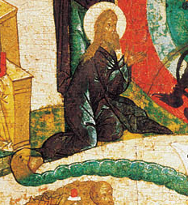
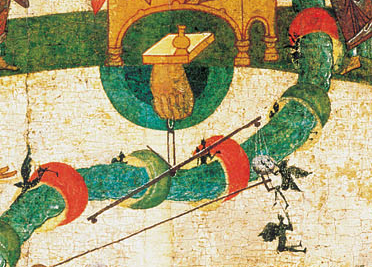

## Воздушные мытарства

<!--- идея: рассортировать цитаты на три группы: против мытарств, против воздушных препятствий, за мытарства и за воздушные препятствия, четвертая группа - сомнительные и подложные
--->

Учение о прохождении души усопшего через препятствия, чинимые в воздушном пространстве падшими духами, по-видимому достаточно укоренено в Православной традиции, хотя и не является догматом. Нужно отметить, что термин "воздушные *мытарства*" (греч. τελώνια τοῦ ἀέρος)  как и сама аллегория, связанная со сбором податей, используется поздними отцами. В эпоху рассвета святоотеческой письменности эти атрибуты не упоминаются[^note34]. Поэтому мне кажется правильным уточнить терминологию и использовать более общее понятие "воздушные препятствия", которое не содержит отсылки к описательным особенностям поздних версий учения.

Наибольшее количество вопросов вызывает поздний текст "мытарств блаженной Феодоры", находящийся в житии св. Василия Нового, где аллегория сбора податей становится уже сутью повествования, при том, что "мытницы", сборщики, от которых нужно откупиться и т.д. оказываются в центре внимания автора. Кроме того, имеются исследования, устанавливающие связь этого текста с учением гностиков[^note35]. В связи с этим в последнее время раздаются голоса, осуждающие учение о мытарствах.

<!---Не исключено, что в этом повествовании действительно присутствуют элементы гностического учения, проникшего на Русь через Болгарию.--->

Среди критиков можно назвать клириков РПЦЗ прот. Михаила Азкула (Michael Azkoul) и митр. Лазаря Пухало (Lazar Puhalo)[^note13][^note33]. С критикой учения о мытарствах также недавно выступил протодьякон Андрей Кураев[^myt20].

<!---Кураев--->

### Общие аргументы против учения о мытарствах:

* О мытарствах не говорится в Священном Писании.
* О мытарствах не учат св. отцы, но это учение поддерживает еретик Ориген (аргумент прот. М. Ацкула).
* Учение о мытарствах подвергает сомнению победу Христа над князем мира сего: Христос очистил "воздушный путь", поэтому никаких "застав" и "мытниц" там быть не может.
* Учение о мытарствах имеет нехристианский, гностический характер:
    * Душу судят бесы, а не Бог. Вводится некий дуализм, ограничивающий суверенность Бога.
    * Картина мытарств напоминает древне-египетские представления о посмертном суде, где Анубис взвешивает сердце усопшего[^egyp]. Душа также проходит испытание сорока двух "черных богов", начальствующих каждый над своим "грехом". Каждому из них испытуемый должен сказать "я никогда не крал", или "я ни разу не прелюбодействовал" и т.п.
<!---(крокодило-бегемоты, "выходящие из Мемфиса")--->
* Учение о мытарствах сходно с католическим учением о Чистилище (особенно это касается учения о заслугах и о "удовлетворении за грех")
* Учение о мытарствах ведет к унынию и отчаянию в своем спасении.
<!--- ведет к унынию --->

{width=400 height=300}

Критики учения о мытарствах указывают и на то, что иконографическое изображение мытарств является особенностью только русской иконописной традиции, начиная с XV-XVI вв. Раньше этого времени таких изображений в православной иконописи не существовало.

{width=400 height=300} *Глава "змия мытарств".*

{width=400 height=300} *Изображение самих мытарств в виде колец на теле змия.*

Описание изображения, позаимствованное из диссертации светского искусствоведа:

>"Зверь правой пастью пожирает грешников, а из левой выпускает змея с 20-ю кольцами мытарств. Последний, поднимаясь в центре до деисусного ряда, выпускает из пасти стопу Адама, коленопреклоненного перед Христом. Хотя сюжеты огненного потока, Адама, Евы идут от византийских Судов, но здесь они трансформированы настолько, что приобрели качественно новое звучание. *Сюжеты же змея и колец мытарств уникальны и не известны ни византийскому, ни западноевропейскому искусству*"[^zod1].

Из этого сходства образности в изображениях и письменной традиции некоторые критики (в особенности, митр. Лазарь) делают вывод о гностическом характере всего учения о воздушных препятствиях и его прямых связях с древне-египетским мистицизмом.

Впрочем, как мы убедимся, это сходство может объясняться иначе.

### В защиту учения о воздушных препятствиях:

<!--- заметно, что мнения о воздушных препятствиях высказывают прежде всего монахи, их суждения носят практический (даже прикладной) характер. Это заметно даже на примере св. Афанасия, который говорит об очищении воздушного пути воскресшим Христом, но в житии прп. Антония он же ясно излагает опыт воздушных препятствий. Возможно, в том, что Господь попускает бесам испытывать восходящие души, скрыта тайна домостроительства Божия. Может быть, отчасти, на этот вопрос отвечает св. Марк Эфесский, говорящий о страхе, претерпевая который, души избавляются от ада.--->

* Учение о воздушных препятствиях связано, в первую очередь, с посланием к Ефесянам, где диавол и падшие духи связываются с воздушной областью и говорится о нашей брани с ними. Так апостол Павел говорит о живших в грехах 

>"по воле князя, господствующего в воздухе, духа, действующего ныне в сынах противления"(Еф 2:2)[^note15][^note12]. 

>"Облекитесь во всеоружие Божие, чтобы вам можно было стать против козней диавольских, потому что наша брань не против крови и плоти, но против начальств, против властей, против мироправителей тьмы века сего, против духов злобы поднебесной. Для сего приимите всеоружие Божие, дабы вы могли противостать в день злый и, все преодолев, устоять" (Еф. 6:10-13).

* Учение о воздушных препятствиях содержится не только в житии св. Василия Нового ("мытарства блаженной Феодоры"), но и в ряде святоотеческих текстов. В этих источниках не обязательно употребляется название "мытарства", но описание происходящего не оставляет сомнений в том, что речь идет именно о воздушных препятствиях, чинимых бесами. Более подробное обсуждение этих текстов приводится в главе "К вопросу о мытарствах. Источники" в дополнительной части курса.
* Обвинение в языческом дуализме несправедливы, так как окончательный вердикт в учении о воздушных препятствиях принадлежит Богу, что видно в ряде высказываний святых отцов. Используя аналогию уголовного суда, можно сказать, что бесы играют здесь роль обвинителей, но не судей. К тому же приговор в результате прохождения мытарств --- не окончательный, недаром этот суд называют "частным", в отличие от последнего, Страшного Суда, когда уже на престоле возсядет "Ветхий денми... и книги разгнутся" (Дан. 7:9-10).
<!---Поэтому цитаты из Священного Писания, например о том, что "Отец... суд весь даде Сынови" (Ин. 5:22), приводимые критиками, не относятся к данному случаю.--->
* Сходство учения о воздушных препятствиях с древне-египетскими представлениями не является доказательством его якобы языческого характера:
    * Общий для всего человечества опыт "пограничных состояний" приводит к некоторому сходству представлений о загробном пути души[^azk1]. Умирающий человек (или даже побывавший в состоянии клинической смерти) видит часть духовного мира, и этот опыт находит свое объяснение в рамках данной культурной традиции. Обратим внимание на разницу в интерпретации: в египетском мифе "мытарей" (черных богов) можно обмануть с помощью произнесенных ритуальных формул. Для египтянина важны не реальные дела, совершенные душой при жизни, а правильность ритуальных действий при погребении. Но христианство чуждо этого магизма: душе помогают не ритуальные формулы, а Церковное поминовение и милостыня, раздаваемая с молитвой о усопшем (так как Бог желает помиловать грешников, внимая молитвам Своей Церкви), но главное значение имеют дела, совершенные усопшим при жизни. Таким образом, очевидно коренное отличие в интерпретации опыта "пограничных состояний" в египетском мифе и в православном Предании.
    * Отвергая учение о ВП на основании образного сходства с египетским мифом, мы будем вынуждены рассмотреть под тем же углом, например, учение о Церковных Таинствах, о воскресении из мертвых, в силу обнаруженного критиками их внешнего сходства с орфическими мистериями и другими позднеантичными языческими культами. Объясняя это сходство мы говорим о рецепции, заимствовании из языческого мира некоторых внешних форм Церковью, которая наполяет эти формы новым, христианским содержанием.
    * Возможно египетский фольклор действительно повлиял на представления о воздушных препятствиях, обеспечив некий образный "фон" этому учению[^alex1]. Однако, если не придавать слишком большого значения роли "мытарей" в этой *аллегории* частного суда, то учение о воздушных препятствиях будет оставаться в границах христианского учения.
* Сходство с католическим учением о Чистилище действительно имеется, так как католики сохранили основы церковного учения о посмертном воздаянии. Нареканию подвергается юридизм, свойственный догматам латинян и их представление об *"удовлетворении за грех"*: после покаяния грешники "должны еще принести некоторое удовлетворение правде Божией за свои грехи, потерпев для сего какое-либо временное наказание". Однако согласно Православному учению, Христос-Спаситель "уже подъял на Себя и все грехи мира и все казни за грехи". От желающих спасения требуется только уверовать в Спасителя, покаяться в грехах и принести *плоды покаяния* --- добрые дела. Разница между этими понятиями заключается, во-первых, в том, что согласно католическому учению "души очищаются в Чистилище и удовлетворяют правде Божией чрез самые свои страдания", а молитва Церкви только облегчает эти страдания. Православное Предание говорит о том, что изменить свое состояние сам грешник, оказавшийся в темнице Ада, уже не может. "Означенные души очищаются от грехов и заслуживают от Бога помилование не сами собою и не чрез свои мучения, но по молитвам Церкви, силою бескровной жертвы, и эти-то молитвы не только помогают страждущим, облегчают их участь, но и освобождают их от мучений (Прав. испов. ч. 1, отв. на вопр. 64)".

* Исход испытания во время прохождения ВП может оказаться неблагоприятным, тогда как из Чистилища души выходят только в Рай (по представлениям католиков Чистилище --- как бы "филиал" Рая).
* Различие также состоит в самом характере происходящего: на мытарствах происходит исследование души, а в Чистилище --- избавление от последствий (злых дел). Первое --- процесс, второе, скорее, --- состояние.
* Наконец, учение о ВП --- недогматизированное предание Православной Церкви, тогда как доктрина о Чистилище является католическим догматом. Этот факт дает нам возможность некоторого полемического "маневра".

Выводы:

* Не следует отвергать учение о воздушных препятствиях, как якобы нецерковное, так как имеется ряд высказываний отцов Церкви, подтверждающих его истинность.

* Несмотря на возможность защищать и учение о мытарствах (имеются в виду его поздние формы), на мой взгляд полезнее было бы отказаться от крайностей, очистить учение о воздушных препятствиях от неуместной, апокрифической образности (часто служащей соблазном для образованных верующих), сохранив суть, содержащуюся в Церковном предании.

* Следует отметить, что существует проблема гармонизации святоотеческих высказываний, одни из которых поддерживают, а другие, по-видимому, отвергают учение о воздушных препятствиях. Этот вопрос нуждается в дальнейшем изучении[^note39] 

* В связи с этим следует согласиться с мнением св. Филарета Московского об опасности догматизации учения о мытарствах:

>"Видения, имеющие свою истину, не всегда удобно обращать в общие догматы. Вы догматствуете о мытарствах, а потом приводите изложение посмертных состояний из св. Макария, который ни слова не говорит о мытарствах. Отсюда родятся затруднительные вопросы"[^phil1]. 

\newpage

[^myt20]: протодьякон Андрей Кураев, Мытарства Феодоры, http://diak-kuraev.livejournal.com/15653.html#cutid1
[^note13]: В отношении деятельности второго Синод РПЦЗ вынужден был принять отдельное решение, запрещающее митр. Лазарю (тогда еще диакону Льву) проповедовать на приходах. Подверглось критике и его учение о "оцепенении души" после разлучения от тела, не принятое Православной Церковью. Тем не менее, возражения, выдвинутые митр. Лазарем и прот. Михаилом, следует рассмотреть со всей тщательностью, поскольку этими богословами был выдвинут ряд справделивых претензий к учению о мытарствах.
[^note33]: Отметим, что на Западе, особенно в США и Канаде, полемика с учением о мытарствах была вызвана книгой иером. Серафима (Роуза) "Душа после смерти". Эта книга стала настоящим камнем преткновения для многих православных американцев.
[^egyp]: Египетская книга мертвых, 128
[^note12]: Справедливости ради надо заметить, что св. Иоанн Златоуст PG 62.159.15, 60.681, св. Василий Великий PG 28.1088.19, блаж. Феодорит PG 82.553.10 (русский перевод этого места искусственно "гармонизирован" в пользу "поднебесной" версии), прп. Иоанн Дамаскин PG 96.785.2 видят в этой фразе апостола не указание на поднебесную область обитания духов, а указание на цель борьбы с ними: "за небеса". Хотя можно думать, что в некоторых случаях такое прочтение не исключает и "поднебесную" версию: "πρὸς τὰ πνευματικὰ τῆς πονηρίας ἐν τοῖς ἐπουρανίοις, καὶ περὶ τὰ οὐράνια πρὸς τὸν ἔνδον καὶ ἐν ἡμῖν αὐτοῖς τὸν ἐν τοῖς πάθεσι πόλεμον" у Св. Григория Богослова, PG 35.837.7
[^note15]: Именно об этих словах вспоминает прп. Антоний, пережив видение, в котором он подвергся допросу нечистых духов. В его житии упоминается также и о подготовке к предстоящей борьбе с падшими духами: "Сего ради приимите вся оружия Божия, да возможете противитися в день лют"(Еф. 6:13). Автор жития, св. Афанасий, понимает это место именно в контексте воздушных препятствий.
[^alex1]: По-видимому, развитие этих подробностей связано с Александрийской богословской школой и египетским монашеством, что, думается, не случайно. Следует также отметить развитие подробностей встречи с "истязателями" в более поздних источниках.
[^zod1]: Цодикович В.К. Автореферат диссертации по теме "Семантика иконографии "Страшного Суда" в русском искусстве XV-XVI веков", С. 2
[^note34]: Источники, приписываемые авторству древних отцов (таких как св. Кирилл, св. Иоанн Златоуст) и содержащие элементы, напоминающие "мытарства блаженной Феодоры", являются подложными сочинениями. Подробнее см. главу "К вопросу о мытарствах. Источники" в дополнительной части курса.
[^note35]: 	Павел Стефанов, архим. Мытарства души после смерти в болгарском фольклоре и культуре // Мир православия. Вып. 5. Волгоград, 2004, 318-334. http://www.krotov.info/history/11/2/mytarstva.htm
[^phil1]: @PhilPis, C. 62
[^azk1]: Мы не считаем убедительными попытки о. Михаила Ацкула доказать теософский и ложный характер любого "внетелесного опыта". В патериковой литературе достаточно примеров описания этого опыта. Достаточно вспомнить житие прп. Антония, где он "видит сам себя, будто бы он оказался вне себя" (ἔβλεπεν ἑαυτὸν ὥσπερ ἔξωθεν ἑαυτοῦ γινόμενον) PG 26.933
[^note39]: См. обсуждение в главе "К вопросу о мытарствах. Источники" в дополнительной части курса

