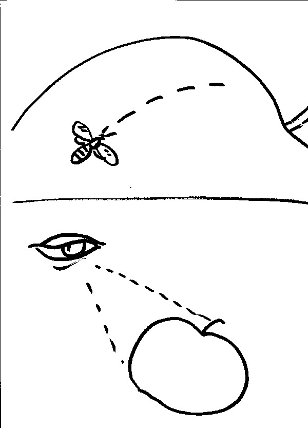
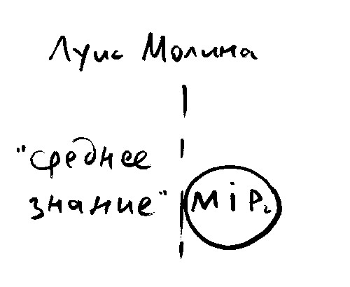
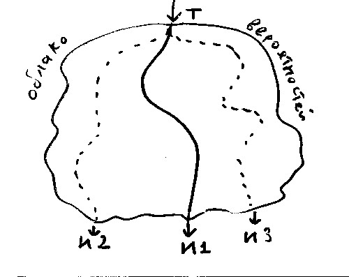

## Всеведение Божие и человеческая свобода

<!--- Нижеследущее является кратким конспектом главы II из книги Ч. Стиви Эванс и Р. Захари Мэнис "Философия религии: размышление о вере". С. 39-49 И Морриса, p. 91- --->

{width=20 height=20}     Атеисты задают следующий вопрос: 

Если Бог обладает **предведением**, т.е. знает все о каждом решении каждого человека, то эти решения предопределены.
Либо Бог не обладает всеведением (не знает всех решений), либо человек не имеет свободы выбора. В последнем случае наказание за грех представляется несправедливым.

Обладает ли Бог знанием выбора, которые будут совершаться в будущем людьми?

Если разделять сам факт, знание о котором мы рассматриваем и мнение, убежденность агента (belief), можно сформулировать проблему всеведения следующим образом:

{width=20 height=20}    Постановка вопроса:

(1) Мнение Бога непогрешимо

(2) Для каждого события "x", если Бог заранее считает, что "x" произойдет, никто не в силах предотвратить "x".

(3) Если никто не в силах предотвратить "x", то никто не свободен в отношении "x".

(4) В отношении каждого "x", когда либо происходящего, Бог заранее считает, что оно произойдет.

   Следовательно:

(5) Никто, кроме Бога не свободен в отношении любого события.

(6) Свободная воля человека --- полная иллюзия.

Пример:

1. Бог знает, что Иван завтра пойдет на службу.
2. Чтобы Иван был свободен в своем выборе, он должен иметь возможность не пойти.
3. Но знание Бога непогрешимо, поэтому на самом деле есть только один вариант - пойти.
4. Иван не имеет свободы выбора, так как не может не пойти на службу.

{width=20 height=20}            Здесь есть логическая тонкость: 

1.  **необходимо** то, что (относится ко всей цепочке): Бог знает, что Иван позвонит → Иван позвонит. Невозможно **знать** ложь: понятие знания ограничено требованием истины. (срав. фразу: "Петя не просто подозревал, он **знал**, что его выгонят из семинарии").
2. Бог знает, что Иван позвонит, **необходимо** (относится к знанию Бога) → Иван позвонит.

Первое суждение можно сопоставить с пассивным наблюдением, не влияющим на результат. Второе - вносит изменение в наблюдаемую картину.

Первое суждение недостаточно сильно, чтобы сделать вывод об отстутствии свободы выбора.
Второе - сильнее, но вызывает вопрос: **каким образом знание о событии может вызвать событие?** (странное поведение "знания" на бесконечности, - и.П. На самом деле "предведение" и "предопределение" не тождественны - см. прп Иоанн Дамаскин, Точное изложение)

-------------------------------

Другой вариант, во временнóм контексте: Бог всю предшествовавшую вечность знал о том, что Иван пойдет на службу, а Иван не пошел.

Иван либо:

1. фальсифицирует мнение Бога о себе в прошлом
2. изменяет прошлое так, чтобы Бог знал о нем, что он **не** пойдет.

Первое невозможно: знание Бога непогрешимо.

Второе - также невозможно. Прошлое нельзя изменить (прошедшие события "облекаются необходимостью": Кеннеди убит 22 нояб. 1963г. и с этим уже ничего не поделаешь).

{width=20 height=20}              Решения: 

### Компатибилизм.  

Для ответа на поставленный вопрос о божественном всеведении важно наше отношение к *принципу альтернативных возможностей*. 

Если мы согласны с тем, что *свобода не предполагает наличия альтернативных возможностей*, мы склоняемся к компатибилизму (теологической совместимости предопределения и человеческой свободы).

{width=20 height=20}     Человек свободен не тогда, когда у него есть возможность поступить как-то иначе, а когда он не принуждается выполнить какое-то действие, желает это сделать[^nt1001].

Если компатибилисты правы, то третий пункт вышеприведенного рассуждения разрушается, как и выводы (5) и (6): Бог знает будущее, потому что Он желает его (включая акты свободного выбора каждого человека). Иначе говоря, Бог знает события, которые собирается осуществить в будущем, но человек остается свободным в своих решениях. Таким образом, компатибилизм означает *совместимость* предопределения и человеческой свободы.

Главный аргумент компатибилистов - отрицание **принципа альтернативных возможностей**. {width=20 height=20}     Критика: 

* Человеческая мысль интуитивно связывает свободу выбора с существованием альтернативных возможностей.
* Проблема зла. Бог желает и тех актов выбора, которые порождают зло?

{width=20 height=20}     Возможный ответ:    

>"Воля Бога направлена на осуществление лучшего из возможных миров, поэтому Его действия в высшей степени заслуживают одобрения, даже когда включают в себя принуждение какого-то человеческого существа к греху"[^evm001] 

{width=20 height=20}     Однако, **вечная** мука, назначенная согрешившим не приведет ни к какому большему благу для этих согрешивших лиц. Получается, что Бог **жертвует** некоторыми людьми ради создания лучшего из миров и относится с любовью только к избранным людям, а не ко всем. Срав. "Ибо так возлюбил Бог мир..." (Ин. 3:16)    

К тому же, если человек не обладает возможностью альтернативного выбора, не ясно, как он может нести ответственность за содеянное зло?

Итак, позиция компатибилистов приводит к слишком жесткому взгляду на человеческую совободу и связанную с ним ответственность. Вероятно, это --- результат ригоризма позднего Августина.

Богослов-либертарианец, в отличие от компатибилиста согласится с тем, что (3) в вышеприведенном рассуждении --- истинно.

### Вильям Оккам.

Атака направлена на следствие (1) → (2).

Пример:

Бог считает, что через пять минут я почешу кончик носа.

Это не значит, что я _должен_ почесать нос, а только то, что я это сделаю. Но возможность поступить иначе для меня открыта, альтернатива существует.

Если бы я не стал чесать носа, то Бог имел бы другое мнение на этот счет.

Проблема здесь в том, что Бог уже имел мнение в отношении данного события. Если я могу изменить свое решение, я могу изменить и мнение Бога об этом, в прошлом ("задним числом"). Это очень странная мысль.

### Боэций. 

Атака на (4): В отношении каждого "x", когда либо происходящего, Бог заранее считает, что оно произойдет.

Полагать что-либо _заранее_ означает пребывать во времени. Но:

1. Бог над временем. Все моменты жизни мира одинаково доступны Богу.
2. Бог наблюдает (пассивно) за своим творением, не предопределяя свободный выбор человека. (как наблюдают за растущим цветком, а не как за обтачиваемой деревяшкой).

Не предопределяющее знание. Этерналисты.

_На рисунке - оса, которая ползет по поверхности яблока и может воспринять эту поверхность только по частям. Человек видит сразу всю поверхность яблока, по которой проползла оса_

{width=20 height=20}     Критика: 

> Знание Бога об актах человеческого выбора **логически вторично** по отношению к сотворению: сотворение мира → акты свободной воли → Бог знает о них. 

> > Поэтому знание о будущем мире не могло определить выбор Самого Бога, каким именно будет мир. Следовательно, Бог не мог гарантировать, что все пойдет правильно, у Него не было возможности обеспечить выполнение Своих целей в творении. → подрыв Суверенности[^6].

> > Следовательно, какая-то часть Божества должна действовать (а не только пассивно наблюдать), чтобы примирить предведение с человеческой свободой.

### Луис Молина.

{width=20 height=20}   Молина попытался представить, как устроено божественное всеведение.

1. Естественное знание.
    Еще до Творения Бог знает реальные вероятности связанные с каждым актом Творения.
2. Свободное знание.
    Бог обладает свободным выбором, какие именно вероятности актуализировать в Творении, поэтому знает реальные факты заранее.
3. Среднее знание.
   (Scientia media) --- знание Богом того, "*что* (именно) то или иное свободное создание, которое Бог мог бы сотворить, свободно сделало бы в том или ином возможном контексте обстоятельств, в который Бог мог бы поместить это создание"[^evm002]. 

>"Бог выбрал ту комбинацию созданий/обстоятельств, которая, как Он "видел", приведет к тому, что каждое создание будет *свободно* выбирать именно так, что окончательные цели Бога, преследуемые Им в Его творении, будут реализованы"[^evm003].

Высказывание (контрфактуал):

>Если личность P была бы помещена в обстоятельства C, она бы свободно совершила действие A.

Бесконечный набор таких высказываний определяет среднее знание.

Пример: Тир и Сидон, которые _покаялись бы_, если бы в них были явлены чудеса, которые были совершены Господом в Хоразине и Вифсаиде (Мф. 11:21). Эти события не состоялись, но представляют собой будущее условное событие, зависящее от свободной воли жителей этих городов.

Другой, более приземленный пример:

Васе предлагают отпуск на Майорке (в противном случае, он может поехать к теще на дачу, копать грядки). Со всей вероятностью, в данных обстоятельствах Вася выберет курорт.

Обладая средним знанием, Бог создает именно такие личности и помещает их в такие обстоятельства, что их свободные решения приведут к тому положению вещей, которого желает Бог.

{width=20 height=20}     Критика    

* "Среднее знание" невозможно. Это знание фактов, которые (еще) не существуют. Действие является свободным, когда совершается действующим лицом. Не может быть фактического знания о том, что сделает свободное создание в некоторой ситуации до того, как это создание действительно окажется в этой ситуации, осуществляя выбор.
* Свободное решение должно быть действительно свободным, не зависящим от обстоятельств. Если я не могу чесать (не чесать) свой нос действительно свободно, независимо от обстоятельств, я не свободен.

### Открытый теизм (ОТ) 

{width=20 height=20} ОТ **отрицает** то, что предведение Бога распространяется на будущие акты свободного выбора. Согласно этой позиции будущее, по крайней мере частично, открыто. 

ОТ является либеральным подходом к вопросу о предведении.

Настоящее --- передний край реального. Это ковер, которые ткется, а не уже готовый ковер, который лишь разворачивается.

>Согласно ОТ Бог знает, например, что **вероятно** сделает определенная личность в любой данной ситуации, основываясь на исчерпывающем знании воспитания (и "истории") данной личности. Однако о том, что **действительно** сделает личность в определенной ситуации просто **нечего знать**. Поэтому отсутствие у Бога такого знания не умаляет Его всеведения.

{width=20 height=20}     Критика: 

* Открытый теизм стоит в стороне от главной линии ортодоксии и противоречит традиции.
* Рисует картину, в которой Бог идет на огромный риск, выбирая сотворение мира со свободными созданиями в нем.

Следствия:

* Бог должен постоянно совершать какие-то экстренные действия, реагируя на наши выборы, чтобы каким-то образом осуществить свои благие цели, высвобождая их из той путаницы, которую мы создали
* Бог позволяет человеческой истории идти туда, куда мы ее направляем, а следовательно, пойти на риск, что Его планы в отношении творения будут попраны.

>Решение открытого теизма в действительности вообще не примиряет Божественное предведение с человеческой свободой; оно просто отбрасывает первое и по ходу дела также подрывает Божественную суверенность.

### Итоги 

* Не существует простого решения проблемы предведения и свободы. Выбор определенного решения влечет за собой определенные последствия для нашей более общей теологической системы.
* Тем не менее, из этого не следует, что теизм является ложным, или хотя бы внутренне противоречивым. Например, согласившись с Молиной, мы примем гипотезу "среднего знания", а выбрав открытым теистом,  - принимаем "рискованность" творения. Однако эти допущения не идут ни в какое сравнение с явным одобрением логического противоречия, в чем нас обвиняют атеисты.

------------------------

### Мои соображения (попытки синтеза) 

* Большой ценностью обладает святоотеческое разделение **предведения** и **предопределения**. **Бог все предведает, но не все предопределяет.** Сам акт человеческого волеизъявления не предопределен (хотя Бог знает о каждом решении), а последствия - предопределены. Именно с помощью предопределения последствий свободного выбора каждого человека Бог управляет историей. 

Например, человек задумал убийство. Прицелился в жертву, спустил курок... но произошла осечка, жертва сбежала. Моральный выбор убийцей был сделан, но "запланированных" последствий не получилось.

Но Бог управляет не только последствиями. Он влияет и на наш выбор даже в момент его совершения.

Пример: во время совершения преступления вор вдруг задумался о том, что станет с семьей обворованного человека и, раскаявшись, не стал воровать. Спасительная мысль, посетившая этого человека - воздействие божественной благодати, одна из форм Промысла. Бог действует таким образом, когда Ему известно, что в этом человеке есть возможность покаяния, метании.

Если же Бог знает, что человек при всех вариантах останется нераскаянным, он "отступает", дает совершиться человеческому злому выбору. Так благодать отошла от фараона и он ожесточился еще больше. Хотя в Св. Писании об этом говорится как об активном действии: "ожесточил Бог сердце фараона", мы понимаем,что не Бог делает фараона злым, это несвойственно Богу, как источнику всякого блага.

* По-видимому Бог использует последствия злых решений человека для Своих Промыслительных действий. 
    * Очень полезна мысль о двух видах Промысла Божия: попущение (в отн. зла) и благоволение, содействие (в отн. добра).

прп. Иоанн Дамаскин: "Первое Его хотение называется предваряющей волею и благоизволением и зависит только от Него. Второе же хотение называется последующей волею и попущением и имеет свою причину в нас. При этом попущение, как мы выше сказали, бывает двух видов: попущение спасительное и вразумляющее и попущение, означающее отвержение человека Богом и ведущее к полному наказанию." [@DamasToch, С. ?]

<!---     и.П. "Бог все направляет к благим последствиям". Предположим, есть некие узловые "позиции", которые должен пройти каждый человек. Путем свободного выбора человек может уклониться от конкретной "развилки", но Бог направит его к другой, которая снова приводит к цели. Только если человек последовательно выбирает неправильные решения, он "выбивается" из плана. --->
<!---     Недостаток: всеведение Божие ограничивается (помимо узловых моментов имеется множество промежуточных шагов, о которых Бог может ничего не знать?) --->
>

* Открытый теизм предлагает концепцию "облака вероятностей", совокупности всех возможных человеческих решений.  Эти цепочки решений образуют огромное количество возмножных "траекторий" развития человечества. В результате мы получаем непредсказуемый исход истории, а Бог идет на огромный риск, приступая к творению разумных существ. Такой вариант объяснения неприемлем (хотя бы с точки зрения Суверенности Бога). Поэтому предложим некоторую коррекцию:
    * Если принять, что Бог предведает все, что вообще может быть известно о каждой личности и обстоятельствах, окружающих каждое решение, то Он знает о том, какая комбинация этих факторов приведет к нужному результату.
    * Можно предположить, что Бог, выбрав в "облаке вероятностей" одно "русло", направляет реку человеческой истории по этому пути с помощью предопределения последствий человеческих решений , а в отношении самих решений: 
        * Совершает промыслительные действия, склоняющие человека к правильному выбору (например, управляя обстоятельствами принятия решений, или, посылая благую мысль).
        * Позволяет человеку осуществить злой выбор (попущение) и испытать последствия собственного выбора.
    * При этом, вероятно, достигается лучший возможный исход мировой истории --- именно И1: спасено наибольшее возможное количество людей (а не И2, или И3). Ведь можно представить себе и наихудший сценарий: "никто из людей не смог спастись".

{width=350 height=400}

Безусловно, эти построения искусственны. Наша попытка примирения всеведения Божия и человеческой свободы предпринята исключительно с целью апологии христианства. Исследование судеб Божиих из любопытства, или других посторонних побуждений --- недопустимо.

<!-- Новый вар: Из Молинизма можно позаимствовать концепцию "облака вероятностей", совокупности всех возможных человеческих решений.  Но гипотеза не лишена недостатков. Например, фактически 100%-е знание Бога о решениях всех разумных творений исключает ситуацию "сложного выбора", когда решение совсем не однозначно и вряд ли вообще предсказуемо, даже с точки зрения "среднего знания". Поэтому предложим некоторую коррекцию:

* Бог предведает все, что вообще может быть известно о каждой личности и обстоятельствах, окружающих каждое решение (обладает "средним знанием").
* Однако, вероятно, существует ряд ситуаций, когда человек может принять решение, противоречащее "среднему знанию".
* Вероятно, Бог учитывает такие решения, управляя их последствиями: направляет поток событий к нужному исходу с помощью промыслительных действий благоволения или попущения. В целом картина, возможно, выглядит как выбор в "облаке вероятностей" одного "русла", соответствующего божественному замыслу о судьбах мира. Бог направляет реку человеческой истории по избранному пути с помощью предопределения последствий человеческих решений. 

В отношении же самих человеческих решений: 

* Бог совершает промыслительные действия, склоняющие человека к правильному выбору (например, управляя обстоятельствами принятия решений, или посылая ему благую мысль).
* Позволяет человеку осуществить злой выбор (попущение) и испытать последствия собственного выбора.
* При этом, вероятно, достигается лучший возможный исход мировой истории --- именно И1: спасено наибольшее возможное количество людей (а не И2, или И3). Ведь можно представить себе и наихудший сценарий: "никто из людей не смог спастись".

{width=350 height=400}

Такое сочетание концепции "среднего знания" и ограниченного варианта открытого теизма, возможно, дает более гармоничное описание сочетания свободы человеческой воли и предведения Божия. К тому же, оно, как кажется, приближается к формулировке прп Иоанна Дамаскина: "Бог все предведает, но не все предопределяет".

Безусловно, эти построения искусственны. Наша попытка примирения всеведения Божия и человеческой свободы предпринята исключительно с целью апологии христианства. Исследование судеб Божиих из любопытства, или других посторонних побуждений --- недопустимо.  -->

<!--- * В ОТ есть интересная мысль: до осуществления конкретного выбора, о нем **нечего знать**. Т.о. есть сходство между ситуацией с "неподъемным камнем": неверное представление о Всеведении. Незнание Богом конкретного выбора не означает ограничение его Всеведения. Однако, святые отцы говорят о том, что Бог всеведущ, предведает все. --->
<!--- * Важной представляется также мысль о том, что каждый человек настолько предсказуем в своих решениях, что для Бога вряд ли возможны в подлинном смысле "неожиданные" поступки человека. --->

<!--- * по поводу "мира идей, логосов". Для православного это вполне христианская мысль. Однако можно предположить общие логосы вещей (камень, чаша, человек), но можно ли говорить о логосах конкретных личностей? Предвечное существование душ - неправославное учение. К тому же логос - это именно общее, а не частное. Чертеж, а не конкретное изделие. Кажется, приходится принять идею Молины о "среднем знании". Бог знал до сотворения мира, какие именно личности Он хотел создать, какие обстоятельства будут сопровождать каждое решение человека. --->

<!--- **Аналогия с квантовой механикой**: если Бог устанавливил в микромире не причинно-следственные связи, а вероятностные, знает ли Он положение каждой эл. частицы? По-видимому это невозможно ("нечего знать"), как и в случае с человеческим решением. Частица находится одновременно во всех состояниях (суперпозиция). Только когда мы за ней наблюдаем, можем сказать "частица пролетела там-то". Так и с человеческим выбором. Выбора нет, и о нем нечего знать, пока он не совершен.  --->

<!---  Кстати, возможно, что парадокс в наблюдениях за микрочастицами связан с тем, что свободный выбор человека имеет сходную природу. Поэтому когда человек принимает свободное решение наблюдать за частицей, это решение воздействует на состояние частицы материи, пребывавшей до этого в неопределенности. Человек выходит из суперпозиции возможных решений, поэтому и частица вынуждена занять определенное положение. Человек схлопывает волновую функцию (облако решений становится единственной актуальной траекторией). Кот Шредингера точно жив, или точно мертв. --->

#### О ветхозаветных пророчествах (Сергей Мазаев): 

{width=20 height=20}     Пророчества о конкретных библейских событиях можно рассматривать как Предопределения о лицах, которые совершили предсказанные действия. Выходит, что, к примеру, Иуда был предопределен к предательству Христа. Можно даже говорить о положительной роли Иуды в истории спасения. 

{width=20 height=20}     Ответ: 

Предопределение - формула почти с одними переменными. Эразм Роттердамский говорит о том, что в пророчествах нет **имен** Иуды или Петра. Иуда (с помощью свободного выбора) сам занимает то место, которое предопределено для совершения определенных действий. То же самое можно сказать о других лицах, участвовавших в исполнении пророчеств. "Предопределение" в отношении их персоны действенно лишь в той мере, в которой они пожелали сделаться участниками этих событий. 

Особенно явно это заметно в таких повествованиях, как Новозаветный рассказ о Тайной вечери, когда Господь предсказывает "Един от вас предаст Мя", но не называет, кто именно это сделает до самого последнего момента. Итак, предательство Иуды не являлось предопределенным фактом.

Итоги: 

1. Мы вряд ли можем согласиться с компатибилистами. Свободная воля подразумевает возможность альтернативного выбора.
2. Православная традиция полагает, что Бог все предведает, но не все предопределяет. Исследование того, каким образом это может происходить, не приводит к однозначному решению.
3.  Возможно, перспективным в понимании соединения свободы воли и предведения Божия является сочетание среднего знания Молины с идеями открытого теизма, хотя результат не вполне совместим с православной традицией.

[^6]: Бог, как Царь Вселенной, Παντοκράτωρ
[^nt1001]: Это мнение в разных формах поддерживалось блж. Августином, Лютером, Кальвином.
[^evm001]: @EvMan, С. 45.
[^evm002]: @EvMan, С. 46.
[^evm003]: Ibid.

\newpage
