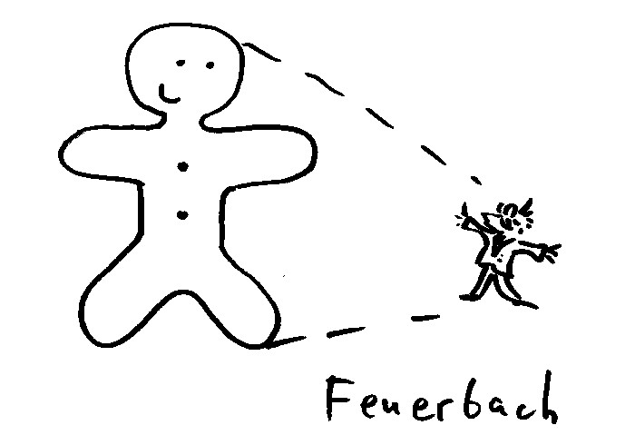
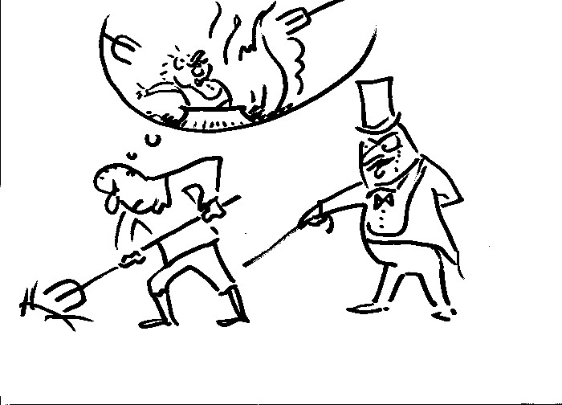

## Гипотезы происхождения религии. 

### Общие подходы к проблеме.

Антропологи и религиоведы, выдвигавшие критические гипотезы происхождения религии, имели характерные взгляды, предпосылки и мировоззренческие позиции, определившие их отношение к изучаемому предмету.

* Атеизм или скептицизм. 
    Многие исследователи придерживались атеистических взглядов, что наложило свой отпечаток на их работу. Некоторые антропологи выражали открыто антиклерикальные взгляды (например, Д. Фрэзер), другие были убежденными материалистами. Встает вопрос: как можно беспристрастно исследовать религию и получать результаты, свободные от субъективных оценок, когда само существование предмета вызывает столь сильную неприязнь и даже агрессию? 

>"Если религия есть явление в основном внутренней жизни, то из этого следует, что она может быть правильно понята только изнутри. Но не может быть сомнения в том, что это может лучше сделать тот, в чьем сознании религиозные переживания играют роль. Слишком большую опасность представляет то, что этот другой (неверующий) будет говорить о религии так, как слепой может рассуждать о цветах или лишенный слуха --- о красоте музыкальной композиции[^shm01]

* Прогрессизм или эволюционизм. 

    С самого начала основой рационалистического оптимизма были идеи прогресса и процветания человечества, водимого исключительно силой разума и науки. С появлением "Теории происхождения видов" Дарвина, идея прогресса получила развитие, найдя себе "подтверждение" в области биологии[^nt03]. Важно, что сторонники прогрессизма чаще всего настаивают на естественном характере возникновения религии (ее истоки --- в природе и деятельности самих людей). Эта позиция, конечно, соответствует точке зрения материалистов[^nt02].

* Расовые предрассудки. 

    В представлениях большинства исследователей религии белый европеец коренным образом отличался от "дикаря". Для европейца характерно рациональное мышление . Дикари --- совершенно "а-логичны", их мысль пропитана магией и мистикой. Устройство европейского общества близко к идеальному. Общество "дикарей" --- варварское, их отношения примитивны и полны предрассудков.

* Ненаучность гипотез происхождения религии. 

    Этнография не может предоставить данные, относящиеся к религиозности в доисторические времена, достаточные для построения _научных_ гипотез. Другими словами, гипотезы происхождения религии нефальсифицируемы[^pp1].

* Недобросовестность обращения с имеющимися данными. Ученые часто позволяли себе "вольности" в этом отношении. Характерными чертами для многих являются:
    * Изначально низкое качество данных (свидетельств путешественников, торговцев и миссионеров). Это замечание справедливо, например, для 12-томной "Золотой ветви" Фрэзера[^fr1].
    * Разрушение контекстов. Явление или понятие изымается из своего контекста и сравнивается с другими "похожими", по мнению автора. Пример - понятие "мана", которое было интерпретировано исследователями в смысле абстрактной, безличной энергии, которая действует в людях, животных и предметах. Факты говорят о том, что у "туземцев" "мана" не бывает безличной[^pr2].
    * Произвольный выбор фактов. Данные, противоречащие "кабинетной" гипотезе просто игнорируются. 
* Субъективность самих гипотез. Вплоть до начала XX века "кабинетные" ученые исходили не из проверенных фактов, а из своих логических построений, основанных на целом ряде предубеждений, часть из которых мы изложили выше.

Приведем гипотезы происхождения религий и их авторов в примерном хронологическом порядке[^nt01].

|Гипотеза      |Автор           |
|--------------|----------------|
|Натурализм    | Дэвид Юм       |
|Анимизм       | Эдвард Тайлор  |
|Соляризм      | Ф. Макс Мюллер |
|Ритуализм     | Джеймс Фрэзер  |
|Психологизм   | Зигмунд Фрейд  |
|Социальная    | Эмиль Дюркгейм |

Необходимо отметить, что все они были опровергнуты данными этнографии и антропологии.
В настоящее время религиоведы предпочитают не задаваться вопросом о происхождении религии, посвящая основное внимание изучению конкретных общин и их культурно-религиозного наследия.

По словам Эванса-Притчарда:

>"Первая ошибка была в простроении их (интерпретаций первобытной религии) на основе эволюционных предположений, к которым не могут быть добавлены этнографические доказательства. Вторая была в том, что, кроме того, что это были теории временной и стадиальной последовательности, они были также и теориями психологических истоков; и даже про те из них, которые мы обозначили как социологические теории, можно было бы сказать, что они основаны в конечном счете на психологических предположениях типа "если бы я был лошадью"[^prit1].

<!--- TODO: поискать в сети материал по натуралистич. и анимистич., социальн (как сделал с Фейербахом) --->

### Христианская точка зрения.

<!---TODO: консервативный и либеральный подходы--->

{width=20 height=20}      Книга Бытия говорит нам о первом опыте богопознания. Адам и Ева в Эдеме общались с Богом непосредственно, но после грехопадения это блаженное богообщение было прервано. Но знание о Боге, Творце мира было передано многочисленному потомству первых людей. Из уст Адама его внуки и правнуки cлышали рассказ о Боге, о Рае и о грехопадении.

1. Итак, первое представление о Боге человечество получило "из первых рук", как непосредственное свидетельство первых людей.
2. Каждому человеку также дано врожденное ощущение Бога и божественного, которое не было уничтожено грехопадением, хотя многие люди подавляют его в себе сознательным отвержением Бога и греховной жизнью.
3. Еще одним важнейшим источником представления о Боге является окружающая природа и сам человек (естественное откровение). Рассматривая вселенную и свой собственный внутренний мир, человек получает ясное свидетельство о Творце.
4. Сверхъестественное откровение. Для сохранения и умножения в человечестве истинного богопочитания Господь изводит от Авраама свой народ, Израиль. В нем Бог воздвиг праведников, судей, пророков, даровал Закон, для поддержания богооткровенного знания. А "в последние дни сии говорил нам в Сыне" (Евр. 1:2). Господь Иисус Христос, показав в Себе Самом Отца Небесного (Ин. 14:9), явил высшее божественное откровение всем людям.

---------

{width=20 height=20}     **Диалог:** 

{width=20 height=20}    Если человечество имеет один общий источник знаний о Боге, почему мировые религии настолько сильно отличаются друг от друга в своих представлениях о божественном? 

{width=20 height=20}      Многообразие может объясняться не только эволюцией, увеличением сложности, но и деградацией по сравнению с первоначальным общим состоянием. Одна из причин отличий --- размывание исторической памяти. Со временем от древних царств с их богатой историей остаются лишь смутные воспоминания. В случае с религией древние события тоже сохранились в памяти человечества с искажениями: это касается сотворения мира и человека и др. Например, о потопе говорят мифы и Месопотамии, и Южной Америки, и Китая. При этом детали сильно отличаются, но основные черты сохраняются. Следовательно само событие имело место в седой древности, но со временем память о нем была размыта и появились расхождения в изложении этой истории.

Это размывание повлияло и на представления о божественном. Где-то они сильно деградировали, где-то сохранились в большей полноте. Сохранность этих представлений зависела от внутреннего состояния носителей предания. Люди, подверженные, например, страсти блуда, и в других видят блудников, пьяницы --- пьяниц. И о духовных вещах они склонны судить по собственным страстям. Это привело, например, к появлению мифов о богах Олимпа.

Что же касается различий внутри единобожия, объединяющего иудаизм, ислам и христианство, то они имеют другую природу, не связанную с проблемами исторической памяти. Здесь речь идет о принятии, или не принятии Господа Иисуса Христа, как Сына Божия.

<!--
Именно об этом говорит ап. Павел: древние люди "познав Бога, не прославили Его, как Бога, и не возблагодарили, но осуетились в умствованиях своих, и омрачилось несмысленное их сердце; называя себя мудрыми, обезумели" (Рим 1:22).

Именно человеческая гордость и желание служить своим стастям приводят к идолопоклонству: люди, не стремящиеся прославлять и благодарить Творца (не только устами, но и делами) "славу нетленного Бога изменили в образ, подобный тленному человеку, и птицам, и четвероногим, и пресмыкающимся" (Рим 1:23). "Они заменили истину Божию ложью, и поклонялись, и служили твари вместо Творца" (Рим. 1:25). 
-->

<!---* Насколько стойким было древнее знание, передаваемое из поколения в поколение? История языческих религий дает ответ на этот вопрос. Религиозные представления разных народов о божественном часто разительно отличаются друг от друга. Поскольку Библия говорит о едином источнике богопочитания, такое многообразие может объясняться только серьезными искажениями древней перворелигии. Поэтому если бы единственным источником вероучения был рассказ Адама и Евы, то оно было бы полностью утеряно последующими поколениями. 
--->

<!--- TOdo: А: религий много, все они говорят о божестве по-разному. Из этого ясно, что все они ошибаются.--->

### Древняя религия.

Св. Епифаний Кипрский говорит о древнем благочестии, которое определялось естественным законом и избранием воли каждого человека в отдельности, так как писанных законов еще не существовало. Это та "вера, водворенная ныне во святой уже вселенской Божией Церкви, какая была в начале, такою и в последствии открылась снова". Адам "обнаруживал в себе черты христианства" т.к. "сотворен не в обрезании, но в необрезании по плоти; не был же идолослужителем, и знал Бога Отца и Сына и Святаго Духа, потому что был пророк. Посему, не имея обрезания, не был иудеем; не кланяясь изваяниям, или чему иному, не был идолослужителем. Ибо Адам был пророк, и знал, что Сыну сказал Отец: «сотворим человека» (Быт. 1:26)". "Так разуметь должно и об Авеле, и о Сифе, и об Еносе, и об Енохе, и о Мафусале, и о Ное, и об Евере, до Авраама"[^ep2][^ep3].

#### Появление язычества.

По мнению св. Епифания Кипрского, в период до Авраама (собственно до его отца, Фарры) еще не было идолопоклонства, но уже существовало нечестие, как непочитание Бога, плотская распущенность[^ep1].

Обращение к поклонению твари, по-видимому, происходило постепенно. Св. Григорий Богослов видит причину этого в том, что "хотя всякая разумная природа... стремится к Богу и к первопричине, однако же не может постигнуть ее"[^Gr001]. Поэтому, "истаевая желанием (постижения)..." она обращает взор на видимое, чтобы "из этого сделать что-нибудь богом"[^Gr002][^Gr005].

>"От этого-то стали поклоняться, кто солнцу, кто луне, кто множеству звезд, кто самому небу вместе со светилами... а кто стихиям: земле, воде, воздуху, огню, так как они для всего необходимы, и без них не может длиться жизнь человеческая; иные же — что кому встретилось в ряду видимых вещей, признавая богом все, представлявшееся для них прекрасным"[^Gr003].

После потопа, во времена Фарры, как считает св. Епифаний, появляется и более грубая форма язычества --- служение идолам[^ep4].

Священное Писание связывает появление идолопоклонства с почитанием родственников, вождей и героев, известных в прошлом. Со временем историческая память об этих людях была стерта временем, а их статуям стали поклоняться, как божествам[^ac1].

>"Кого в лицо люди не могли почитать по отдаленности жительства, того отдаленное лицо они изображали: делали видимый образ почитаемого царя, дабы этим усердием польстить отсутствующему, как бы присутствующему... а народ, увлеченный красотою отделки, незадолго пред тем почитаемого, как человека, признал теперь божеством" (Прем. 14:17-20).

Этой точки зрения на происхождение идолопоклонства придерживались и святые отцы[^id1].

<!---Идолослужение "не иначе изобретено... у людей, как из вожделения к воображаемому" (AthanI с137)--->

<!---"Они вошли в мир по человеческому тщеславию, и потому близкий сужден им конец" (Прем. 14:14).--->

<!--- надо сказать и тот и другой метод используется христианами --- аллегоризм в отношении эпизодов ВЗ где говорится о кровопролитии и подоб., эвхемеризм --- когда требуется обличить язычество --->

<!--Языческие культы, связанные с почитанием душ усопших, других духов (леса, воды и проч.), антропоморфных богов произошли путем искажений первоначального знания. -->

Так, по мысли св. Григория Богослова, люди, отличавшиеся особой чувствительностью и оплакивавшие смерть своих родственников, ставили им памятники, почитая память усопших. Со временем памятники особенно славных предков стали почитаться очень далекими потомками этих людей и, таким образом, потерялась связь с реальным человеком. Другие люди стали почитать какие-то человеческие качества (силу, хитрость и т.д.), а самые сластолюбивые "признали богами страсти или как богов стали чествовать гнев, убийство, похотливость, пьянство... потому что в этом находили (конечно, недоброе и не справедливое) оправдание собственных грехов"[^Gr004]. 

<!--
После рождения Христовой Церкви практически сразу начинают появляться ереси. Причины этого явления точно такие же, как и у появления язычества. Гностические секты получили свое продолжение у павликиан, затем на сцену выходят богомилы, которых сменяют кафары и альбигойцы, на смену им приходят европейские секты унитарианистов и русских жидовствующих. Последние передали семена ереси хлыстам и духоборам. Наконец, в новое время возникает целый ряд ересей (виссарионовцы, богородичный центр, ивановцы), как две капли воды напоминающих первые гностические секты. Главное, что объединяет их --- искажение Евангелия, почитание основателя секты вместо Христа, отвержение Церкви.

В смене этих сект прослеживается определенная преемственность. У богомилов, хлыстов, современных "богородичников" есть свои "христы" и "богородицы", "апостолы". Даже обряды имеют некоторые сходство с христианскими.
-->

Подтверждением этой мысли о деградации религиозных представлений является мифология многих древних народов. В древнейшем слое мифа часто содержатся сведение о божестве, сотворившем мир, но затем отошедшем в сторону[^prim1].

Отметим, что некоторые христиане соглашаются с идеей "прогресса" религиозных представлений человечества. Имеется в виду историческое развитие религии от более примитивных форм --- шаманизма (поклонения духам) и многобожия к монотеизму и пантеизму. Эта позиция обладает следующими недостатками:

* не согласуется с библейским повествованием о первых людях (например о Каине и Авеле), служивших единому Богу и противоречит святоотеческому преданию.
* Необоснованно переносит концепцию эволюции и вертикального прогресса на религиозную сферу. Ведь неразвитость обрядовой стороны религии еще не говорит о ее примитивности.

В новейшее время критиками традиционных взглядов было придумано несколько "естественных" объяснений происхождения религии.

### Натуралистическая гипотеза 

>От лат. слова "natura", природа.

{width=20 height=20}      Страх перед суровыми явлениями природы привел к изобретению человеком первых богов и первобытной религии. 

{width=250 height=300}

{width=20 height=20}     Критика: 

* Явление, внушающее страх, вызывает желание уклониться от него, а не поклоняться. Человек многого боялся, но не все обоготворял (часто --- безобидные предметы: камень, дерево и подобное)
* Первобытный человек субъективно ощущал свои познания вполне достаточными для объяснения окружающего мира (пример с дикарем в лесу --- племя кубу с о. Суматра).
* С развитием науки человек научился объяснять окружающие явления с большой точностью. Тем не менее, религия не перестала существовать. (Верующие ученые: Паскаль, Декарт, Мендель, Павлов, Планк)

> Напротив: при существующем религиозном чувстве, человек способен "обоготворять" даже неодушевленные предметы.

### Анимистическая гипотеза 

>От латинского слова "anima", душа.

{width=20 height=20}      Источник человеческой религиозности --- измененное состояние сознания вроде сна, комы (или сходные вещи). 

{width=250 height=300}

{width=20 height=20}     критика: 

* Аргументы А.И. Осипова:
    * все человечество сошло с ума, спутав сон с реальностью?
    * как такое неразвитое сознание (не отличает сна от реальности) способно дойти до абстрактной идеи бытия Божия и твердо ее удерживать на протяж всей истории?
    * принятие сна (грез) за реальность и религиозное отношение к нему --- разные вещи.
    * человеку присуще недоверие к снам (снится, что наелся, а проснувшись по-прежнему голоден)
    * всеобщность религии в человечестве.
* опыт говорит о реальности потустороннего мира
  В этом случае шаманизм и другие формы контакта с этим миром --- вовсе не причина появления религии, а обстоятельства, послужившие _оформлению_ религиозности. 

* это может быть и ложный опыт, связанный с особенностями измененного сознания, но объяснять этим происхождение религии неразумно.

{width=20 height=20}      Последние исследования деятельности мозга (например, связь трех ступеней измененного сознания в шаманизме бушменов с наскальными изображениями, имеющими религиозный характер) вроде бы подтверждают эту гипотезу. 

{width=20 height=20}      То, что волны мозга меняют частоту (а религиозные практики, напр. чтение мантры могут быть с этим связаны) не опровергает того, что человек может взаимодействовать с иным миром (ведь бывают случаи, когда такому воздействию подвергается нерелигиожный человек). Алкоголики видят бесов, тяжелобольные и умирающие видят "усопших родственников", становятся свидетелями других видений. Все это признаки истончения преграды, отделяющей человека от иного мира. Одним словом, есть факты, а есть интерпретации. Мы имеем право не соглашаться с атеистическим объяснением. 

### Гипотеза Фейербаха 

{width=20 height=20}      Бог --- проекция человеческих желаний. Религия --- поклонение человека самому себе. 

{width=350 height=400}

{width=20 height=20}      Концепция: 

* Бог как существо, удовлетворяющее все наши желания и мечты.
* Желание → фантазия (проекция) → ложные представления (иллюзии)

Мы желаем такого существа, и оно нами придумывается. Например: учение о Воскресении --- отражение желания человека быть непосредственно уверенным в собственном бессмертии. Получается Библия "наоборот": "человек создал Бога по своему образу и подобию".  Бог --- человеческое желание, исполненное и поддерживаемое иллюзией, а религия --- отражение в сознании самого сознания и всей действительности.

{width=20 height=20}      Критика: 

* Контекст идей Фейербаха --- идеи Шлейермахера: его богословская система строится на анализе человеческого опыта, (особенно опыта зависимости). Шлейермахер ставит реальность Бога в зависимость от религиозного опыта верующего.
* Подход Фейербаха --- критика идей Шлейермахера (как будто богословие сводится только к этим идеям):
    * Шлейермахер: Бытие Бога коренится в человеческом опыте (переживаниях, чувствах).
    * Фейербах: Но это может быть опыт не внешний, а опыт, переживание **нас самих**. Мы можем сами проецировать свой опыт и называть это "богом", в то время как на самом деле "переживаем" свою собственную человеческую природу.
        * однако традиционное богословие говорит о том, что вера, религия --- ответ не на человеческий опыт, переживания, а на реальное взаимодействие с Богом. Карл Барт показал слабость позиции Шлейермахера. 
        * Прежде радости искупления и воскресения необходимо пройти через покаяние, осознание греха. Проекция человеческих желаний, как объяснение всего религиозного опыта не вяжется прежде всего с этим аспектом религии.
        * Фейербах странным образом вообще "проглядел" религиозную идею греха (если Бог --- только фантазия, то откуда у человека идея греха (вины) перед этим выдуманным существом). Фрейд придумал, как выйти из положения (Эдипов комплекс, см. ниже).
* Фейербах обобщает все религии. Но, напр. Тхеравада, старейшая форма буддизма вообще не признает бытия какого-либо бога. Как же объясняется происхождение этой религии? 
* Это всего лишь гипотеза, не подтвержденная научными данными, серия догматических утверждений. Нефальсифицируема (ее невозможно опровергнуть в принципе), т.е. ненаучна. Фрейд попытался создать научную опору для этой гипотезы, но потерпел неудачу.
* По Фейербаху получается, что **Атеизм можно считать проекцией человеческих желаний** (надежд). Надзиратель в концлагере Треблинка, вероятно, желал бы, чтобы никакого бога не было (и ему не пришлось бы отвечать за содеянное).
* Основа гипотезы Фейербаха --- порочная логика:
    * Не все, чего мы желаем, существует
    * Бог --- то, чего мы желаем (представляем, фантазируем)
    * Бог не существует.
* Однако:
    * То, чего мы желаем может и существовать. Например из-за того, что человек создан по образу и подобию Божию, он тянется к Источнику своего бытия, желает с Ним соединиться.
    * Надсмотрщик в концлагере желает, чтобы Бог не существовал. (Получается, что атеизм --- религиозный феномен по Фейербаху).
<!---     * Друга форма: --->
<!---         * У человека много желаний --->
<!---         * Некоторые вещи, которых мы желаем, неосуществимы (напр. стать бесконечно сильным) --->
<!---             * они неосуществимы для человека! Принципиально может существовать бесконечно сильное существо, или параллельная вселенная. --->
<!---         * Бог --- проекция наших **неосуществимых** стремлений, желаний  --->
<!---             * Не доказано. Наоборот, наличие в человеке неосуществимых желаний можно рассматривать как доказательство существования Бога. --->
<!---             * Сотворение человека по образу и подобию Божию => неосуществимое для человека желание совершенства. --->

* Критика гипотезы Фейербаха из книги А.И. Осипова:
    * Религия как проекция --- по сути смешивание реальности и внутреннего мира. Это равнозначно обвинению всего человечества в сумасшествии. "Человек вымысел фантазии считает реально существующим предметом и постоянно вплетает его во все отношения своей жизни". Кудрявцев-Пл
    * Создание абстракций и вера в их существование --- разные вещи. 
    * Гипотеза годится для объяснения деградации религии, а не ее возникновения. Влияние человеческих комплексов, страхов, вожделений способно повлиять на религиозные взгляды, но 

#### Версия Фрейда. Психогенез религии. 

Идеи Фейербаха в наши дни больше известны в интерпретации Фрейда.

{width=20 height=20}      Для Фрейда религиозные идеи --- иллюзии, исполнение древнейших и наиболее сильных желаний человечества.
<!--- (цитата?)  --->

По Фрейду сны --- сильные желания, подавленные сознанием и перемещенные в подсознание
(отсюда понятие "психогенезис религии"). Религия --- искаженная форма обсессивного невроза. (Поведение некоторых пациентов напоминало исполнение религиозных обрядов).

Фрейд выделяет два слоя религии: 

* Общественный
    * Якобы имело место ужасное событие, произошедшее на заре человеческой истории: фигура отца, доминирующего над всеми самками. Убийство отца сыновьями, которые становятся носителями этой гнетущей тайны и вины, которое передалось потомкам (т.н. "Эдипов комплекс")
    * Религия имеет в своей основе эту вину, а обряды и ритуалы --- способ сгладить ее.

Эта гипотеза выглядит неубедительно (нет и не может быть научных методов, способных выяснить, имело ли место "древнее отцеубийство"). Поэтому атеисты в основном апеллируют ко второму слою:

* Индивидуальный (личный)
    * Бог --- фигура отца, только преувеличенная 
        * Подтверждение этой идеи видят в том, что религиозная вера молодых людей часто разрушается с падением авторитета отца. 
        * В детстве человек, переживая страх наказания со стороны отца, отвечает почитанием, ассоциирует себя с ним ("хочу быть сильным, как папа!") и проецирует то, что он знает о воле отца как супер-эго, сверхволю.
        * Религия --- незрелый ответ на трудности жизни, подсознательное обращение к детсткому опыту (папа меня защитит)

{width=20 height=20}      Критика: 

* Несомненно влияние на Фрейда работ Smith'а[^3], который говорил о том, что сущность религии --- не в учениях и догмах, а в сакральных действиях, обрядах, культе. Как уже было сказано, *в настоящее время ритуализм отброшен учеными, как неверная гипотеза.* Т.о. опровергнуто само основание рассуждений Фрейда.
* Фрейдовская теория психогенезиса религии предшествует его исследованиям религии. Биограф Фрейда, Эрнст Джонс, выделяет письмо, в котором тот ворчит, что ему приходится читать массу литературы по религии и замечает, что это довольно бессмысленно, поскольку он уже инстинктивно знает ответ. "Я читаю книги, не испытывая к ним реального интереса, поскольку я уже знаю результат; мой инстинкт говорит мне об этом"[^jns1].

>Т.о. **атеистические взгляды Фрейда предшествуют его исследованию религии**, а не являются его результатом.

* Гипотеза Фрейда нефальсифицируема (ее невозможно опровергнуть в принципе), поэтому она ненаучна. Фрейд не дал гипотезе Фейербаха доказательную базу. В редких случаях, когда гипотезу можно проверить, в общем считается, что она неправильна. Например, перекрывание понятий Бог и отец происходит только в том случае, если отец --- предпочитаемый родитель, в то время как большинство людей "моделируют" представления о Боге по матери[^4]. 

>Итак, вопросы атеисту:

* Откуда произошли взгляды Фрейда: из научных фактов, или из его атеистических предрассудков?
* Где историческое доказательство того, что христианство происходит от "Эдипова комплекса"? (Фрейд помещает "отцеубийство" в доисторическую эпоху, никаких материальных следов этого найти невозможно). Кстати, в этом есть сэксизм: женщины подчиняются давлению мужчин (ведь эта "вина" --- мужская, а религиозными становятся и женщины).
* Почему христианам нужно отказаться от своей веры, следуя гипотезе, основанной на логической ошибке?

### Гипотеза ритуалистов.

Тяга человечества к очищению от скверны, отмеченная Харрисон в древнейших "хтонических" мифах, --- та основа, которой Бог воспользовался для спасения человека. Жертвоприношение, стоящее в центре религиозного сознания --- жест отчаяния, попытка примириться с Небом пусть даже и страшной ценой смерти. Человечество мыслит в категориях покаяния и жертвы. Это то, что человек способен принести Богу. Поэтому Христос отвечает на этот покаянный вопль и завершает путь человечества, принося Свое Тело и Кровь как совершенную Жертву за весь мир.

Таким образом, не отрицая связь (культурную и религиозную) христианства с древней традицией жертвоприношений, мы утверждаем принципиально новую суть Жертвы Христа.

Евангелие повествует о том, что Господь сам избрал пасхальную вечерю (пасхальный агнец --- еврейская очистительная жертва) как форму воспоминание своих страданий (Лк. 22:19), (1 Кор. 11:24-25). Это сознательный акт искупления, а не вынужденное следование "традиции". Жертва Христова --- ответ на вопль человечества об очищении, жертва совершенная и окончательная.

В центре представлений Фрейзера и ритуалистов --- человек-дикарь, мышление которого в корне отлично от нашего. Это постулат, который не подвергается сомнению.

Основная причина поражения ритуалистов - их учение больше не является передовым в науке. Эволюционизм в области религиоведения "вышел из моды".

#### Сходство языческих мистерий с Евхаристией.

Тема умирающего и воскресающего Бога, присутствующая в древних мифах, привлекла внимание ритуалистов, сделавших ошибочные выводы о мифологическом происхождении Евангельских повествований о Воскресении Христовом.

* Как уже говорилось, Господь Иисус Христос сам избрал этот путь, предсказывая, что Сыну Человеческому предстоит быть убитым и воскреснуть в третий день. Т.о. добровольное страдание за весь человеческий род, а не следование языческим традициям является основным смыслом Креста и Воскресения.
* Сходство с языческими мистериями --- поверхностное. Но и это внешнее сходство можно объяснить тем, что мистерийные обряды также, как и древняя традиция жертвоприношений, являются "воплем человечества о спасении". В Ветхом завете содержится множество прообразов, предзнаменований и пророчеств о совершенной Жертве Спасителя. 
<!--Нужна цитата из о Василия-->
* Эниавтос-дэмон греческих мифов символически умирает каждый год, а жертва Христа - единственная и уникальная, реально произошедшая в истории.
* В начале XX века Эндрю Лэнг и другие исследователи опровергли гипотезу Фрэзера о стадиях в развитии религии (магия → религия → наука). Даже у самых примитивных людей есть знание Бога, создателя и судии людей. Следовательно, мы должны говорить не об "эволюции" религиозных идей, а об их "деградации". От чистой жертвы Авеля и первых людей человечество, "наученное демонами" обратилось к кровавым языческим жертвам Хананеев, Карфагенян, жутким обрядам друидов. 

### Социальная гипотеза 

Эта гипотеза --- эклектическая (смешанная): Натуралистическая + Фейербаха + Марксистская теория общественных отношений.

{width=20 height=20}      Религия --- не изначальное явление в человеческом обществе, возникла лишь на определенной ступени разивития, сформировалась благодаря классовым отношениям 

Возникновение религии обусловлено:

* социальным фактором: в первобытном обществе --- чувством бессилия человека в борьбе с природой, в классовых обществах --- чувством бессилия перед социальным гнетом.
* гносеологическим фактором: способность человека к абстрактному мышлению приводит к возникновению в сознании _фантастических отражений реальной действительности_.

{width=350 height=400}

{width=20 height=20}      Критика: 

* Религия --- древнéе социального гнета. История классового общества исчисляется максимально 6 тысячами лет.
* Наука не знает никакого "дорелигиозного" состояния человека. Возраст неандертальцев согласно научным данным --- не старше 150 тыс. лет, а Homo sapiens --- 30-40 тыс. лет. Согласно данным археологии неандертальцы уже обладали зачатками религиозного сознания (украшение могилы цветами), а религиозность кроманьонцев (наши непосредственные предки) ни у кого из ученых сомнений не вызывает.
    * Отсутствие религии, например, у австралопитеков не должно вызывать удивления, так как вопрос о их "человечности" по-прежнему открыт. Точно также неудивительно отсутствие религии у современных шимпанзе и горилл.
* Бессилие и страх человека перед силами природы --- миф, созданный кабинетными учеными. Эта часть аргументации разобрана в разделе "Натуралистическая гипотеза".
* Возникновение фантастических отражений в сознании человека, обусловленная способностью его к абстрактному мышлению --- повторение гипотезы Фейербаха (см. критику в соответствующем разделе). 

Дополнительные соображения: 

* "Ночь тысячелетий" --- наука ничего не может сказать о состоянии психики человека в древнейший период истории. Предположения Фейербаха --- фантазии.
* Религия, по всей видимости, --- древнее развитого абстрактного мышления человека. Даже некоторые современные племена не имеют развитых абстрактных понятий (напр., есть слова, обозначающие укусы разных животных, но нет слова, означающего "укус" вообще), но им (как и древним людям) известны такие понятия, как "Бог", "дух", "душа", "ангел". 
* Социальная гипотеза содержит противоречие: либо первобытный человек --- примитивный дикарь, не имеющий абстрактного мышления, боящийся суровых явлений природы, либо он --- "философ со смелым, оригинальным умом" (см. соответствующую главу в книге проф. А.И. Осипова), способный осмысливать и создавать весьма отвлеченные понятия.

### "Инопланетная" гипотеза  

{width=20 height=20}      Согласно этому представлению, непосредственный контакт с "пришельцами" стал источником представлений о "божественных" существах. 

{width=350 height=400}

{width=20 height=20}     критика (по сравнению с теистическим представлением): 

* Эта гипотеза вторична --- идея позаимствована у (поли)теистов. 
* Для нее характерно приниженное представление о божественном, по сравнению с теизмом.
* Гипотеза не объясняет происхождение мира 
* Не объясняет происхождение человека. Остается открытым вопрос о происхождении свободы воли и стремления к совершенству.
* Не предъявляет нравственных требований к человечеству. Страстные, человекообразные "боги-пришельцы" не имеют морального авторитета, а потому не могут требовать от человека соблюдения нравственных правил. Это не говоря о случаях, когда "пришельцы" и вовсе предстают в образе жутких монстров, уничтожающих все живое. У этой псевдо-религии начисто отсутствует нравственный компонент.

Следует отметить, что образ "пришельцев", созданный средствами масс-медиа очень напоминает богов политеизма. Эти персонажи точно также не могут претендовать на всемогущество, чаще руководствуются своими собственными эгоистическими интересами и страстями, потенциально даже представляют угрозу для человека. 

Все это, с одной стороны, указывает на все более низкое падение религиозной культуры современного человека. Языческие боги наказывали людей за безнравственные поступки. Но "религия пришельцев" не несет никакой нравственной нагрузки. Это по сути --- один из развлекательных проектов, отвлекающих человечество от подлинной религиозности.

С другой стороны, пример "пришельцев" показывает, что и в наш век технического прогресса и великих научных открытий человек по-прежнему нуждается в религии и создает современную версию язычества из "подручных материалов" и по своему вкусу. Отвергая традиционную религиозность, он создает новую, которая на поверку оказывается повторением старых языческих мифов в новой обложке.

"Факты", которые представляют сторонники этой гипотезы (т.н. "мегалитические конструкции", "полигональная кладка" и т.п.) совершенно не обязательно подтверждают существование пришельцев. Возможны другие объяснения. Во-первых, с высоты технических достижений нашего времени мы склонны недооценивать эффективность ручного труда и действенность человеческой смекалки. 
Во-вторых, нельзя исключать и деятельность падших духов, с которыми древние язычники довольно плотно общались.

Итак, инопланетная гипотеза происхождения религии не выдерживает критики.
<!---  todo: Выводы по инопланет гип и общие --->

Подведем итоги этой главы:

* Критики христианства создали множество гипотез, пытаясь объяснить происхождение религии. Каждая из них обладает рядом серьезных недостатков.
* Христианское объяснение происхождения религии, хотя и подвергается критике, по-прежнему является убедительным, отвечая на ряд "трудных вопросов": о происхождение мира и человека, о сущности нравственного закона, смысле жизни и других.
* Представляется очень важной мысль, высказанная св. Григорием Богословом о том, что язычество появилось как результат отчаянных поисков Бога падшим человечеством и о том, что демоны пользуются этой тягой, склоняя людей к идолопоклонству и другим мерзостям.

[^3]: См. @RobRel
[^4]: См. @Spilka
[^ac1]: Такое представление получило в науке название "эвхемеризм" по имени греческого писателя, передавшего рассказ о посещении острова, где он слышал о человеческом прошлом языческих богов. См. @Acker, p. 3
[^id1]: св. Афанасий Великий, св. Григорий Богослов, св. Епифаний Кипрский.
[^ep1]: "До сего времени продолжалось какое-то скифское преемство и именование, и не было еще никакой ереси, никакого другаго ухищрения, кроме только блужения — примышления идолов. После сего или злосчастных самовластителей, или чародеев, мечтами обольстивших вселенную, стали боготворить, почтив их памятники, и по прошествии многаго времени обоготворили Крона и Дия, Рею и Иру, и их окружающих". Epiph., 1.177-178
[^ep4]: "С сего времени (Фарры) произошло делание кумиров лепной и скудельной работы, при помощи Фаррина в этом искусстве". Panarion, SC 2021:002, TLG 1.177-178
[^ep2]: Epiph. Panarion, SC 2021:002, TLG 1.174-175
[^ep3]: Святитель Епифаний разделял древнюю религиозную историю человечества на четыре периода: "варварство", "скифство", "эллинизм" и "иудаизм".
[^Gr001]: Greg. Naz. De Theologia (or. 28) SC 2022:008, TLG 13.20
[^Gr002]: Greg. Naz. 13.20-25
[^Gr005]: "Он (лукавый), чтобы привлечь людей под власть свою, воспользовался их неверно направленным стремлением найти Бога и, обманув в желаемом, водя как слепца, ищущего себе пути, рассеял их по разным стремнинам и низринул в одну бездну смерти и погибели". Greg. Naz. 15.20
[^Gr003]: Greg. Naz. 14.1-5
[^Gr004]: Greg. Naz. 15.1
[^prim1]:  Об этом говорится в мифах Угарита, индийских Ведах. По некоторым сведениям, африканские бушмены ("сэн", племя, сохранившее до наших дней древний родовой уклад) сохранили сведения о Боге-отце только в традиции жрецов (непосвященным запрещается раскрывать эзотерические сведения, "лаики" знают только поклонение духам пустыни, охоты и проч.)
[^jns1]: @Jones, p.123.
[^shm01]: Schmidt W. The Origin and Growth of Religion. 1931, p.6, цит. по: @Pritchard, С. 121
[^nt01]: Оговорюсь, что это лишь схематические соответствия. Становление этих гипотез конечно не связано с именем только одного автора.
[^nt02]: Не будем забывать о возможности христианского взгляда на эволюцию.
[^nt04]: Так Пьер Бэйль (Pierre Bayle, 1647-1706) впервые установил связь между греческими мифами и традициями современных "дикарей". Будучи сторонников эвхемеризма, он настаивал, что в древности мифы воспринимались языческой аудиторией просто как "сальные" истории (что-то вроде современных анекдотов).
[^prit1]: @Pritchard, С. 109
[^pp1]: Критерий Поппера позволяет назвать научной лишь ту гипотезу, которую можно опровергнуть (фальсифицировать).
[^nt03]: Настойчивые попытки применения идей эволюции в областях, далеких от биологии (напр. исторической науке, религиоведении) заставляют усомниться в беспристрастности исследователей, поддавшихся этой моде.
[^pr2]: "...Ясно, что в туземных языках слово _мана_ не означает безличной силы, т.е. не имеет того, почти метафизического смысла, который Маретт и другие (например, Кинг, Пройс, Дюркгейм, Юбер и Мосс) в него вложили, использовав неточную этнографическую информацию". @Pritchard, С. 40.
[^fr1]: "Фрэзер подвергся нападению в особенности в том отношении, что использование им источников было некритическим, в том смысле, что он без разбора использовал данные, добытые миссионерами, путешественниками и купцами, чьи наивные, чопорные и этноцентричные предрассудки серьезно искажали их отчеты о "туземцах", которых они описывали". @Acker, p. 46

\newpage
