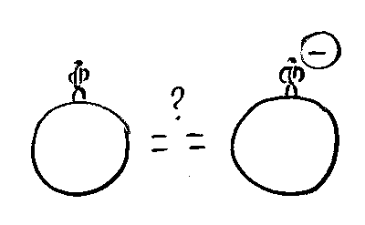

## Вопрос о существовании сознания. 
<!--- = The hard problem of conciousness = --->

ἡ σύνεσις - (др. гр.), букв. со-знание. 

<!--- от  συνίημι - соединять (позд. - понимать) --->

<!--- Человек способен осмысливать свое восприятие мира (опыт опыта) --->

### Проблема объяснения **опыта**: 

>Каким образом некоторые организмы могут быть подвержены опыту (переживанию)?

>Почему вообще существует ощущение чувственной информации (данной в чувствах)?

>Почему существует субъективный компонент существования?

>Почему мы не являемся "философскими зомби"?

### Философский зомби (p-zomby) 

Представим себе существо, которое вовсе лишено самосознания, но внешне неотличимое от обычного человека: оно полностью копирует все реакции, говорит, отвечает.

### Зачем нам понадобилась концепция p-zomby? 

<!--- * Бихевиоризм, физикализм - материалистическое объяснение сознания. --->

{width=20 height=20}     Физикализм (материализм) утверждает, что все факты сознания - следствия физических фактов (процессов, протекающих в головном мозге).   

Т.е. помимо физических процессов (взаимодействие нейронов и т.п.) больше ничего нет (например, нет никакой "души", нефизической субстанции).

{width=20 height=20} {width=20 hight=20}    Для того, чтобы опровергнуть это утверждение, можно воспользоваться мысленным экспериментом **Чалмерса**: 

* Допустим, что существует точная **физическая** копия нашего мира (все элементарные частицы на тех же местах и т.п.). Из мнения физикалистов следует, что такой мир будет не только **физически**, но **полностью** тождествен нашему (т.к. физикалисты считают, что кроме физических фактов и процессов в нашем мире больше ничего нет).
* Однако, мы можем себе представить мир (точную физическую копию нашего мира), в котором все люди лишены самосознания (только имитируют поведение людей нашего мира, обладающих самосознанием), т.е. являютя философскими зомби.
* Такой мир не тождествен нашему: в нашем мире у людей есть самосознание (по крайней мере, "я сам" уверен, что обладаю им) . Следовательно, физическая копия нашего мира не обязательно тождественна нашему миру. Следовательно изначальная посылка о физическом происхождении сознания - неверна. 

{width=250 height=300}

* Прямым следствием опровержения Чалмерса будет **невозможность создания искусственного интеллекта** в смысле самосознания, подобного человеческому. Если суждение физикалистов о жесткой связи фактов сознания и физических фактов неверно, то физическая копия человеческого мозга не является его полной копией (не содержит сознания). Мы можем создать машину, имитирующую самосознание, но само сознание создать не можем.
* Верно и обратное - если все-таки можно создать машину, обладающую самосознанием - материалисты правы. Остается проблема с доказательством наличия у машины подлинного самосознания (это может быть великолепная имитация).
* Сознание можно воспринимать как характеристику души ("разумная душа").

*Выводы:*

* Мысленный эксперимент Чалмерса показывает, что, вероятно, наш мир не сводиться к чисто физическим явлениям. Может оказаться, например, что физическая копия нашего мира не содержит не только сознания, но и, например, религиозного опыта, который переживается нами не на физическом уровне, а на духовном, хотя внешне может казаться, что "люди-копии" молятся Богу.

{width=20 height=20}     Важный факт: **Опровержение Чалмерса принимается большинством психо-физиологов**.    

\newpage
