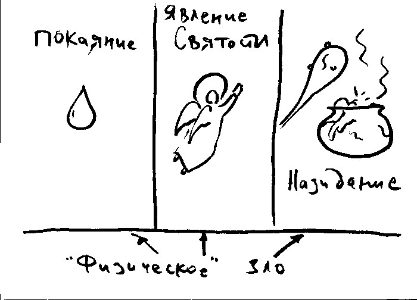

## Проблема зла 

<!--- === В общем виде: === --->
{width=20 height=20}      Формулировки проблемы зла атеистами: 

* Логическая форма:
    * Существует всеблагой, всеведущий и всемогущий Бог
    * Существует зло
    * Первое и второе положения --- взаимоисключающи

Другими словами: если существует благой и всемогущий Бог (который знает все, может и хочет уничтожить зло), то зло в мире существовать не может. Тем не менее, мы постоянно сталкиваемся со злом. Следовательно Бог теистов не существует (Бог на самом деле не благой, или не всемогущий, или не всеведущий). Либо не существует никакого Бога.

* Вероятностная форма
    * Допустим, существует всеблагой, всеведущий и всемогущий Бог
    * Возможно, у Бога есть причины допускать существование зла
    * Однако, количество и характер существующего в мире зла делает существование Бога неправдоподобным и маловероятным.

{width=20 height=20}              Классический теизм предлагает следующие варианты ответа на этот вопрос[^ev1]:

Ответ на 1й тип критики:

* Бог имеет оправдания для допущения зла
* Изложение причин существования зла, доказательство их весомости. 

Ответ на 2й тип критики:

* У Бога есть причины допущения зла, которые мы не знаем и не можем знать 
* Можно представить возможные причины (не заявляя, что они необходимы для Бога), по которым допускается сущестование зла,

#### Логическая формулировка "доказательства небытия Бога" (подробный ответ) 

{width=20 height=20}              В рассуждениях атеиста есть скрытые посылки:  

* благая Сущность всегда устраняет зло настолько, насколько это возможно
* для всемогущей Сущности нет пределов того, что Она может сделать
* *благая, всемогущая Сущность устраняет зло*
* существование благой всемогущей Сущности и существование зла несовместимы
* зло несомненно существует
* Бог не существует.

<!---   (Mackie J.L. Evil and Omnipotence P. 173) --->
{width=20 height=20} {width=20 hight=20}   Опровержение обычно направлено против положения "благая сущность всегда устраняет зло насколько это возможно".  

*Пример*: солдат закрывает своим телом вражескую гранату. Допущено зло - смерть солдата, но этим предотвращается большее зло - смерть его товарищей.

Мы можем утверждать, что благая Сущность всегда устраняет зло, если:

* не теряется большее благо (greater good). На этом строится большинство современных теодицей.
<!---  Напр. в фильме "Hot Fuzz" (Типа крутые легавые) преступная клика, состоящая из именитых горожан-убийц, одетых в черные балахоны, скандирует "For greater good, for greater good!" (т.е. "ради большего блага"!). --->
* не допускается худшее зло

{width=20 height=20}     Но этот принцип применим только к ограниченным существам. А Всемогущий может сделать так, чтобы граната не взорвалась, или исцелить всех пострадавших.

{width=20 height=20}     Причина ошибки заключается в неправильном понимании всемогущества. Всемогущество Бога --- это не способность сделать _все что угодно_. Например, Бог не делает того, что логически невозможно (2+2=5). Такие состояния вещей не являются *действительно возможными*.

{width=20 height=20}     **Воспитательная теодицея**    

Вводим термин *"благо второго порядка"* --- благо, которое было бы логически невозможно без существования некоторого количества зла. 

Например, смелость непредставима без возможности претерпеть вред, а сочувствие --- без страданий других людей.
<!---     * Можно привести пример прпмуч. Ефрема, который в ответ на просьбу исцеленной помочь и другим женщинам сказал: "Как же они покажут свою любовь ко Христу?"  --->

* Большая часть зла в мире (речь о физическом зле, --- страданиях и смерти) необходима для того, чтобы люди могли взращивать свои нравственные добродетели (блага второго порядка).
* Эти добродетели обладают настолько большой ценностью, что оправдывают существование зла.
* Мiр --- среда, делающая возможным и способствующая нравственному и духовному развитию человека.

{width=20 height=20}     Проблемы воспитательной теодицеи:  

* не все виды естественного зла способствуют большему благу (страдания животных: молния попадает в олененка, который долго и мучительно умирает, все происходит без свидетелей). Кажется, что большее благо, которое оправдывало бы такое зло, не существует.
* из существования зла, кроме блага второго порядка, происходит *вторичное зло* (трусость и озлобленность как результат существования боли и страданий)

Отсюда вытекает необходимость дополнительных объяснений:

{width=20 height=20}     Зло --- результат неверного использования человеком свободной воли, результат человеческой порочности.

{width=20 height=20}     Тогда почему Бог дал свободу воли, и позволил столь злонамеренно ей воспользоваться?

Представим себе отца, который дал пистолет сыну (про сына известно, что он способен на самоубийство). Вина за случившуюся трагедию в таком случае ляжет и на отца. В этой аналогии отец --- Бог, сын --- человек, пистолет --- свободная воля, а самоубийство --- грехопадение.

Итак, то, что Бог дал человеку свободу воли, делает Его соучастником грехопадения и появления зла в мире.

{width=20 height=20}     Существо, лишенное свободной воли --- "робот", не способный нарушить заданную программу. Ценность "робота" заведомо ничтожна по сравнению со свободной личностью, добровольно избирающей благо. 

Поэтому свобода воли является очень значительным благом, перевешивающим возможность зла.

Таким образом, дар свободной воли подразумевает и серьезный риск, и великое благо: появление свободного существа, способного добровольно любить Бога и служить Ему.

{width=20 height=20}    Почему Бог не создал мир, в котором все существа, обладающие свободной волей --- праведники? 

Перед Богом не стоял жесткий выбор создания либо "робота", либо существа, способного иногда творить зло, а иногда - добро. 

Возможные варианты:

1. Мир "роботов", лишенных свободной воли.
2. Мир, в котором некоторые существа, обладающие свободой воли, избирают зло.
3. Мир, в котором все существа, обладающие свободой воли, избирают добро.

Почему Бог не реализовал третий вариант, а остановился на втором?

{width=20 height=20}     Апология Альвина Плантинги: {width=20 height=20}

Логически возможно существование в одном мире Всеведущего, Всемогущего, Всеблагого Существа и, при этом, существование нравственного зла.

Для доказательства этого положения Плантинга воспользовался разновидностью модальной логики, предполагающей существование бесконечного количества миров (в качестве мысленного эксперимента)[^5].

Рассматривается следующая модель:

* Есть ряд возможных миров, с существами, наделенными свободной волей.
* Неизбежно в каждом из таких возможных миров хотя бы одно из существ избирает зло[^note112].

Данная модель возможна и не противоречива. Мы имеем право считать, что наш миропорядок соответствует именно этой модели. Из этого следует, что какой бы мир не был реализован, в нем либо не будет существ, обладающих свободной волей, либо будет присутствовать зло.

Другими словами:

* Есть потенциально возможные миры, которые не может актуализировать даже Всемогущее Существо [^leib1].
* Мир с нравственно свободными творениями, поступающими только нравственно --- один из таких нереализуемых миров (вероятно, нереализуем также мир, где нет процессов, где не действуют никакие законы и т.п.)

<!--- Пример Плантинги, не понял: --->
<!--- Взятка в 20т. долларов. Карл может взять, а может не взять (30 бы взял) --->
<!--- Если истинно первое (взял), то существование второго - невозможно. --->

Следует еще раз обратить внимание на то, что упрощенное понимание свойства всемогущества Бога приводит к нежелательным результатам. Необходимо настаивать на том, что одни свойства Бога не могут противоречить другим (например всемогущество Бога не может вступать в противоречие с Его премудростью).

<!--- {width=20 height=20}              Защита, не теодицея (оправдание):   --->
<!--- Можно смоделировать "возможное состояние дел", которое, если актуально, могло бы сделать совместимым существование Бога и зла. Концепция зла как результата действия свободного, разумного, погрешимого (fallible) человеческого существа позволяет это. --->

<!--Таким образом, есть вещи, которые Всемогущий Бог не мог сделать, все же оставаясь Всемогущим. Например, если Всемогущий Бог имеет *необходимое бытие*[^ont1], Он не мог бы создать мир, в котором *не* существует[^note111]. Поэтому Бог не мог создать любую Вселенную, которую можно себе представить.-->

Можно также предположить, что мир, задуманный Богом (Царствие будущего века) еще не раскрылся, не актуализировался во всей полноте. Поэтому вообще бессмысленно сравнивать текущее состояние мира с другими возможными мирами.

<!--- === Три варианта объяснения естественного зла === --->
<!---  --->
<!--- # Объединение, напр. с воспитательной теодицеей (остается проблема некоторых видов зла - напр смерть животных, не связанных со свободной волей человека --->
<!--- # Естественное зло - результат деятельности Сатаны и демонов. --->
<!--- # Естественное зло - следствие морального зла. (вар. - Божественный приговор человеческому роду)  --->

### Вероятностная форма атеистического "доказательства" 

{width=20 height=20}     Признаем, что существование Бога и зла в одном мире не является логически противоречивым, но при существовании некоторых видов зла и с учетом его количестве в мире существование Бога представляется невероятным.    

На самом деле это высказывание --- ответ на концепцию "большего блага" (greater good). Атеисты считают, что существующее в мире зло *бессмысленно*, оно не ведет ни к какому "большему благу":

* Если Бог существует, Он не допускает существование никакого *бессмысленного* зла
* Вероятно в мире существует определенное бессмысленное зло
* Следовательно, Бог, вероятно, не существует.

{width=20 height=20}              Важное замечание Апологета: нам *кажется*, что существует *бессмысленное* зло. На основании этого впечатления человек делает вывод о несуществовании Бога.

* **Возражение 1** (защита от человеческой ограниченности познания):

Человек заходит в гараж, включает свет и заявляет: "кажется, собак в гараже нет" (оправданное заявление). Но если он говорит: "кажется, мух в гараже нет" --- заявление не оправдано (для его обоснования недостаточно только поверхностного осмотра).

Вывод: заявление "кажется нет никаких N" является неоправданным, если есть основания считать, что человек в данном когнитивном состоянии не был бы способен заметить какие-то N, если бы они присутствовали. 

* Отсюда:
    * Бог всеведущ, обладает огромным объемом знания о зле и его отношении к добру. 
    * В случае любого предположительно бессмысленного зла, если бы у Бога было объяснение для допущения этого зла, мы скорее всего не смогли бы его воспринять (Знаменитое "Антоний, внимай себе!")

* **Возражение 2** (перевернутая "вероятностная форма" атеистов)
    * Если Бог существует, Он не допускает существования никакого бессмысленного зла
    * Вероятно Бог существует
    * Следовательно, вероятно, в мире нет бессмысленного зла

---------------------

В целом для теиста существование зла является затруднением (мы не вполне понимаем, почему Бог допускает его существование), но это затруднение не является решающим.

Если человек осознал Бога как любящее и благое Существо, у него есть серьезные основания считать, что у Бога есть причины допускать существование зла, даже если у человека нет никакого представления об этих основаниях.

Существование зла может считаться испытанием веры человека в Бога.

Подробнее о христианском взгляде на проблему зла говорится в главе, посвященной учению св. Василия Великого.

[^5]: Подробнее см. @PlantAT
[^ev1]: Существуют также ответы на этот вопрос, которые не устроят классического теиста, христианина: зло - иллюзия (пантеизм, панентеизм); допущение ограниченность Бога в силе, знании, благе, или во всех трех свойствах (теология процесса).
[^leib1]: Лейбниц считал, что Всемогущее Существо должно быть в состоянии сотворить любой мир, который можно себе представить, но сотворил "лучший из (возможных) миров". Это представление атеисты используют как аргумент против бытия Бога, утверждая, что наш мир на самом деле не является лучшим из возможных.
[^ont1]: Напомним: необходимое бытие --- то, что не может не существовать (следовательно, его бытие ничем не обусловлено).
[^note111]: В данном случае рассуждение косвенно допускает, что Бог существует "внутри" мира, хотя классическая христианская традиция говорит о "надмирности" Творца.
[^note112]: Концепция трансмирной порочности (transworld depravity): возможно, что все существа, которые Бог может актуализировать, злоупотребляют своей свободой в то, или иное время.

<!---
### Св. Василий Великий о проблеме зла 

 TODO: перенести сюда материалы из соотв. раздела лекций 

См. работу св. Василия "О том, что Бог не виновник зла".

--->

\newpage
