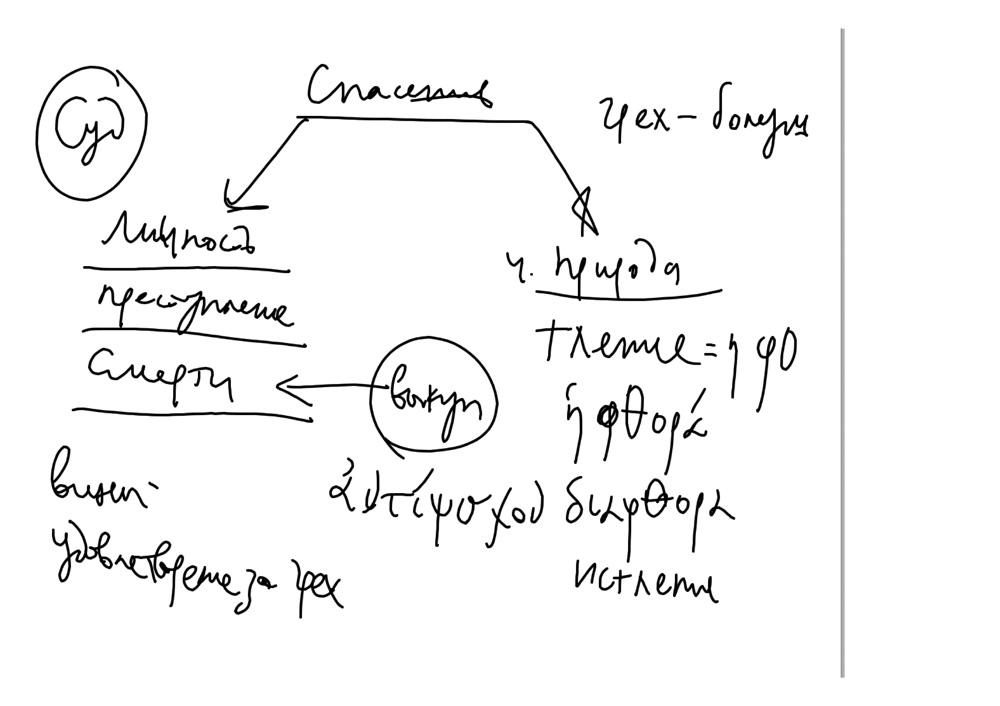
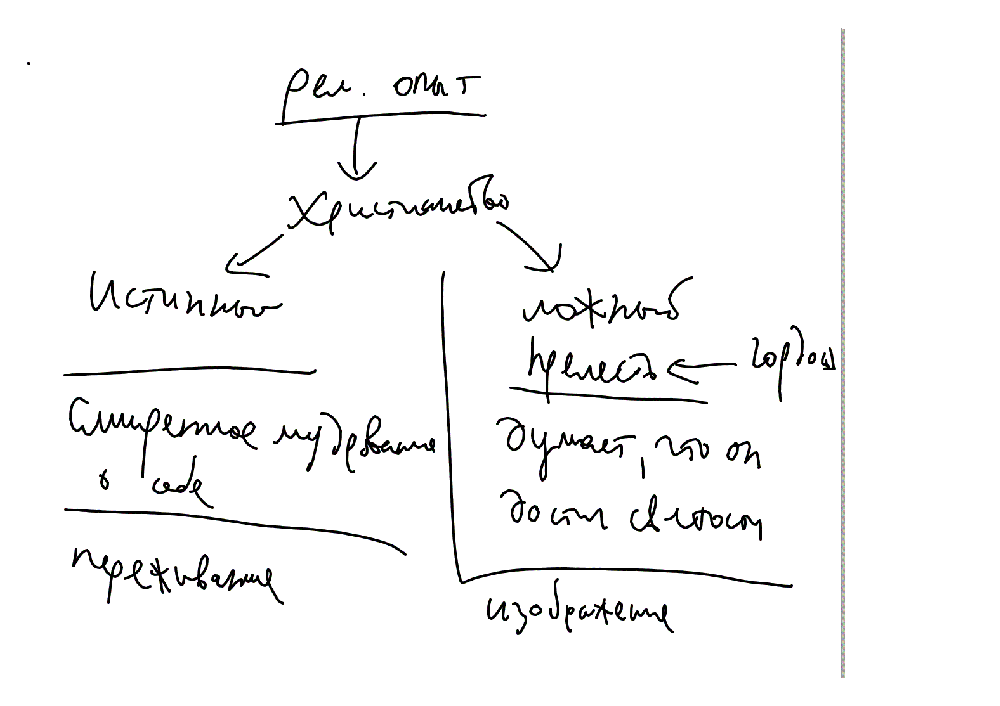
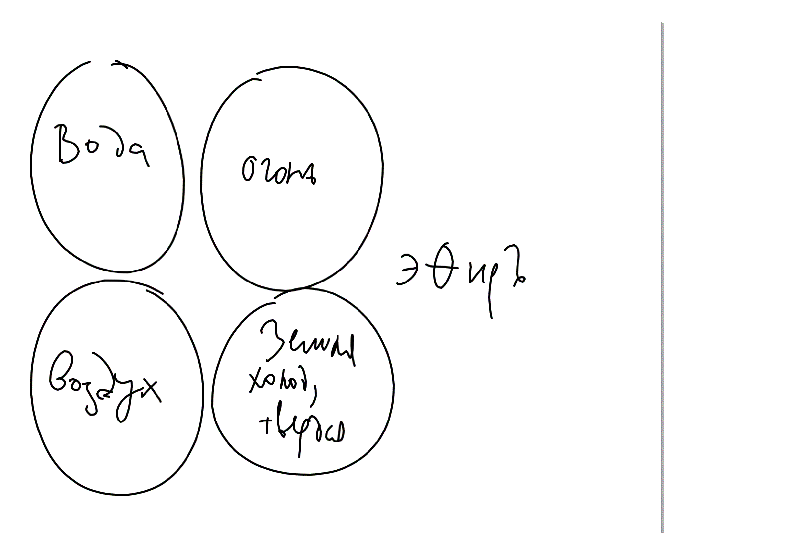

## Спасение человека Богом

Основной проблемой человечества является грех и произошедшая от него смерть.

Святитель Афанасий Александрийский видит корень этой проблемы в нарушении человеком божественного закона: "а от дерева познания добра и зла не ешь от него, ибо в день, в который ты вкусишь от него, смертью умрешь" (Быт 2:17). Св. Афанасий называет эту заповедь законом смерти, в том смысле, что для нарушивших заповедь Адама и Евы он действительно стал причиной смерти и тления.

Это нельзя понимать так, будто Бог связан собственным решением. Это онтологический принцип, заложенный в основу бытия разумных тварей - нарушение заповеди влечет за собой отпадение от Источника Жизни и смерть.

Св. Афанасий считал, что Бог не может отменить этот закон без того, чтобы Его слова не оказались ложью (хотя, как заметили студенты прецеденты были, например, с ниневитянами (хотя бы временная фальсификация).

В результате грехопадения смерть овладела человеком (цит.)

В состоянии падения можно выделить две стороны: то, что касается человеческой воли (свободное решение) и то, что касается природы человека (последствие решения). Св. Афанасий говорит только о поражении тела. Но это, очевидно, относится и к душе.

<!--- {width=450 height=400} --->

### Выкуп за преступника

С одной стороны, грех состоит в преступлении закона. Закон - термин юридический (см свидетельство Св Писания). В рамказ юридической аналогии получается, что за преступлением должно следовать наказание виновного. Это преступление (нарушение заповеди Бога) по закону карается смертью. В рамках этой аналогии можно говорить о выкупе, вносимом за виновного.[^1] 

"Ибо будучи выше всех, Слово Божие, как и следовало, Свой храм и телесное орудие принеся как выкуп (ἀντίψυχον) за всех, исполнил должное в (Своей) смерти" [^2] (перевод мой, и.П.).

Святитель говорит здесь о спасении через Искупление.

### Исцеление природы

С другой стороны грех поразил природу человека. В теле поселилось тление, φθορά. Здесь уже используется аналогия не суда, но болезни. Спасение происходит через Исцеление человеческой природы. Оно происходит облачением в Христа ("Елицы во Христа крестистеся, во Христа облекостеся").

Образ соломы, завернутой в солому. Огонь - смерть, солома - чел. природа. Асбест (в рус переводе "каменный лен" - Божество, Логос.
см. 
    
<!--- {width=450 height=400} --->

### Доказательства воскресения.

* Мученики как свидетели (μάρτυρες) воскресения. 
  Даже маленькие дети и женщины пренебрегают смертью. 
  Сравнение смерти с дохлым львом (или змеей). Смерти нет. 
* Отношение к языческим богам изменилось: к ним стали относиться как к людям.
* Оракулы умолкли.
  Духи больше не совершают предсказаний в Дельфах и других языческих центрах.
* Волшебство разрушается простым знамением Креста. 
  Люди перестают увлекаться волхвованием, сжигают колдовские книги.

Обобщение рел опыта христиан:

<!--- {width=450 height=400} --->

Смирение и гордость

**Переживание** подлинного опыта и изображение, **симуляция** опыта

Развитие мысли: католическое учение о молитве, запад икона, пение, богословие - следствие скорее изображения опыта.

Система 4х стихий у древних святых (св. Василий сознательно отказывается от атомарной системы в пользу "стихийной")

<!--- {width=450 height=400} --->

<!--- Возможно стоит сказать о том, что упор на понимание греха как вины и спасение как искупление не всегда позволяет найти контакт с собеседником. Полезно указать на понимание греха как болезни и спасения как исцеление --->

[^1]: @Athan, С. 100
[^2]: @Whit, p 124; @Athan, С. 100
