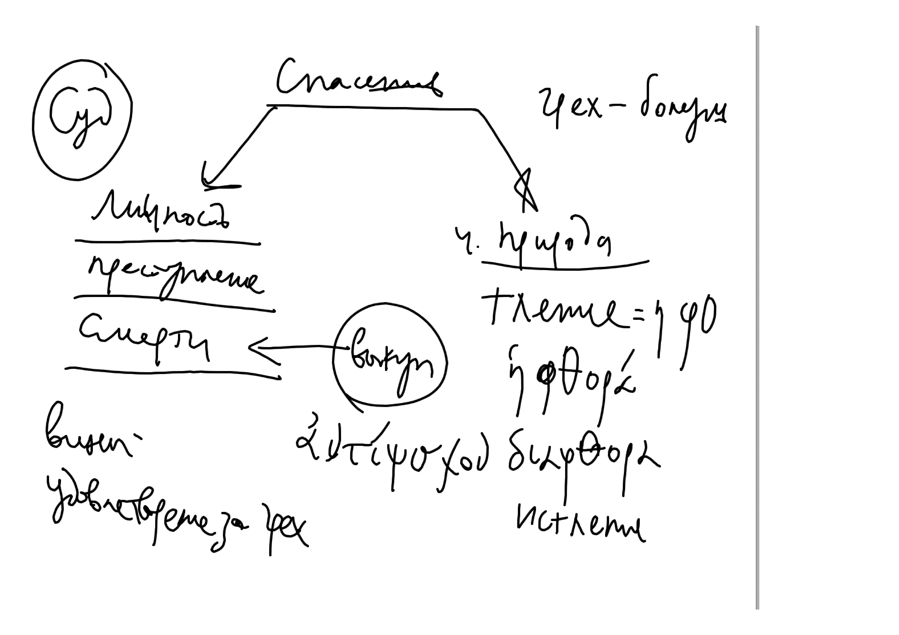
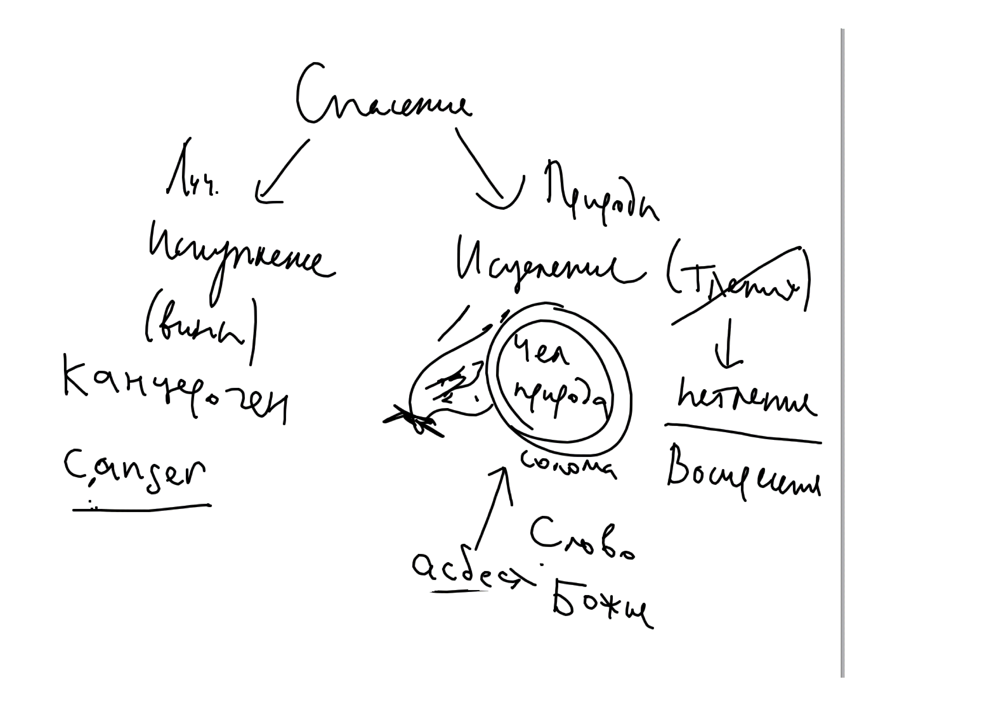
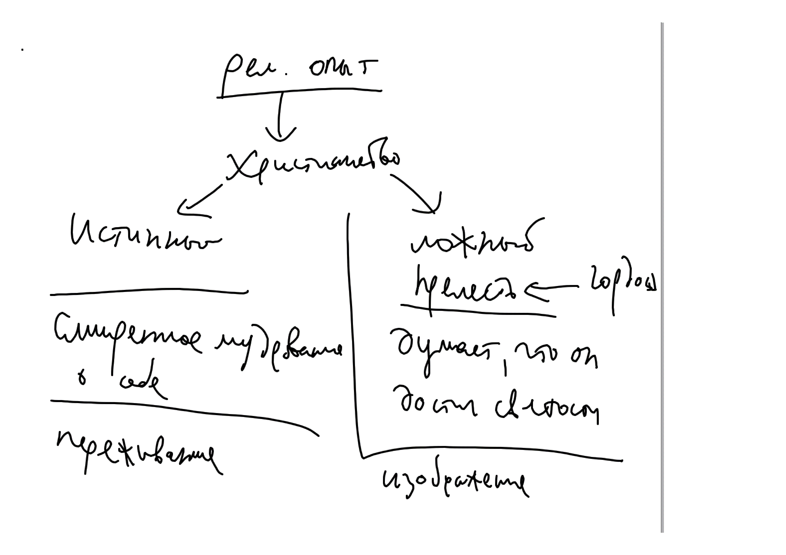
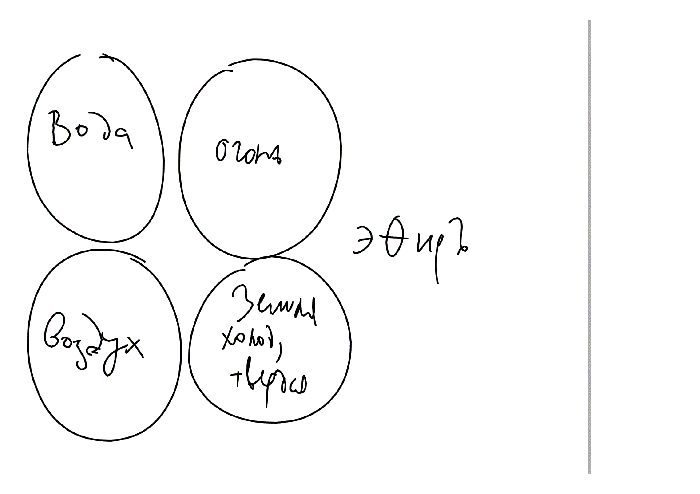

# Спасение человека Богом

Святитель Афанасий Александрийский видит корень проблемы в законе смерти, который был нарушен человеком: "а от дерева познания добра и зла не ешь от него, ибо в день, в который ты вкусишь от него, смертью умрешь" (Быт 2:17).

Это нельзя понимать так, будто Бог связан собственным решением. Это онтологический принцип, заложенный в основу бытия разумных тварей - нарушение заповеди влечет за собой отпадение и смерть.

Св. Афанасий считал, что Бог не может отменить этот закон без того, чтобы Его слова не оказались ложью (хотя, как заметили студенты прецеденты были, например, с ниневитянами (хотя бы временная фальсификация).

В результате грехопадения смерть овладела человеком (цит.)

В состоянии падения можно выделить две стороны: то, что касается человеческой воли (свободное решение) и то, что касается природы человека (последствие решения). Св. Афанасий говорит только о поражении тела. Но это, очевидно, относится и к душе.

<!-- {width=450 height=400} -->

С одной стороны, грех состоит в преступлении закона. Закон - термин юридический (см свидетельство Св Писания). В рамказ юридической аналогии получается, что за преступлением должно следовать наказание виновного. Это преступление (нарушение заповеди Бога) по закону карается смертью. В рамках этой аналогии можно говорить о выкупе, вносимом за виновного.[^1]
    
С одной стороны, грех состоит в преступлении закона. Закон - термин юридический (см свидетельство Св Писания). В рамказ юридической аналогии получается, что за преступлением должно следовать наказание виновного. Это преступление (нарушение заповеди Бога) по закону карается смертью. В рамках этой аналогии можно говорить о выкупе, вносимом за виновного.[^2] 

"Ибо будучи выше всех, Слово Божие, как и следовало, Свой храм и телесное орудие принеся как выкуп (ἀντίψυχον) за всех, исполнил должное в (Своей) смерти" [@Whit, p 124], [@Athan, С. 100]

<!--[@Whit p. 124] -->

, перевод мой, И.П.

у св. Афанасия. Другими словами, спасение через Искупление.

С другой стороны грех поразил природу человека. В теле поселилось тление, φθορά. Здесь уже используется аналогия не суда, но болезни. Спасение через Исцеление человеческой природы. Оно происходит облачением в Христа (елицы во Христа крестистеся, во Христа облекостеся).

Образ соломы, завернутой в солому. Огонь - смерть, солома - чел. природа. Асбест (в рус переводе "каменный лен" - Божество, Логос.
см. 
    
<!-- {width=450 height=400} -->

Доказательства воскресения. 

* Мученики. Смерти нет. Даже маленькие дети и женщины пренебрегают смертью. Дохлый лев (или змея).
* Оракулы умолкли. Пифия
* отношение к яз. богам как к людям
* волшебство разрушается простым знамением Креста. Люди перестают увлекаться им.

Обобщение рел опыта христиан:

<!-- {width=450 height=400} -->

Смирение и гордость

**Переживание** подлинного опыта и изображение, **симуляция** опыта

Развитие мысли: католическое учение о молитве, запад икона, пение, богословие - следствие скорее изображения опыта.

Система 4х стихий у древних святых (св. Василий сознательно отказывается от атомарной системы в пользу "стихийной")

<!-- {width=450 height=400} -->

[^1]: @Athan, С. 100
[^2]: @Osip, C. 66

Литература:
