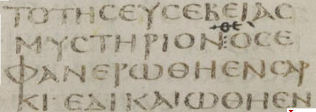
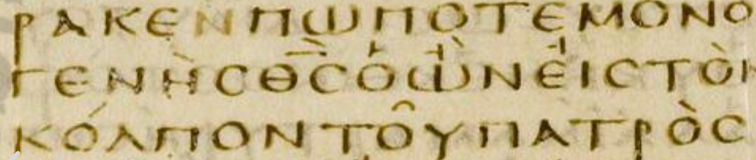
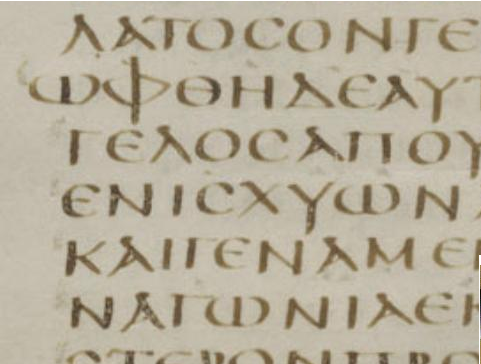

## "Рукописная традиция и богодухновенность Новозаветного текста". Иеромонах Павел (Коротких).

### Введение.

В последнее время все громче раздаются голоса критиков, использующих методы современной текстологии для дискредитации Библии как богодухновенного текста. В связи с этим важнейшее значение для апологета приобретает осмысление Новозаветного текста, сочетающее опору на Предание Церкви с внимательным изучением научных достижений в области библеистики.  На этом поприще подвизались многие русские ученые, среди которых хотелось бы особо выделить труды Н.И. Сагарды и епископа Кассиана (Безобразова), понимавших важность современных исследований в области текстологии НЗ. 

Что касается современных публикаций, то следует отметить важную обзорную работу Митрополита Волоколамского Илариона (Алфеева): "Иисус Христос. Жизнь и учение". Так, в главе, посвященной источникам НЗ, автор проводит последовательный анализ основных направлений библейской критики и отвечает на многие вопросы, поставленные современной наукой перед традиционным христианством. В целом в работе довольно оптимистично оцениваются результаты научных исследований:

>"Расцвет библейской критики как науки, сосредоточенной на изучении текста Библии и контекста, в котором появлялись отдельные библейские книги, относится к XIX – XX векам, когда вся Библия, в том числе четыре Евангелия, стала объектом скрупулезного изучения. Это изучение, как мы уже говорили, велось под влиянием разных факторов, нередко на основе предвзятых идеологических установок, но в своей совокупности оно дает богатейший материал для глубокого и всестороннего понимания источников. При этом данные библейской критики не только не опровергли, но, наоборот, во многих случаях убедительно подтвердили те представления об отдельных книгах Библии и их авторах, которые на протяжении веков хранились в церковной традиции". (Иисус Христос. Жизнь и учение. Начало Евангелия. Книга 1. Глава 2. Параг. 3).

В том же позитивном ключе следует рассматривать и текстологию НЗ, которая может быть использована не только для критики богодухновенности Писания, но и для ее защиты.

В данной статье ставится довольно узкая задача: рассмотрев конкретные примеры критики, попытаться выстроить непротиворечивую апологию Новозаветного текста. При этом автор этих строк видит цель работы не столько в том, чтобы предложить готовое решение (хотя и предпринимает попытку в этом направлении), сколько дать общее представление о проблемах, связанных с данной дисциплиной и возможных путях их преодоления.

Полемика в этой статье сосредоточена, в основном, на возражениях Барту Эрману, который, выдвинул наиболее острую и хорошо аргументированную критику богодухновенности текста НЗ. С другой стороны этот автор является серьезным ученым, автором ряда монографий, хорошо принятых научным сообществом, учеником известного знатока текстологии НЗ, Брюса Метцгера. Одним словом, автор этих строк сознает, что частые ссылки на Б. Эрмана могут утомить читателя, но они вызваны необходимостью.

### Текстология Нового Завета.

Начнем с примера. В свое время Ориген, руководствуясь географическими и этимологическими соображениями, счел, что местом Крещения Спасителя в Ин 1:28 должна была быть названа Вифавара, а не Вифания (как значилось в древнем тексте)[^bp0066]. Впоследствии именно "Вифавара" закрепилась в большей части греческих рукописей НЗ. Интересно, что в таком виде данный текст существует сегодня в церковнославянском и Синодальном переводах. Однако, в Остромировом Евангелии, древнейшем русском списке этого текста, в Ин 1:28 стоит дооригеновский вариант "в Вифании". Этот пример выбран мной специально, чтобы показать, что рассматриваемый предмет не является для нас чем-то далеким и отвлеченным.

Итак, греческий текст Нового Завета изменялся со временем, а вслед за этим менялись и переводы, которые выполнялись с греческих оригиналов[^bp0097]. Изменения текста можно разделить на две группы: случайные ошибки переписчиков и намеренные правки. Первый тип ошибок, как правило, не затрагивает смысла текста, второй порой серьезно влияет на этот смысл.

В связи с этим зададимся вопросом: можно ли с достаточной уверенностью определить какое из чтений --- подлинное? Для начала попробуем вкратце рассмотреть методы, используемые при подоготовке критических изданий НЗ современными учеными.

#### *Типы текста*.

Тексты НЗ, сохранившиеся в древних рукописях, обладают рядом признаков, позволяющих разделить их по типам.  К таким признакам относятся, например, краткость, или пространность редакции, включение или исключение определенных фрагментов текста, особенности языка.

Большинство исследователей, занимающихся текстологией НЗ, придерживается мнения о древности *Александрийского* типа текста и считают его наиболее близким к оригиналу. Это самая краткая его форма (по сравнению с *Византийским*, *Кесарийскиw* и *Западным* типами)[^bp0031]. Именно на основе Александрийского типа редакторы критических изданий НЗ пытаются реконструировать изначальный облик текста.  

Одним из характерных примеров чтений Александрийского типа является наличие выражения "οὐδὲ ὁ υἱός" ("ни Сын") в Мф. 24:36. В результате текст в переводе читается как "О дне же том и часе никто не знает, ни ангелы небесные, *ни Сын*, но один только Отец" (Касс.[^bp0152]).

Другой важной группой свидетелей является *Западный* тип. Он представлен самыми пространными чтениями и считается "народной", "неконтролируемой" версией НЗ[^bp0029]. Судя по всему, многие *вставки* проникли в более поздние версии текста НЗ именно из рукописей Западного типа. Так, самыми древними сохранившимися источниками, содержащими Перикопу прелюбодейки, рассказ о схождении ангела в купель Вифезда и ряд других интерполяций, являются кодекс Безы и старолатинские манускрипты. Данный тип текста использовался некоторыми древними Западными отцами.

Одним из чтений, характерных для этого типа, является изменение в конце Мк. 15:34. В результате текст в переводе звучит как "Боже Мой, Боже Мой! Для чего Ты Меня оскорбил/упрекнул?".

*Кесарийский* тип считается смешанным. По всей видимости, редакторы были знакомы с Александрийским и Западным типами и создали "компромиссиный" вариант. Считается, что данный тип возник в Александрии, затем рукописи с этим текстом были принесены Оригеном в Кесарию и позже оказались в Иерусалиме[^bp0032]. Характерное для этого типа чтение --- имя разбойника в Мф. 27:16-17: "Иисус Варавва" вместо просто "Варавва" в большинстве рукописей.

Самой противоречивой репутацией обладает *Византийский* тип (Койне). Примерно девяносто процентов сохранившихся рукописей содержат Византийский текст, однако большинство из них --- поздние. Это последнее обстоятельство вместе с другими факторами приводят большинство ученых к выводу о вторичности Византийского типа по отношению к более древним.

Нужно отметить, что Византийский текст употребляется в грекоговорящих Православных Церквах и в РПЦ (в церковнославянском и "синодальном" переводе). Нет нужды приводить здесь примеры чтений этого типа, так как их разбору посвящена большая часть этой работы.

При том, что стабильная традиция, связанная с этим типом, формируется около IX века с переходом на минускульный почерк, ее корни явно уходят в древность (многие исследователи связывает ее с рецензией Лукиана Антиохийского (IV в.))[^bp0030]. При этом нужно отметить важный момент: когда речь идет о Византийском *типе* текста, большинство ученых имеет в виду совокупность чтений, которая складывалась постепенно. Присутствие отдельных "Византийских" вариантов, например, в некоторых древних папирусах еще не говорит о существовании во II-III вв. Византийского типа, как системы чтений. 

Описанную тонкость определения часто упускают из вида сторонники гипотезы Византийского приоритета (далее --- ВП). Эти исследователи[^bp0149] заявляют, что в поздних Византийских рукописях содержится оригинальный текст, промыслительно сохраненный Богом в течение веков (некоторые сторонники ВП более сдержанно говорят о том, что этот тип стоит ближе всего к автографам НЗ).

Позиция сторонников ВП еще в 1990-х подверглась жесткой критике[^bp0056][^bp0081]. Насколько мне известно, наиболее актуальной попыткой ответить на этот вызов являются работы Мориса Робинсона (Moris Arthur Robinson)[^bp0150]. Однако, несмотря на все усилия защитников ВП, большинство претензий, предъявляемых к этой гипотезе остается в силе.

#### Источники.

*Возраст рукописей*. Большинство современных ученых предпочитают свидетельство древнейших источников. Логика простая: чем памятник ближе по времени к созданию оригинала, тем меньше изменений успело в нем накопиться.
    
Некоторые исследователи не соглашаются с этим и считают, что поздние рукописи Византийского типа скопированы с образцов II-III века (восходящих к оригиналам), которые по каким-то причинам не сохранились[^bp0060]. 

Итак, проблема с источниками выглядит примерно следующим образом: тексты Александрийского типа после IV века сменяются Византийскими. При этом сторонникам ВП приходится объяснять, по какой причине не удается обнаружить рукописи старше IV в., содержащие текст Византийского типа, а ученым критической школы --- почему на территории Византийской империи древний Александрийский тип текста довольно быстро (в течение примерно столетия) сменился Византийским. Интересно, что объяснения обеих сторон этого спора сталкиваются с проблемами. Текстологическая "революция" в IV веке, по-прежнему является предметом научных споров.

#### Помощь статистики.

В поддержку ВП выдвигаются следующие соображения: непрерывная передача рукописного текста в целом должна подчиняться т.н. "нормальному закону распределения" (Гаусса). 

Представим себе струю воды из крана. Большая часть воды сосредоточена в основном потоке. Остальная, меньшая ее часть, --- брызги, улетающие далеко от центра струи. Сравнив основной поток воды с большинством сохранившихся манускриптов, содержащих Византийский тип текста, а далеко улетевшие капли --- с немногочисленными носителями других типов, получим примерную аналогию статистической модели ВП. 

Из этого сравнения ясно, почему сторонники ВП считают наиболее близким к оригиналу тип текста, представленный наибольшим количеством сохранившихся экземпляров, а текст "меньшинства" связывают с отклонением от основной традиции.

Однако это объяснение сталкивается с проблемами:

* Дело в том, что мы не имеем дело непосредственно со всем потоком, а лишь с доступными нам следами. Например, нам сложно судить о состоянии потока, когда он только "вырвался из крана", поскольку в этот момент он, судя по всему, был весьма бурным. Проще говоря, "водяная" аналогия не учитывает внезапных изменений, которые происходили с текстом НЗ в ранний период его истории.

    Кажется, в качестве примера здесь больше подходит ствол дерева. Если посмотреть на его срез[^bp0151], можно заметить, что со временем внешние "кольца" становились все шире. С другой стороны "ядро" составляет небольшой процент общего объема, но именно оно является следом первоначального состояния растения (увы, середина дерева, как самая старая его часть, наиболее подвержена разрушению). В рамках этой модели внешние кольца --- поздние рукописи, содержащие Византийский тип текста, а уцелевшая часть ядра --- манускрипты Александрийского типа. Примерно так выглядит история текста НЗ, с точки зрения большинства исследователей.

* Сторонники ВП не смогли показать на практике, что статистический метод действительно работает так, как ими задумано. Например, "стемматический" метод Ходжеса и Фэрстеда принес результаты, которые противоречили ожиданиям авторов. В полученном ими материале другими исследователями был обнаружен ряд чтений "меньшинства" (вариантов из рукописей Александрийского и Западного типов), что, по замечанию Уоллэса[^bp0064], идет вразрез даже с названием опубликованного ими издания: "Греческий Новый Завет согласно тексту *большинства*"[^bp0063].

#### Профессионализм переписчиков.

Некоторые критики гипотезы ВП уверенно заявляют, что переписчики текстов НЗ в первые века христианства не были профессионалами. Согласно этой точке зрения НЗ документы в ранний период копировались более-менее образованными членами общины, не имевшими специальной подготовки. Их непрофессионализм должен означать большую склонность к случайным ошибкам и к намеренным изменениям текста, дополнениям и гармонизациям. С другой стороны в более поздний период (начиная с царствования св. равноап. Константина Великого) появляются скриптории, и передача текста НЗ оказывается в руках профессиональных переписчиков (чем и объясняется стабильность Византийского "текста большинства"). С этой точки зрения в начальный, "турбулентный" период изменения легко проникали в текст и затем закреплялись в традиции при копировании.

<!--Отметим, что профессионализм переписчиков НЗ во II-III-м веках стал важным фактором не только в оценке гипотезы ВП, но и в отношении к сохранности НЗ текста (вплоть до утверждений о том, что мы не обладаем подлинным текстом НЗ и даже не можем надеяться на его успешную реконструкцию).-->

Вопреки вышеприведенной точке зрения современные исследователи папирусов считают, что большинство переписчиков НЗ II-III-го века все же были профессионалами. Они, по всей видимости, не трудились в скрипториях, практикуясь в переписывании литературных трудов, но занимались "частной практикой": составлением писем, отчетов, юридических документов. Это предположение подтверждается тем, что большинство сохранившихся НЗ папирусов II-III-го вв. написано смешанным "литературно-документальным" почерком, который хотя и не является классическим майускулом, но все же указывает на профессионализм переписчиков[^bp0053].

Вместе с тем, поскольку в ранний период тексты НЗ переписывались в частном порядке, а не организованно, не существовало и систематического контроля над качеством копирования, что несомненно должно было отразиться на количестве изменений в НЗ тексте в начале его истории.

#### Внутренняя логика исправлений.

Как показали работы Гордона Фи, Дэниэла Уоллеса и других исследователей, Византийские чтения легко объясняются как поздние дополнения и гармонизации более древнего текста, сохранившегося (частично) в Александрийском типе. Рассуждение в противоположном направлении чаще всего противоречит логике и здравому смыслу.

Например, в стихе Мк. 1:2 ("как написано *у пророков*: вот, Я посылаю Ангела Моего пред лицем Твоим...", Синод.) имеется вариант "ἐν τῷ Ἠσαίᾳ τῷ προφήτῃ" / "ἐν τοὶς προφήταις". Если второе чтение "у пророков", содержащееся в поздних Византийских источниках, является изначальным, сложно понять, зачем неким древним редакторам понадобилось изменять его на "у Исаии пророка", ведь такое указание не является точным (цитата в Мк. объединяет два пророческих изречения: Малах. 3:1 и Ис. 40:3). Если же предположить, что изначальным чтением было "у Исаии пророка", из этого достаточно очевидно следует, что причиной исправления является "шероховатость" оригинала, которую редактор решил сгладить[^bp0058].

Приведем еще ряд примеров, говорящих о том же: внутреннее свидетельство и логика передачи текста часто говорят о вторичности Византийских чтений (хотя это справедливо не во всех случаях).

(1) Лк 10:21. В Византийском тексте добавлено "ὁ Ἰησοῦς". Это одно из самых многочисленных Византийских расширений (оно проясняет фразу, в которой первоначально отсутствовало подлежащее).

(2) Лк. 10:41. В рассказе о Марфе и Марии изначальное "θορυβἀζῃ" (смущаешь криком, --- др. греч.) в Византийском тексте заменено на "τυρβάζῃ" (суетишься, волнуешься, --- др. греч.). В последнем случае используется более мягкий по смыслу глагол, "сглаживающий" неподобающий поступок Марфы.

(3) Лк 11:2-4, "Отче наш". Византийский вариант молитвы гармонизован с параллельным местом Мф 6:9-13, Александрийский же --- краток и отличается от параллели в Мф.. Вряд ли редактору пришла бы в голову мысль сокращать молитву Господню, если перед ним находился подлинник, схожий с текстом Мф., а вот обратное действие, гармонизация, --- вполне объяснимо (желанием сделать так, чтобы важнейший христианский текст выглядел единообразно у обоих евангелистов).

Во всех этих случаях неясно, зачем редактору могло понадобиться исправление "от сложного к простому". Эта правка явно не укладывается в рамки предполагаемой "научной" Александрийской редакции (исправления могут сокращать текст, отсекая "лишнее", но не ставить своей целью разрушение его смысла). Очевидно, Византийский тип является развитием более древнего текста, который в подавляющем большинстве случаев лучше сохранился в Александрийскомм и Западном типах. Вместе с тем, следует иметь в виду, что Византийские исправления намного чаще относятся к грамматике и синтаксису, не затрагивая смысла высказываний[^bp0153].

#### Критика последовательного эклектизма.

Последовательный эклектизм[^bp0084] --- метод, лежащий в основе современных критических изданий НЗ. Этот метод признает чтение подлинным в том случае, если получившийся смысл соответствует смыслу остального текста. То же самое касается характерных слов и выражений, литературного стиля. Чтение, которое избрано в качестве аутентичного, должно также логично объяснять появление вторичных чтений.

Все эти соображения и еще ряд других оцениваются в свете "внешнего свидетельства", т.е. принадлежности текста к определенной группе, его возраста, генеалогических связей и подоб.

Главным недостатком метода считается, собственно, его эклектичность. Готовый текст критического издания в довольно коротких фрагментах содержит вариантные единицы, которые одновременно не присутствуют ни в одной сохранившейся рукописи[^bp0014]. В общем, это неудивительно, учитывая небольшое число сохранившихся древнейших манускриптов II-III вв., однако такая реконструкция на основании небольшого количества свидетелей действительно выглядит догадкой. Именно это обстоятельство является поводом для заявлений о фактической невозможности восстановления оригинального текста НЗ, хотя, безусловно, с ними согласны не все исследователи-эклектики. Количество НЗ рукописей в сотни раз превосходит количество дошедших до наших дней копий других древних документов. При этом никто не заявляет, что мы не имеем доступа, скажем, к тексту "Илиады" Гомера.

Крайности эклектического метода можно увидеть в подходе Б. Эрмана к поиску "ортодоксальных правок" в тексте НЗ. Автор выбирает чтения, которые с его точки зрения более соответствуют состоянию текста до внесения исправлений ортодоксальными редакторами, якобы стремившимися изменить некоторые места таким образом, чтобы еретики не смогли их использовать для подтверждения своих идей. Значительную "нагрузку" в качестве доказательства идей часто несет довольно немногочисленная группа рукописей Западного типа (D, it)[^bp0069]. Это особенно странно при том, что основным свидетелем оригинального текста большинство текстологов считают рукописи Александрийского типа. Более того, именно Александрийские, а не Западные чтения помещаются в качестве основных в тексте критических изданий в тех местах, которые Эрман избрал в качестве подтверждения своей гипотезы.

Одной из самых характерных черт методологии последовательного эклектизма является принцип принятия кратких чтений (lectio brevior potior). Логика такова: переписчики склонны изменять текст, внося в него "усовершенствования" разного рода. С этой точки зрения более длинные чтения, скорее всего, --- производные, а краткие стоят ближе к оригиналу. Это основной пункт, с которым принципиально не согласны сторонники ВП, так как это автоматически делает предпочтительным краткий Александрийский тип текста, а Византийский --- производным.

>"... если бы поздние писцы поступали в соответствии с тем, что о них заявляют, в результате Византийская форма текста была бы длиннее, чем обнаруживается сейчас: "священные имена" были бы серьезно расширены, параллельные места были бы в большей гармонии, а универсально объединенный текст доминировал. Но этого просто нет"[^bp0024][^bp0025].

Справедливости ради, стоит отметить, что данный факт (наличие "средних чтений" в "тексте большинства") не может служить однозначным доказательством того, что редакторы-византийцы не вносили правок в текст НЗ. В ряде случаев они вполне могли предпочесть умеренный вариант, достаточный, скажем, для объяснения "трудных мест", но отвергнуть слишком развернутые дополнения, например, "неконтролируемой" Западной версии. И это --- в том случае, если рукописи с "пространными" чтениями вообще были доступны Византийским редакторам.

В целом сдержанность в отношении расширения текста неудивительна для Византийского периода, ведь в скрипториях, в том числе, монастырских, контроль за процессом копирования НЗ манускриптов был, судя по всему, гораздо строже, чем в первые века христианства, когда списки создавались по инициативе отдельных лиц, пусть даже с привлечением частных профессионалов в качестве исполнителей. Другими словами, консервативность поздних переписчиков вовсе не означает такой же дисциплинированности ранних, ведь серьезные разночтения в рукописях возникали именно в ранний период существования НЗ традиции.

#### *Предварительные выводы.*

Кажется, метод последовательного эклектизма дает исследователю слишком большую свободу, и случается, что главным критерием, влияющим на выбор чтений и групп источников, являются личные вкусы и ощущения автора[^bp0111]. Однако было бы ошибкой ассоциировать всю школу текстологического критицизма с безудержным либерализмом. Не обязательно вставать на сторону крайних консерваторов для того, чтобы отмежеваться от крайностей либеральной критики. Существует здоровый консенсус среди исследователей-христиан, сложившийся вокруг текста изданий NA/UBS. 
Среди них можно отметить Гордона Фи (Gordon Donald Fee, 1934)[^bp0126] и Дэниэла Уоллеса (Daniel Baird Wollace, 1952)[^bp0127]. Эти исследователи сумели сформулировать продуманную научную позицию, сохраняя глубокое уважение к Священному Писанию, как слову Божию.

Нельзя сказать, что выбор чтений издателями критического текста произволен. Чаще всего они следуют чисто Александрийским свидетелям: ранним папирусам и Ватиканскому кодексу, даже в тех случаях, когда им противостоит Синайский и большинство ранних унциалов. 

Безусловно, временами эклектики сталкиваются с препятствиями, например в связи со скудостью источников для данного фрагмента, или равномерным распределением Александрийских свидетелей, затрудняющим однозначный выбор. Но это вовсе не значит, что издатели NA/UBS постоянно "гадают на кофейной гуще", ломая голову над тем, какое чтение является оригинальным.

С другой стороны, нельзя исключить, что сам метод, избранный большинством текстологов --- неверен. Возможно, издатели критических изданий действительно впадают в ошибку (или правы лишь отчасти), избирая Александрийские источники в качестве основы для своей реконструкции. Например, может оказаться, что все краткие чтения Александрийского типа --- результат древней "научной" редакции исходного текста, или изменений, внесенных еретиками (это можно заподозрить, по крайней мере, в одном из рассматриваемых ниже случаев)[^bp0075]. 

Принципиальная ошибка эклектиков в выборе метода, наверное, возможна (хотя и маловероятна). Однако необходимо сделать важное уточнение: если эклектики все же потерпели неудачу в своей попытке реконструировать оригинальный текст НЗ, это еще не означает, что правы сторонники Византийского приоритета[^bp0076]. Это всего лишь означает, что исследователям пока не удалось реконструировать оригинальный текст НЗ. Но даже если мы согласимся с этим выводом, нам не обязательно впадать в пессимизм, ведь мы не связаны постулатом Solo Scriptura, как исследователи с протестантскими корнями. Писание не существует изолированно, отдельно от церковной традиции. Если мы не обладаем изначальным текстом Новозаветных книг, это не означает, что мы лишились Священного Писания. Об этом подробнее мы поговорим в третьей части этой работы.

### Пропуски и серьезные разночтения в НЗ.

К сожалению, рамки журнальной статьи не позволяют рассмотреть все разночтения в тексте НЗ, которые по мнению критиков оказывают серьезное влияние на его смысл, поэтому нам придется ограничиться самыми известными.

Первые два случая (пространное окончание Марка и перикопа прелюбодейки) особенно важны в современной полемике со скептиками. Прежде всего, это достаточно большие по объему тексты, которые, как считает большинство исследователей, не являлись изначально частью НЗ. Конечно, они очень рано вошли в текст Священного Писания и сегодня занимают прочное место в традиции, однако, несмотря на большое эмоциональное значение этих текстов для христианства, признание их интерполяциями не приводит к каким-либо догматическим проблемам. В них не содержится учение, уникальное именно для этих фрагментов, те же идеи и похожие описания встречаются в других местах НЗ. 

#### Окончание Евангелия от Марка, Мк. 16:9-19.

В древнейших сохранившихся рукописях (Синайский и Ватиканский кодексы, ряд папирусов) Евангелие от Марка оканчивается 8м стихом 16й главы, где говорится о испуге мироносиц, которые никому ничего не рассказали о видении юноши в белой одежде.

Существует также два "расширенных" окончания этого Евангелия[^bp0119], которые большинство современных исследователей считают более поздними добавлениями:

*Пространное окончание* (далее --- ПО)[^bp0036] --- традиционно. Оно присутствует в старых переводах вроде King James Version, Luther Bible, церковнославянском ("Елизаветинская Библия"), Синодальном и др.. По некоторым оценкам греческий текст ПО относится к началу II в. (об этом говорит цитирование у ранних отцов)[^bp0037].

"Среднее" окончание Евангелия от Марка (далее --- СО)[^bp0038] встречается в рукописях гораздо реже. В современных переводах оно часто публикуется наряду с пространным, в квадратных скобках. Само существование СО может говорить о том, что древняя короткая концовка в дальнейшем по-разному "восполнялась" редакторами.

В научных кругах существуют разногласия по поводу происхождения ПО. Одни ученые считают, что оно было создано самим евангелистом и является оригинальным текстом[^bp0039]. Другие, --- что подлинная концовка была утеряна еще до того, как с автографа была сделана первая копия, или что евангелист намеренно остановил повествование "на полуслове", добиваясь определенного воздействия на читателя. С этой точки зрения ПО это отдельный текст, который был использован как "заплатка", чтобы завершить внезапно обрывающееся повествование Марка[^bp0009].

##### Богословский комментарий.

В целом проблема выглядит следующим образом: если придерживаться древней традиции, согласно которой ап. Матфей написал свое Евангелие первым, ап. Марк вряд ли мог исключить из своего рассказа события, описанные в 28-й главе Матфея (и в 24-й Луки) и написать Евангелие с концовкой, в котором отсутствуют явления воскресшего Иисуса. Гораздо вероятнее предположить, что если Марк был последним из синоптиков, он соединил сжатые повествования из других Евангелий и написал 16:9-20. 

Итак, отношение библеиста к подлинности пространной концовки Марка зависит от общей установки. Исследователь, который спокойно относится к приоритету Марка, оставляет для себя открытой возможность того, что апостол записал свою краткую версию событий, к которой позднее в сжатой форме были добавлены отчеты других евангелистов[^bp0070].

Признание позднего характера ПО также снимает некоторое напряжение: апологету не приходится объяснять, почему обещанные в этом тексте знамения (в особенности, говорение новыми языками, держание змей и принятие ядов без ощутимых последствий) в настоящее время не наблюдаются.

Подытожим: принятие, или отвержение ПО не является критичным для богословия. Хотя краткая версия Марка не содержит повествований о явлениях воскресшего Иисуса, в ней есть рассказ о видении ангела, засвидетельствовавшего Воскресение мироносицам. К тому же мы не обязаны соглашаться с критиками в том, что рассказы других евангелистов о Воскресении являются поздними добавлениями к рассказу Марка. В конце концов, самое раннее (~55-56 гг.) повествование о Воскресении (в т.ч. и упоминание о явлении Воскресшего более чем 500 ученикам, многие из которых были живы ко времени написания послания) находится в тексте 1 Кор. 15:3-8.

#### Перикопа прелюбодейки (Pericope Adulterae), Ин. 7:53-8:11.

В этом фрагменте речь идет о женщине, которую фарисеи и книжники застали в прелюбодеянии, и привели к Иисусу. Стараясь уловить Его в слове, они спрашивают, следует ли побить женщину камнями как указывает закон Моисея. В ответ звучит знаменитое "кто из вас без греха, первый брось в нее камень" (8:7, Касс).

Большинство из сохранившихся древнейших рукописей не содержат перикопу прелюбодейки (далее --- ПП)[^bp0046]. ПП также меняла свое место в тексте: современные исследователи обнаружили десять различных мест ее вставки в текст Евангелий. Так она помещалась после Ин. 7:36, 7:52, 21:24, Лк 21:38 и др., однако, скорее всего, вставка изначально располагалась на нынешнем месте, после стиха 7:52[^bp0092].

Первое свидетельство вне НЗ текста, связанное с ПП относится ко II-му веку. Евсевий Кесарийский свидетельствует о том, что Папий Иерапольский (около 125г.) упоминал "повествование о женщине, обвиненной перед Господом во многих грехах, которое содержится в Евангелии от Евреев"[^bp0098]. Однако, свидетельство, прямо указывающее на присутствие ПП в тексте Ин. относится уже к IV в. и локализовано на Западе (Амвросий Медиоланский)[^bp0099]. В V в. такие свидетельства даются Иеронимом и Августином.

Упоминание в Didascalia Apostolorum и в Апостольских постановлениях не говорят об источнике и содержат текст, который сильно отличается от Ин. Дидим Слепец, передавая содержание ПП с серьезными отличиями от текста Ин., использует фразу "Итак, мы находим в *некоторых евангелиях*"[^bp0135], что заставляет вспомнить ссылку Папия на Евангелие от евреев.

На Востоке, вплоть до Евфимия Зигабена, нет никаких указаний на то, что ПП входила в текст Ин. Важным моментом является отсутствие упоминаний о ПП у Златоуста и Оригена, которые составили построчные комментарии на Ин.

В результате оценки вышеизложенных фактов (а также внутренних свидетельств) многие современные переводы помещают этот эпизод (как и ПО Марка) в квадратные скобки, указывающие на неаутентичность этих стихов[^bp0091].

#### Происхождение ПП.

Вопрос о происхождении текста является предметом дискуссии. Предлагаемые варианты: несохранившийся источник Q, одна из первоначальных версий Евангелий от Марка или Луки, апокрифы вроде "Евангелия от Петра", или "Евангелия от евреев" и др.[^bp0095].

Самая ранняя рукопись Евангелия от Иоанна, в которой находится ПП --- кодекс Безы (~400г)[^bp0096]. Следующий по времени источник отстоит от него, по крайней мере, на 400 лет (K, Codex Cyprius, Византийский тип).  Можно предположить, что "неконтролируемая" Западная версия Евангельского текста вполне могла вобрать в себя устную традицию, уже давно существовавшую в Церкви (хотя есть и сторонники ее гетеродоксального происхождения), и уже гораздо позднее ПП начинает распространяться на Востоке.

Примерно в то же время, когда был написан кодекс Безы, блж. Августин уже знает о наличии ПП у Иоанна, считает эпизод оригинальной частью текста и предлагает причину, по которой рассказ мог быть исключен из этого Евангелия в некоторых списках:

>"Некоторые маловерные люди, или скорее --- враги истинной веры, боясь, я полагаю, чтобы их женам не было дано безнаказанно грешить, удалили из своих рукописей прощение Господом прелюбодейки, как будто Тот, кто сказал «больше не греши», дал разрешение грешить"[^bp0042].

Другое объяснение пропуска ПП относится к литургическому использованию текста. В Византийских лекционариях чтение на Пятидесятницу (Ин 7:37-8:12) пропускает стихи о женщине, взятой в прелюбодеянии. Сторонники Византийского приоритета считают, что в одном из древних списков Ин. на полях были добавлены отметки, обозначающие, что чтец должен был остановиться в конце 7:52 и перейти в начало 8:12[^bp0093]. Когда профессиональный переписчик, незнакомый с лекционарным циклом, использовал эту рукопись в качестве образца, он неправильно понял смысл отметок и пропустил отрывок[^bp0043]. Таким образом перикопа была потеряна.

Впрочем, более убедительным выглядит другое объяснение: чтение на 50-цу сформировалось еще до того, как на Востоке распространяется ПП. Поскольку рассказ о прощении Иисусом женщины, взятой в прелюбодеянии, появляется в первую очередь в рукописях Западного типа (Кодекс Безы, некоторые старолатинские), и при том, что на Востоке ПП не упоминается даже у тех отцов, которые построчно комментировали Ин., интерполяция более вероятна, чем пропуск.

##### Богословский комментарий.

Наличие, или отсутствие ПП в НЗ вряд ли может оказать влияние на христианское богословие. Наше представление о характере Господа Иисуса, его отношение к грешникам и грешницам формируется на основе не только этого текста, но и других (срав. напр. Лк. 7:37-48).

Как уже было сказано, этот рассказ уже присутствовал в христианском Предании начала II века (и, вполне вероятно, восходит к апостольской традиции). Поскольку для Церкви Предание важно не менее Писания, позднее появление ПП в тексте НЗ не представляет проблемы.

Трудности может вызвать, пожалуй, только подтверждение гипотезы некоторых исследователей о происхождении ПП из гностических апокрифов и о последующем включение ее в канон НЗ. Вероятно, это могло бы некоторым образом дискредитировать Писание в целом. Однако довольно раннее знакомство Западных отцов с повествованием о женщине, взятой в прелюбодеянии, и их отношение к нему явно свидетельствуют в пользу ортодоксального характера этого предания.

#### Предсказание дня Второго пришествия. Мф. 24:36.

"О дне же том и часе никто не знает, ни Ангелы небесные, [ни Сын,] а только Отец [Мой] один".

В древнейших свидетелях текст содержит чтение "ни Сын"[^bp0147], которое пропущено в некоторых поздних Византийских рукописях и Вульгате[^bp0148]. Многие отцы Церкви предлагают толкование на это место, явно имея в виду подлинность чтения.

Эти слова также содержатся в современных переводах (Касс., Кулаков, РБО), но отсутствуют в церковнославянском и "Синодальном".

##### Богословский комментарий.

Перед нами один из случаев, особенно полюбившихся критикам христианства[^bp0146]. По их мнению пропуск слов "ни Сын" в поздних манускриптах говорит о злонамеренном исправлении евангельского текста ортодоксальными редакторами.

Данный аргумент критиков, на мой взгляд, имеет мало смысла, так как у текста в Мф. есть параллель в Мк 12:32, где чтение "ни Сын" поддерживается большинством источников, за исключением некоторых рукописей Вульгаты и одной поздней греческой. Зачем "злокозненным ортодоксам" потребовалось опускать чтение, которое осталось неприкосновенным в другом Евангелии? К тому же выражение в Мф. "εἰ μὴ ὁ πατὴρ μόνος" исключает знание Сына о времени парусии даже в случае пропуска "οὐδὲ ὁ υἱός".

Что касается экзегезы, то толкователи по-разному подходили к данному тексту. Некоторые объясняли неведение Иисуса немощью человеческой природы (Господь знал о времени Второго пришествия по Божеству), другие использовали "воспитательную" аналогию.

<!--Возможно, это плохо вписывается в контекст ("ангелы" и "Отец" предполагают прочтение "Сын" в смысле второй Ипостаси Св. Троицы). С другой стороны, отталкиваясь от логики антитринитаристов, стремившихся доказать что в НЗ "Сын" употребляется в переносном смысле, такое толкование как раз оправдано. "Вы говорите, что Сын здесь употребляется в смысле "Сын Человеческий", значит и незнание о дне второго пришествия нужно понимать в человеческом смысле".-->

Так св. Иоанн Златоуст уверен, что Сын Божий не мог не знать времени второго пришествия, так как Он "веки сотворил" и объясняет употребление выражения "ни Сын" тем, что Господь не хотел, чтобы ученики любопытствовали о времени Его Второго пришествия. Блаж. Феофилакт Болгарский поясняет, что Господь ведет себя с апостолами как отец с маленькими детьми: "Иногда родители держат что-нибудь в руках. Когда же дети просят у них, родители не хотят дать, утаивают и говорят: «у нас нет, чего вы ищете», и тогда дети перестают плакать".

Какое бы толкование мы ни избрали, совершенно очевидно, что исключение слов "ни Сын" из текста Мф. не могло изменить христианское богословие, свидетелями чего являются отцы Церкви, имевшие в своих списках это чтение, но поддерживавших древний христианский догмат. Лакуна в тексте появляется достаточно поздно и это обстоятельство никак не могло повлиять на ортодоксальную догматику, которая сложилась задолго до обсуждаемого исправления.

В заключении отметим, что нам следует согласиться с подлинным характером чтения "ни Сын". Не следует подавать критикам повод для обвинений христиан в "намеренных искажениях" текста НЗ.

#### "Бог явился во плоти", 1 Тим. 3:16.

"И беспрекословно — великая благочестия тайна: *Бог* явился во плоти, оправдал Себя в Духе, показал Себя Ангелам, проповедан в народах, принят верою в мире, вознесся во славе".

В древнейших рукописях вместо "Бог" стоит "Который", или "Он"[^bp0114]. Такое разночтение объясняется исправлением греческого местоимения "ΟΣ" на "nomen sacrum"[^bp0121], ΘΣ (сокращенное "Θεος"). Для такого исправления достаточно провести горизонтальную перемычку внутри "омикрона" и штрих сверху, обозначающий сокращение. Обратное преобразование сложно объяснить, не говоря о том, что ранние свидетели в основном тексте содержат местоимение, а не "nomen sacrum". Например, в Синайском кодексе в основном тексте стоит ΟΣ, но один из редакторов добавил над строкой исправление, которое читается как θε. В результате получилось то же чтение, что находится в более поздних рукописях.

{width=200 height=60} 

В Александрийском кодексе исправление внесено чернилами другого цвета (перемычка у фиты и горизонтальный штрих-"титло" сверху). Это достаточно хорошо видно на цветном изображении листа[^bp0123].

По некоторым оценкам, этот вариант возник в течение третьего века[^bp0116].

Гармонизация текста на Западе пошла другим путем. Вместо "ΟΣ" в кодексе Безы стоит местоимение среднего рода, "Ο". Таким образом, фраза читается в переводе: "великая благочестия тайна, *которая* явилась во плоти...". Такое чтение поддерживается латинскими рукописями, в т.ч. Вульгатой.

##### Богословский комментарий.

Некоторые критики считают, что данное изменение текста было сделано намеренно, рукой ортодоксальных редакторов, с целью добиться того, чтобы данный стих можно было успешнее использовать против еретиков-адопционистов, учивших об усыновлении "человека-Иисуса" Богом[^bp0122]. 

Однако, как признают и сами критики[^bp0115], речь в этом фрагменте идет о Христе. И хотя редакторы действительно усилили ортодоксальное звучание этого стиха, основная мысль уже присутствовала в его изначальной форме.

Сам факт исправления вполне может рассматриваться как обычное развитие текста в рамках Церковного Предания, когда текст расширялся и изменялся посредством введения в текст объяснений, или дополнений. Можно спорить о том, какой вариант гармонизации был удачнее --- Западный, или Восточный, но, как мне кажется, важен факт рецепции Церковью и того, и другого варианта.

#### "Единородный Бог", Ин. 1:18.

"Бога никто не видел никогда: Единородный *Бог*, сущий в лоне Отца, Он открыл" (Касс.).

Чтение "μονογενὴς Θεὸς" содержится в древнейших Александрийских рукописях[^bp0117], но не поддерживается более поздними кодексами, включая A, его также нет в латинских манускриптах[^bp0118].

{width=250 height=80} 

То, что Эрман пренебрегает консенсусом древнейших Александрийских источников, исходя только из внутреннего свидетельства, и отвергает это чтение, многое говорит о его методе, который довольно радикально расходится с подходом издателей NA28, выбравшими в качестве аутентичного именно чтение "μονογενὴς Θεὸς".

##### Богословский комментарий.

Эрман заявляет, что "μονογενὴς Θεὸς" означает "единственный (уникальный) Бог", что может относиться только к Отцу. "Проблема, конечно, в том, что Иисус может быть уникальным Богом только если нет другого Бога; но для четвертого Евангелия, Отец --- также Бог"[^bp0125]. 

Вместе с тем, Климент, Ориген, Евсевий Кесарийский, Григорий Нисский нисколько не смущались таким словосочетанием и, напротив, успешно использовали его в своих трудах[^bp0124]. Это вряд ли может быть аргументом в отношении аутентичности чтения, т.к. речь идет о словоупотреблении в I в. от Р.Х., однако, это говорит, что само по себе оно не представляло проблемы для Церкви.

<!--Допустим, Эрман прав, предполагая изменение текста Александрийскими редакторами. Создает ли это богословские проблемы? -->

Впрочем, Александрийский вариант не был окончательно реципиирован Церковью ни на Западе, ни на Востоке. Это чтение стало возвращаться в обиход лишь с появлением новых переводов, созданных на основе критических изданий. К тому же большинство отцов, писавших о догмате Троицы, пользовались текстами, не содержавшими Александрийское чтение, так что никакого существенного урона учению Церкви эта редактура нанести не может.

#### Comma Iohanneum (Иоаннова вставка), 1 Ин. 5:7-8.

"Ибо три свидетельствуют [на небе: Отец, Слово и Святый Дух; и Сии три суть едино. И три свидетельствуют на земле:] дух, вода и кровь; и сии три об одном".

Согласно исследованиям современных ученых этот текст, получивший в науке название Comma Iohanneum (лат.), или Иоаннова вставка (далее --- ИВ) появился около IV-го в.[^bp0130] в качестве комментария-глоссы на полях в одной из рукописей старо-латинского перевода (Itala)[^bp0100]. В греческие манускрипты этот отрывок проникает только в XV-м в. в качестве перевода с латинского.

ИВ не цитируется в трудах отцов Восточной Церкви. На Западе первые свидетельства появляются с IV в. (испанский еп. Присциллиан (+385))[^bp0131].

Отечественный патролог и библеист Н.И. Сагарда еще в 1903 году писал: "На Востоке до XV в., а на Западе в течение трех с половиной веков нет сколько нибудь определенного следа знакомства со словами о Небесных Свидетелях. На основании свидетельств латинских манускриптов и писателей также нельзя доказать, что они изначала стояли и в латинском переводе..."[^bp0129].

##### Богословский комментарий.

Перед нами --- пример интерполяции, который практически невозможно оспорить с научной точки зрения. Однако, вопреки мнению критиков, обнаружение неподлинности этого текста, не наносит ущерба учению Церкви. Каппадокийцы и другие отцы, не знавшие этого чтения, не испытывали трудностей в поиске достаточных свидетельств Священного Писания в пользу христианского догмата о Троице. Так почему отсутствие данного текста в 1 Ин. должно представлять проблему для современного христианства?

Врочем, факт интерполяции вызывает еще один вопрос --- как к нему относиться в свете представлений о богодухновенности текста НЗ?

* Мы могли бы заявить о подлинности данного текста, несмотря на убедительное свидетельства об обратном. Такое решение означает отказ от попытки найти хотя бы частичный консенсус церковной традиции и науки и представляет странную разновидность фидеизма.
* С другой стороны, мы можем принять интерполяцию как факт. Отсюда может следовать:
    * Бог не контролирует каждую букву Писания, но в значительной степени предоставил людям заботиться о его сохранности.
    * ИВ имеет право на сохранение своего места в НЗ, так как эти строки --- часть Предания Церкви (он появился как комментарий на оригинальный текст послания). Но достаточно ли укоренено это чтение в церковной традиции, чтобы рассматривать его как часть Писания, несмотря на свидетельства о его неаутентичности?

Как писал Н.И. Сагарда: "Но если эта предосторожность (вызванная тем, что ИВ стоит в «нынешних печатных изданиях», как текст «подлинно принадлежащий апостолу Иоанну», --- и.П) не позволяет совершенно опустить спорный стих, как это сделано в английской Ревизованной Библии и ученых иностраннных изданиях, то во всяком случае необходимо отметить его сильнешим знаком подозрения, чтобы обратить внимание читателей на те важные возражения, какие в таком обилии представляет текстуальная критика"[^bp0132].

#### С благодатью, или без? Евр. 2:9.

"Но видим, что за претерпение смерти увенчан славою и честью Иисус, Который не много был унижен пред Ангелами, дабы Ему, *по благодати* Божией, вкусить смерть за всех".

Подавляющее большинство рукописей (в том числе א и B) содержат чтение "χάριτι θεοῦ" (букв. "благодатью Бога"). Альтернативное чтение: "χωρὶς θεοῦ" ("помимо Бога") поддерживается всего несколькими поздними свидетелями, хотя кодекс 1739 это копия ранней и качественной рукописи[^bp0085].

Гораздо большую проблему представляет явное знакомство с альтернативным чтением древних писателей и отцов Церкви: Оригена, Амвросия Медиоланского, Иеронима Стидонтского, Фульгенция[^bp0090], а также Феодорита Кирского[^bp0089]. 

К тому же не очень ясно, зачем переписчику понадобилось бы исправлять "благодатью Бога" на "помимо Бога". Первое чтение достаточно комфортно, не вызывает лишних вопросов. С другой стороны исправление в противоположном направлении как раз логично и объясняется попыткой снять трудность[^bp0086]. Одним словом, существует вероятность, что изначальное чтение "помимо Бога" было позднее исправлено на "благодатью Бога", хотя большинство исследователей, включая издателей NA28 с этим не согласны[^bp0087].

Выстраеваемая Эрманом в "Искаженных словах Иисуса" мысль о том, что Иисус был в отчаянии и ужасе перед лицом смерти, основана как раз на аутентичности чтения "помимо Бога". К этому автор добавляет прочтение Евр 5:7 как относящееся к Самому Иисусу (что вовсе не очевидно). В целом такая экзегеза данного  места не выглядит слишком убедительно.

С точки зрения Эрмана это альтернативное чтение более соответствует общему смыслу послания к Евреям. Однако неясно, что именно оно меняет в христианской догматике, и почему мы должны делать однозначный вывод о том, что "изначальное" чтение подразумевало отвержение божества Христа.

Более того, альтернативный взгляд на эти стихи послания к Евреям (если не принимать крайностей критики) дает возможность развивать теодицею Креста и взглянуть на проблему человеческий страданий в свете ужасных мучений и смерти Господа Иисуса. Предсмертный вопль "Боже Мой, Боже Мой! Для чего Ты меня оставил?" (Мф. 27:46) в сочетании с богооставленностью в Евр 2:9, крепким воплем и слезами в Евр 5:7, подчеркивают реальность, подлинность страданий и смерти Сына Божия. В свете этой муки яснее проступает смысл страданий человечества и его отношение к тайне Христовой Жертвы.

Как все это может противоречить древней вере Церкви в Богочеловека Иисуса Христа? Богооставленность и страшная смерть --- добровольная Жертва Господа (см., напр. Фил. 2:6-8), а не свидетельство в пользу адопционистского характера изначального смысла послания к Евреям[^bp0120].

#### Гефсиманская молитва, Лк. 22:43–44.

"Явился же Ему Ангел с небес и укреплял Его. И, находясь в борении, прилежнее молился, и был пот Его, как капли крови, падающие на землю".

Нужно отметить, что поддержка этого фрагмента в древних рукописях неоднозначна. Синайский кодекс содержит его в основном тексте, хотя он и снабжен пометками (obeli), обычно означающими сомнение. Но в данном случае, кажется, сомнения принадлежат более позднему комментатору. 

{width=200 height=200} 

Кроме того, описание Гефсиманской молитвы (далее --- ГМ) содержатся в кодексе Безы и некоторых других унциалах. С другой стороны, они отсутствует в Александрийских источниках[^bp0045]. Местонахождение стихов варьировалось[^bp0047].

Неоднозначность поддержки описания ГМ в Лк. не позволяет сделать окончательный вывод, основываясь только на внешних свидетельствах. В этой связи многое зависит от позиции исследователя.

##### Богословский комментарий.

Для Эрмана, увлеченного идеей гетеродоксального характера многих оригинальных текстов и их последующей правки ортодоксами, мнение о неаутентичности ГМ --- вполне логичный ход мысли. Однако, если взглянуть на проблему с точки зрения изначальной ортодоксальности текста НЗ, исчезновение этих стихов из Александрийских рукописей вполне можно считать делом рук докетов, которые считали, что Воплощение Христа было призрачным и Его молитва не могла сопровождаться проявлениями человеческой слабости. Возможно, исключение подробностей ГМ из текста Лк. была вызвана тем, что церковные полемисты (Иустин, Ириней, Ипполит) активно использовали данный текст для борьбы с ересью.

Мы вполне можем считать, что в данном случае поддержка в сочинениях отцов Церкви --- важнее, чем свидетельство сохранившихся рукописей[^bp0141]. Сам Эрман часто вовсе не обращает внимания на приоритет Александрийских источников, выбирая чтения со слабой поддержкой. Почему же теперь он делает другой выбор? Ответ довольно очевиден: лакуна в Александрийском тексте поддерживает его представления о том, как должно было выглядеть аутентичное чтение.

В целом вопрос о подлинности Лк. 22:43–44 находится в прямой связи с концепцией "отчаявшегося Иисуса", развиваемой Эрманом. Согласно этой идее, страдания, изначально описанные у Марка как весьма тяжело переносимые Господом, затем сглаживаются и "облагораживаются" у других евангелистов, в частности, у Луки. Именно поэтому наличие в этом Евангелии фрагмента, противоречащего тенденции смягчения, и вызывает вопросы.

Однако, оценка стиля автора --- весьма субъективная характеристика. Строить на этом основании далеко идущие выводы --- ошибка. Нельзя игнорировать тот факт, что некоторые исследователи отмечают сходство стиля и содержания данного фрагмента с общим стилем Луки. В нем подчеркивается явление ангела, используется аналогия, включены традиционные для евангелиста выражения.

Апологет, желающий следовать решениям издателей NA28, где ГМ выделено двойными скобками (указание на вставку), может следовать другой стратегии. Хотя данные стихи и признаны многими исследователями интерполяцией, само повествование --- часть древней устной традиции, рано вошедшей в канон[^bp0142]. Включение таких фрагментов --- нормальная практика рецепции, к тому же, поддержанная древними отцами.

#### Исцеление расслабленного у овечьих ворот (купание ангела), Ин. 5:3b-4.

"В них лежало великое множество больных, слепых, хромых, иссохших, [ожидающих движения воды, ибо Ангел Господень по временам сходил в купальню и возмущал воду, и кто первый входил в нее по возмущении воды, тот выздоравливал, какою бы ни был одержим болезнью]" (Ин. 5:3b-4).

Эти стихи отсутствуют в древнейших рукописях[^bp0054], хотя упоминаются у Тертуллиана[^bp0071], Амвросия, Августина[^bp0072]. На Востоке до IV в. этот текст был неизвестен, за исключением Диатессарона, имеющего западное происхождение[^bp0073]. Если Ориген еще не знает о сходящем в купель ангеле[^bp0137], то Златоуст ссылается на этот рассказ, как на часть Писания в нескольких сочинениях[^bp0139].

Любопытно, что Кирилл Александрийский указывает, что схождение случалось в праздник Пятидесятницы, при этом ангелов было несколько. После возмущения воды они производили из воды некий шум (или гром, κτύπον), --- "вестник своего присутствия"[^bp0138]. Эти детали явно указывают на устное предание, которое отличалось от текста Ин.

*Внутреннее свидетельство:*

Без этих стихов текст является "трудным": непонятно, зачем больные собирались возле купели, а также, почему парализованный желал быть брошенным в купель при движении воды. Это одна из причин, по которым фрагмент 5:3b-4, разъясняющий трудность, признается большинством ученых позднейшей вставкой. Обратное изменение (исключение стихов об ангеле) в Александрийских источниках было бы сложно объяснить.

Особенности используемого здесь языка также представляют проблему. Выражения: κατὰ καιρὸν, ἐτάρασσε, νοσήματι и ряд других по мнению большинства исследователей не являются характерными для Иоанна[^bp0052]. К тому же изложение Ин. 5:3b-4 в рукописях нельзя назвать стабильным из-за разночтений в более древних списках. Например, в Александрийском кодексе (A) имеется только стих 4, а конец 3го отсутствует, а в кодексе Безы (D) имеется только 3b. По этой причине Гордон Фи предлагает рассматривать историю передачи этих стихов отдельно друг от друга. В результате он приходит к выводу, что складывающаяся картина гораздо лучше объясняется интерполяцией этих стихов, а не их исключением[^bp0074].

Все вышесказанное приводит к выводу о том, что древний текст Ин., скорее всего, был дополнен объяснением, позаимствованным из устной традиции. 

##### Богословский комментарий.

Возможно, включение эпизода с ангелом в текст НЗ создает некоторые проблемы (по крайней мере, в этом уверен Гордон Фи)[^bp0083].

* Концепция ангела, освящающего воду, противоречит НЗ взгляду на чудо. И действительно, исцеления Господа Иисуса связаны с личной верой страждущих, тогда как чудеса в купели Вифезда зависят от проворства жаждущих исцеления, или от наличия здоровых помощников.
* В этом фрагменте --- странное видение благодати, которая позволяет исцелиться только одному человеку, при этом наиболее нуждающийся в исцелении лишается этой возможности.

На это можно возразить следующее: схождение ангела в купель --- "тень будущих благ" (Евр 10:1), это "Ветхозаветное" чудо, которому противопоставляется исцеление расслабленного, происходящее одним словом Сына Божия. Отцы Церкви однозначно видят в купели Вифезда прообразование Таинства Крещения.

Тем не менее, кажется, история про погружающегося в купель ангела скорее имеет признаки народного предания, чем подлинного повествования евангелиста. Об этом говорят еще только формирующиеся детали повествования у Оригена (ангел не упоминается, воду возмущает таинственная "сила Божия"), оригинальные детали в описании Кирилла Александрийского (наличие нескольких ангелов и шум, производимый ими после освящения воды).

Кажется, повествование о схождении ангела --- не самый удачный случай рецепции, и он может быть пересмотрен. В любом случае не следует слишком сильно сосредотачивать внимание на этом фрагменте[^bp0088].

В Ин. 5:3b-4 также содержится указание на периодичность чуда: ангел сходит "на всяко лето" (Елизав.). Это чтение не поддерживается Византийским текстом ("κατὰ καιρὸν", --- "по временам" (Синод.)), однако у некоторых отцов упоминается ежегодное схождение[^bp0140].

Проблема здесь в том, что чудо по определению --- уникально, или случается редко. Любая периодичность сразу ставит вопрос о естественных причинах события. Это еще одна причина задуматься, насколько оправдано принятие этого чтения.

#### Молитва Христа о мучителях, Лк. 23:34а.

"Иисус же говорил: Отче! прости им, ибо не знают, что делают".

Текст заключен издателями NA28 в двойные квадратные скобки, что указывает на вставку (возможно, под влиянием параллельных мест в Деян 7:60,3:17 и др.).

<!--По предположению Эрмана текст первоначально присутствовал у Лк, но потом был исключен в одной из версий. Так как текст содержит молитву о помиловании иудеев-распинателей, Эрман делает вывод об антисемитском характере правки.-->

Интересно, что несмотря на отсутствие поддержки чисто Александрийских свидетелей[^bp0104], Эрман заявляет об аутентичности фрагмента. У этого факта постое объяснение: автор предпочитает не связывать себя последовательным выбором источников, довольствуясь идеологическими установками. Он не может признать данное чтение интерполяцией (как это сделали издатели NA28), ведь тогда частично теряет поддержку его идея о злонамеренных справщиках, стремившихся изменить текст НЗ так, чтобы он соответствовал ортодоксальной идеологии (разумеется, антисемитской).
 
При том, что мы вполне можем согласиться с Эрманом и принять аутентичность чтения, непонятно, почему нас должно беспокоить его последующее исправление, которое игнорируется в основной традиции (собственно, ортодоксальной), по крайней мере, с IV-V века (Синайский, Александрийский, Ефремов кодексы). С этой точки зрения данный случай выглядит как маргинальная правка, которая не закрепилась в традиции передачи.

#### Предварительные выводы:

Довольно странно звучат заявления Эрмана об "*ортодоксальной*" правке, которая в большинстве случаев почему-то не закрепилась в *ортодоксальной* традиции (т.е. в Византийском тексте большинства). Автор часто опирается на немногочисленные или поздние группы свидетелей, которые противопоставляются авторитетным и древним Александрийским источникам. В тех случаях, когда поддержку чтений, избранных Эрманом, все же можно признать достаточной, он делает из этих случаев слишком далеко идущие выводы (например, о гетеродоксальном смысле многих оригинальных чтений НЗ). 

Подводя черту под обсуждением самых серьезных разночтений в НЗ рукописях, отмечу, что ни одно из них не представляет непреодолимых трудностей для христианского богословия. Или, словами Даниэла Уоллэса: "...значительные текстовые варианты, изменяющие основные доктрины Нового Завета, пока не были обнаружены"[^bp0133].

### Как нам относиться к разночтениям в тексте НЗ?

Изложенные выше факты могут привести к одному из выводов:

1. "Писание небогодухновенно. Его текст и, самое важное, смысл искажались переписчиками и редакторами. Более того, Бог не имеет никакого отношения к тексту НЗ, это творение людей". Такова вкратце точка зрения Барта Эрмана[^bp0004].

    Плюсы:

    Этот подход позволяет совершенно свободно исследовать текст НЗ и делать самые смелые предположения о его истоках и формировании. В этом есть своя польза и для христианских библеистов: возможность взглянуть на текст с неожиданной стороны, увидеть интересные нюансы (хотя при этом, разумеется, совершенно необязательно соглашаться с выводами скептиков).

    Минусы:

    Очевидно, что такой взгляд означает полный или частичный разрыв исследователя с христианством. Появляется соблазн гиперкритицизма, когда ученый увлекается эпатажем и попытками шокировать широкую публику, преувеличивая факты разночтений и давая им крайне радикальную оценку.

2. "Писание богодухновенно в том смысле, что каждая его буква сохраняется Богом. Византийская форма текста (или, как вариант, Textus Receptus) --- изначальная и богодухновенная. Выводы текстуальной критики ошибочны". Такая точка зрения называется пропозиционной и характерна для защитников гипотезы Византийского приоритета.

    Поясню: для того, кто понимает выражение "слово Божие" буквально (Бог дает Откровение в конкретной словесной формулировке), концепция изменяющегося со временем текста Писания неприемлема. Отсюда упорные попытки консерваторов найти форму текста, которая изменялась в истории меньше всего и объявить ее "богодухновенным текстом"[^bp0107].

    Судя по всему, этой позиции изначально придерживался и Эрман[^bp0003]. Столкновение его веры в буквальную богодухновенность Писания с фактами привело впоследствии к его разочарованию в христианстве, но, как это ни странно, не к оставлению пропозиционной концепции Откровения. Весь пафос его критики направлен именно на пропозиционное понимание богодухновенности и она дает осечку, когда сталкивается с иным, непропозиционным взглядом.

    Плюсы:
    
    Пропозиционный подход позволяет сохранить традиционное отношение к Священному Писанию, исключает компромиссы с рационализмом и является "простым ответом" на проблему разночтений в тексте НЗ.
    
    Минусы:
    
    * Какой именно текст объявляется аутентичным и богодухновенным? История знает, по крайней мере, три варианта ответа на этот вопрос: Вульгата, Textus Receptus, Византийский текст большинства. В настоящее время многие протестанты поднимают на этот пьедестал критические издания Nestle-Aland'а, или UBS. Несмотря на то, что приверженцы некоторых разновидностей текста относятся к разным богословским "лагерям" (и даже конфессиям), теологическая основа их убеждений одинакова (и, на мой взгляд, неверна).

    * Этот взгляд полностью или частично игнорирует данные современной науки. Например, Византийский текст содержит множество "внутренних" разночтений, хотя они и не так серьезны, как разночтения между типами текста[^bp0113] . Выбор "единственно правильного" варианта требует применения методов текстуальной критики, которую консервативный подход отрицает[^bp0102]. Каким же образом установлен текст, который считается "непогрешимым"?
    
        Может ли критерием истинности являться традиция отдельной конфессии? Например, для многих протестантов самым близким является TR и выполненный на его основе перевод короля Иакова (или Лютера), для католиков --- Иеронимова Вульгата и перевод Douay-Rheims, для православных --- поздний Византийский текст (и "Елизаветинский" перевод на церковнославянский). На мой взгляд такой подход выглядит ограниченным и неполным, хотя и по-человечески понятным.

    * Богу угодно было дать человеку возможность приоткрыть тайну Его действий в мире и, в том числе, в отношении Священного Писания не только посредством молитвы и богомыслия, но и путем интеллектуальных усилий. Однако, вместо добросовестного поиска истины многие консерваторы предпочитают декларировать готовое решение, полностью основанное на довольно спорных теологических предпосылках и не обращают никакого внимания на реальность. 
    
    * Еще несколько слов о теологической основе этого взгляда. Сторонниками ВП не была создана убедительная экзегеза тех мест Священного Писания, на которые они опираются в попытке доказать неизменность Библии. Необходимо показать, что "единая черта" (Мф. 5:18; Лк 16:17) относится именно к *тексту* Священного Писания, а не к Откровению в широком смысле[^bp0108]. Второй момент: если идею о неизменности текста еще можно применить к НЗ, она неприменима к Ветхому: в ряде случаев восстановить изначальный вид текста просто невозможно[^bp0109].

    Итак, настаивать на неизменности "буквы" Откровения --- очень плохая идея. Особенно она опасна в век, когда доступность источников (в частности, электронных копий рукописей) сделала безнадежными попытки консерваторов игнорировать факты, установленные наукой. Позиция упорного отрицания этих данных приводит к дискредитации христианства.
    
    Другим крайним следствием буквализма в отношении Открования является разочарование в богодухновенности Писания. Когда убежденность в неизменность текста НЗ сталкивается с фактом многообразия вариантов в рукописях, это может стать слишком серьезным испытанием для всего здания веры. Ход мысли может привести христианина к тому, что поскольку часть Откровения утрачена, Сам Бог, допустивший эту утрату, относится к такому положению дел совершенно безразлично и, скорее всего, вообще не имеет отношения к текстам, которые считаются священными. Примерно так выглядят рассуждения Эрмана, приведшие его к агностицизму.

    Одним словом, с какой бы стороны мы ни смотрели на эту проблему, --- нам дорого обходится инфантилизм в отношении Писания и его богодухновенности.

<!--TODO: посмотреть святоотеческую экзегезу этих мест! Некоторые цитаты из Оригена, Августина и Иеронима показывают, что многие образованные христиане понимали проблему разночтений. Иероним даже пользовался методом, напоминающим текст критику-->

3. "Богодухновенность понимается так, что мысли, изложенные в Писании, исходят от Бога и имеют особый, спасительный характер. Формулировки текста и язык Откровения имеют второстепенное значение, так как священный текст --- отклик человека на встречу с Богом". Так кратко формулируется непропозиционный подход. 

    Немного поясню мою собственную позицию. В этом взгляде на Откровение многое зависит от контекста. Например, слова Господа Иисуса в Нагорной проповеди не являются самостоятельной, субъективной реакцией евангелистов, слабо связанной с реально произнесенной речью. Это, безусловно, --- результат усилий человеческой памяти, восстанавливающей события прошлого, результат молитвенного подвига евангелистов и помощи Святого Духа. 
    
    В других случаях можно предположить больше индивидуальной работы писателей Священных книг (срав. неточное атрибутирование цитаты из пророков в Мк. 1:2, Мф. 27:9). Самое слабое звено в этой связке --- то, что зависит от человеческой немощи и субъективизма, чем еще со времен Златоуста и объясняются разночтения в Евангелиях, разные неточности и шероховатости их оригинального текста.

    Плюсы:

    * Этот взгляд на Писание позволяет совместить христианскую традицию с данными последних научных исследований (одним из рассмотренных ниже способов). Оставляя за бортом буквалистский подход, мы освобождаемся от теоретический положений, которые расходятся с реальностью: текст НЗ изменялся со временем.

    * Непропозиционный подход дает место синергии Бога и человека, а не настаивает на том, что книги Писания --- всецело человеческое, или полностью божественное творение. Вероятно, здесь Бог смиряется с человеческой немощью так же, как и в Воплощении. Ему не нужна непрерывная череда чудесных вмешательств, не нужна "непогрешимая буква" для того, чтобы сохранить смысл Своего слова. Иначе Ему пришлось бы "диктовать" апостолам весь текст слово за словом, исключая любое человеческое участие (кроме непосредственной записи текста), а затем --- приставить Ангела к каждому переписчику НЗ книг, чтобы оградить "букву" Писания от повреждений. Но если дело обстоит таким образом, как объяснить расхождение евангелистов в описании одних и тех же событий (не говоря о том, что в мире не существует двух совершенно одинаковых рукописей НЗ)? Бог "по ошибке" продиктовал им разные тексты? 
        
        Надо отметить, что вопрос о расхождении Марка и других синоптиков особенно привлекает внимание Эрмана. С его точки зрения такие расхождения явно противоречат богодухновенности Писания. С точки рения сторонника непропозиционного взгляда эти расхождения не создают никаких проблем (что видно, например, из публичного диспута Крейга Эванса с Бартом Эрманом, 2012).

    * Ядро новозаветного послания (Воплощение, проповедь и чудеса, смерть на Кресте, Воскресение и Вознесение Спасителя) передается неизменно во всех сохранившихся рукописях. Даже самые крупные разночтения не могут влиять на богодухновенность Библии. К этому можно прибавить мысль о том, что многие измения в тексте НЗ происходили не без воли Бога.
    
        По моему мнению, защита с непропозиционной точки зрения является наиболее эффективным методом апологии богодухновенности НЗ в свете последних научных данных и критики, которая на них основана.

    Минусы:

    * Непропозиционный взгляд на текст НЗ является определенным отходом от традиции. Можно даже заявить о том, что этот компромисс произошел под давлением науки. 
    
        На это можно возразить: нет ничего постыдного, или унизительного в том, что религиозное мировоззрение меняется вместе с изменением научных взглядов в той части, которая относится к физическому миру и, особенно, к регулярным, повторяемым событиям.  Гораздо более компрометирующими христианство выглядят попытки использовать теоретические построения прошедших столетий, стремление не замечать данные, которые предоставила в наше распоряжение современная наука. Это слишком похоже на отрицание реальности.

    * Проблема рецепции. Преимущество пропозиционного подхода, описанного выше, --- в том, что он принимает изменения все и сразу, в том виде, в котором они сохранились в Вульгате, TR, или Византийских рукописях (при этом делая вид, что никаких изменений не было). С другой стороны, сторонник непропозиционного подхода, принимающий, что текст НЗ со временем изменялся, должен ответить на вопрос: какие исправления должны быть приняты Церковью, а какие --- отвергнуты? Каков критерий рецепции?

        Аутентичность --- не такой простой вопрос, если рассматривать его в контексте Предания. Например, Перикопа прелюбодейки хотя и не является, судя по всему, частью оригинального текста Ин., настолько прочно вошла в традицию христианской проповеди, богослужения, церковного искусства, что фактически является неотъемлемой частью НЗ.

        Очень показательным является литургический аспект. Если с Comma Iohanneum все более-менее понятно[^bp0105], то как быть с погружающимся в купель ангелом (Ин. 5:3b-4)? Данный текст вызывает серьезные сомнения в подлинности, но является одним из самых часто читаемых в Церкви отрывков Писания. ПО Марка также укоренено в литургической традиции ПЦ и составляет одно из чтений на воскресной утрени.
        
        Как же следует поступить в сомнительных случаях? Радикальным решением было бы выведение из литургической практики чтений, которые очевидно не являются оригинальными, не обращая внимание на их укорененность в традиции ("обычай без истины --- застарелое заблуждение"). Например, отказ от литургического употребления Перикопы прелюбодейки имеет некоторые основания в древнерусской богослужебной практике[^bp0080].
        
        Однако, бережное отношение к Преданию подсказывает другой вариант: допольнительные чтения для каждого случая[^bp0103]. Мне кажется, это было бы самой правильной реакцией на изменение наших представлений об изначальной форме текстов НЗ.

        Еще более консервативным решением было бы оставить литургические чтения без изменений, но в этом случае появляются три разных области употребления Писания: церковно-литургическая (Византийский текст), богословская (критический текст), и область "домашнего" чтения (где пространство для "творчества" не ограничено). Разобщенность между тем, что мы считаем аутентичным текстом и тем, что читается на Богослужении, или дома заставляет подумать о некоей объединительной концепции.

        Например, можно взглянуть на НЗ как на общность всех типов текста, всех изменений, всех особенностей перевода, всех святоотеческих толкований[^bp0110]. Такой подход позволяет взглянуть на Священное Писание с самых разных сторон и составить более полное впечатление о взаимном влиянии традиции христианской общины и текста, которым она пользуется.
        
        Все это относится не только к научной стороне вопроса, но и к сакральной. Являясь частью Предания, Священный текст обогащается опытом Церкви. К таким изменениям не стоит относиться как бесполезным, или даже вредным. В них часто заключается опыт Церкви в осмыслении и переживании Откровения.
        
        Например, известная "монашеская" правка во фразе: "и сказал им: сей род не может выйти иначе, как от молитвы [и поста]" (Мк. 9:29) для ученого-критика являются недопустимым искажением древнего оригинала. Но для православного верующего это дополнение исполнено глубокого смысла, ведь молитва становится особенно действенной именно в соединении с постом. Можно сказать, что эта Евангельская мысль на определенном этапе раскрылась полнее, Церковь взглянула на нее с точки зрения своего аскетического опыта, подвижнической жизни пустынных отцов.  

        В других случаях мы имеем дело с объясняющими вставками, которые не ухудшают, а улучшают наше понимание того, или иного стиха. Например, в Византийском тексте Евангелий часто встречается добавление имени "Иисус" в предложениях, излагающих речь, или действия Господа. Это чаще всего происходит в тех случаях, когда в древнем варианте фразы отсутствует подлежащее, как в примере (1). В результате текст становится яснее грамматически, при этом ничего не теряя в смысловом отношении.

        Встречаются случаи "смягчающей", благочестивой правки, как в примере (2), описывающем шумное поведение Марфы (Лк. 10:41). Но разве с точки зрения христианина благочестивая правка делает текст хуже? При том, что эти изменения прошли рецепцию Церкви и существовали в НЗ тексте на протяжении столетий, у кого повернется язык сказать, что такие изменения вредны, или искажают смысл Писания? 

        Конечно, мы должны быть благодарны и ученым, создавшим критические издания НЗ, за то, что они дали нам возможность взглянуть на все разнообразие вариантов, содержащихся в текстах священных книг. С их помощью мы лучше понимаем, чем руководствовались редакторы и переписчики прошедших столетий. Мы имеем богатство оттенков, которые текст приобретал в разные периоды своего существования. Особенно ценна возможность взглянуть на реконструкцию изначального текста Писаний НЗ, позволяющего прикоснуться к истокам христианской традиции.

        В свете сказанного, мне кажутся важными оба подхода: и попытки понять как изначально выглядел текст НЗ, и его оценка в контексте жизни Церкви, в исторической, литургической, экзегетической перспективе.

В конце этой части позволю себе небольшую патетическую реплику. Можно сравнить историю текста НЗ со зданием храма, созидавшимся на основании, которое положил Сам Господь Иисус в Своем Воплощении, проповеди, Смерти на Кресте и Воскресении. Затем появляются стены и кровля, которые воздвигли на этом основании апостолы. Наконец именитые отцы Церкви и безымянные праведники, которые и сами не были лишены откровения от Бога, завершают отделку здания, навешивают двери, вставляют окна, ограждающие внутреннее помещение от ветров и еретических бурь и пропускающие лишь чистый солнечный свет. 
        
Теперь, когда мы говорим "храм" мы имеем в виду не только сами стены, или купол (древние части, конечно, сами по себе имеют огромное значение), но все здание в совокупности. Для нас это в первую очередь --- дом молитвы, и лишь во вторую --- памятник архитектуры и истории.
        
Эта аналогия позволяет увидеть, что рассказ о помиловании женщины, взятой в прелюбодеянии, или гефсиманская молитва Господа это не посторонние детали, случайно попавшие в текст, но часть большого здания, построенного не только человеческими усилиями, но и помощью божественного Духа.

### Заключение.

1. Для православного библеиста очевидно, что Священное Писание существует в контексте Священного Предания, а не само по себе (Solo Scriptura). Это означает, что нельзя принять за основу ряд рукописей (древних, или более поздних) и объявить, что полученный на их основе текст и является самым близким к изначальному, а значит и самым богодухновенным. Такой подход в принципе ошибочен. Слово "Богодухновенный" означает "вдохновленный Богом", и, думаю, никто не будет спорить с таким определением. При этом некоторые христиане почему-то решили, что вдохновляющее действие Бога прекратилось сразу после того, как высохла последняя капля чернил на папирусе, содержавшем оригинал Откровения Иоанна Богослова. Между тем, совершенно непонятно, почему к этому мнению должны присоединиться православные верующие. 

    Не бывает ли так, что слово Божие действует на нас по-разному? Священное Писание никогда не бывает в точности одинаковым, передающим единственный смысл, потому что это не только текст, который был однажды записан, но который читается, интерпретируется, проживается тысячами христиан на протяжении сотен лет. Неудивительно, что эта жизнь Священного текста в христианской общине может изменять букву Писания.

    Мне кажется также важным, что не все изменения, которые вносились в текст НЗ (порой, из самых лучших побуждений) закрепились в традиции. Б. Эрман нашел множество примеров "ортодоксальной правки", но лишь небольшая часть этих изменений закрепилась в Византийской традиции, или в тексте Вульгаты.

2.  Благодаря ученым наш взгляд на Библию в каком-то смысле десакрализировался. Мы узнали о том, в каких формах и по каким естественным законам существовал ее текст[^bp0012]. Но я не думаю, что Бог полностью предоставил людям все, что касается сохранения и изменения Своего слова. Здесь, как и во многих других случаях, можно видеть синергию, совместную деятельность Бога и человека. Не случайно такое важное место в истории текста НЗ занимают Византийские рукописи. Византийский тип текста доминировал в Восточной Церкви на протяжении более тысячи лет и это на мой взгляд не может быть случайным обстоятельством, но заслуживает нашего пристального внимания, а сам текст --- соответствующего отношения.

    Вместе с тем, "канонизация" одного единственного типа текста (Византийского, критического или какого-то другого) --- путь, уводящий от истины. По этому пути уже когда-то пошли католики, канонизировав Вульгату на Тридентском соборе. Когда текстология показала, что этот текст во многом отличается от содержания древнейших латинских и греческих рукописей, репутации РКЦ был нанесен ущерб. Примерно та же история произошла с отношением к тексту у протестантов. Textus Receptus, созданный на основе изданий Эразма Роттердамского --- попытка создать альтернативу Вульгате, некий "оригинал", который по своему статусу превосходил бы традиционный текст католиков. Но и эта попытка оказалась неудачной. Труды Весткота и Хорта, других исследователей, убедили большинство христиан Запада, что TR не является аутентичным текстом НЗ (к злорадству некоторых католических ученых).

    Попытки доказать "подлинность" Византийского текста большинства также столкнулась с серьезными проблемами. Как уже говорилось, начиная с 70-80х годов XX века выходит ряд работ, опровергающих основные положения гипотезы Византийского приоритета.

    Итак, непротиворечивый взгляд на НЗ должен включать и критическую реконструкцию изначальной формы текста, и его исторически зрелую форму в виде текста большинства, и другие формы, существовавшие в разных местных традициях, переводах и писаниях отцов.

3. Некоторые протестантские апологеты, защищая Писание от критики ученых, вроде Б. Эрмана, используют следующий аргумент: сегодня мы уже знаем о существовании в тексте НЗ поздних вставок. У нас нет сложностей с их отделением от оригинального текста. Поэтому эти "неподлинные" чтения не представляют проблемы для современного христианства. 

    Кажется, этот аргумент не подходит для ортодоксальных верующих, ценящих традицию. Например, принятие в текст НЗ Иоанновой вставки может говорить о том, что традиция в этот момент потеряла первоначальную чистоту. Не подрывает ли такой взгляд саму концепцию Священного Предания? Думаю, что нет. На мой взгляд, опираясь на концепцию универсального текста НЗ (охватывающего и древние, и более поздние его формы) можно с успехом отстаивать авторитет и Писания, и Предания.
    
    Однако, остается вопрос критерия: какие изменения, происходившие в истории должны быть приняты, а какие --- отвергнуты? После знакомства с работами Гордона Фи и Дэниэла Уоллэса у меня не осталось сомнений в том, что Византийский текст не может рассматриваться в качестве оригинального. Вместе с тем, его положение в церковной традиции позволяет относиться к нему как к основному критерию рецепции тех, или иных чтений. 
    
    Впрочем, при создании новых переводов и переиздании старых нам следует опираться на греческий текст НЗ, который отражает "золотой век" его существования, а не поздний упадок, связанный с накоплением подозрительных вставок, которые, к тому же, не укоренены в древнем Предании Восточного христианства. В этой связи православные библеисты должны задуматься над вопросом: какой исторический срез в истории передачи НЗ текста в наибольшей степени отражает чистоту зрелого Предания Православной Церкви? Возможно, им является текст, сложившийся к XII веку в результате студийской реформы[^bp0112]. Другой интересной перспективой является, например, обращение к семейству рукописей П, отражающему более раннюю Византийскую традицию. Такой выбор критерия рецепции автоматически отсечет поздние вставки, вроде Comma Iohanneum, но позволит принять те ранние интерполяции, которые глубоко проникли в церковную традицию.

<!--    Самой минимальной реакцией Церкви на данные науки в области изучения текстов НЗ должно быть обозначение сомнительных чтений скобками во всех печатных изданиях.-->

4. Какими бы ни были подходы и методы библеистов и литургистов, они всегда должны иметь в виду апологетическую составляющую. Сегодня, когда серьезными тиражами издаются переводы книг Б. Эрмана и других критиков христианского Откровения, нельзя игнорировать проблемы, связанные с поздним характером некоторых чтений, принятых в христианской традиции. В связи с этим:

    * Необходимо иметь в виду огромную роль Предания в нашем понимании Писания. Это наше основное оружие в борьбе с критикой западных рационалистов, избравшей мишенью фундаменталистскую веру в неизменность буквы Библии.
    * Мы не должны привязываться только к одному-единственному виду текста, будь то критический, или Византийский текст большинства. Универсальная концепция НЗ помогает ответить на упреки в игнорировании научных достижений и избежать разрыва с церковной традицией.
    * Христианские догматы веры не могут подвергаться сомнению вследствие разночтений (даже очень значительных) в рукописях НЗ. Ядро евангельской проповеди не разрушается из-за существующих разночтений в сохранившихся свидетелях.
    * "Огромное количество" изменений в тексте НЗ, о котором говорит Эрман и другие критики, в основном представлено малозначительными исправлениями грамматики. Другие исправления (их гораздо меньше) могут несколько смягчать первоначальный резковатый стиль некоторых выражений. Встречаются и обычные ошибки писцов, которые, чаще всего, не закреплялись в традиции передачи текста. Более серьезные расхождения, часть из которых используется критиками для дискредитации христианского Откровения, были разобраны во второй части этой работы. В результате непреодолимых препятствий для христианского понимания Писания обнаружено не было.

Необходимость дальнейшей разработки универсальной концепции Священного Писания в контексте Предания, предусматривающей подробное исследование каждой из сторон богатейшей традиции передачи текста, его исправлений и дополнений, экзегезы, ставит перед православными библеистами большую задачу, которая еще ожидает своего решения.

Библиография:

[^bp0003]: По собственным словам Эрмана, в библейско институте Муди, где он учился "господствовала только одна точка зрения... Библия --- непогрешимое слово Божье. В ней нет ошибок. Она целиком и полностью ниспослана свыше, и в самых ее словах --- «словесная, полная богодухновенность»" @Ehrman1, C. 17.
[^bp0004]: "Я стал воспринимать Новый Завет как сугубо человеческую книгу. Я понял, что Новый Завет в известной нам ныне форме --- плод человеческих трудов, изделие рук переписчиков. Затем до меня постепенно дошло, что не только переписанный, но и оригинальный текст представляет собой человеческую книгу. Эти представления ничем не напоминали те, которых я придерживался в двадцать лет, когда только возродился в вере и был убежден, что Библия --- непогрешимое слово Божье, а сами библейские слова явлены нам Святым Духом", @Ehrman1, С. 288.
<!--[^bp0007]: К тому же, рассматривая поддержку этого текста в критическом издании (NA28) нельзя не заметить, что лакуна вместо "καὶ νηστείᾳ" может быть обнаружена только в Ватиканском и Синайском кодексах (и еще паре второстепенных манускриптов). Если взглянуть на это с точки зрения Византийского приоритета, то нельзя не задаться мыслью, не произошло ли обратного: не было ли исчезновение этих слов в א и B результатом неортодоксальной правки Александрийских редакторов, исключивших это чтение из-за предубеждения против поста?-->
[^bp0008]: See @Ehrman2, P. 215.
[^bp0009]: Сторонники этой идеи считают, что греческий текст не может обрываться на слове γάρ (ибо, потому что, --- др. греч.). Ни одно классическое, или ранне-христианское произведение не оканчивается таким образом.
[^bp0012]: Впрочем, и в древности многие отцы и церковные писатели сознавали существование разночтений в списках Библии и принимали соответствующие меры для исправления текста по наиболее добротным с их точки зрения спискам.
[^bp0014]: М. Робинсон критикует примеры реконструкций, предпринятых издателями NA27, когда два (и более) избранных эклектиками варианта, находящиеся в непосредственном соседстве, не могут быть обнаружены ни в одном сохранившемся манускрипте одновременно (see @Robinson1, P. 536). Эти примеры показывают, что текст критических изданий местами напоминает "лоскутное одеяло" чтений, связанных только предпочтениями и "чутьем" исследователей-эклектиков.
[^bp0024]:  @Robinson1, P. 553.
[^bp0025]: Робинсон также приводит пример Византийского чтения (τῇ ἡμέρᾳ τοῦ Κυρίου Ἰησοῦ, 1 Кор 5:5), которое занимает среднее положение между кратким Александрийским чтением (τῇ ἡμέρᾳ τοῦ Κυρίου) и более пространными вариантами(τῇ ἡμέρᾳ τοῦ Κυρίου [ἡμῶν] Ἰησοῦ Χριστοῦ). Если Александрийское чтение было бы оригинальным, то непонятно, почему все поздние византийские переписчики останавливались на Ἰησοῦ, вместо того, чтобы перенять "благочестивое расширение", которое существовало уже в V веке, в рукописях предположительно более древней Александрийской и Западной традиций (Codex Alexandrinus, Codex Bezae). See @Robinson1, P. 550.
[^bp0029]: Среди самых известных свидетелей Западного типа --- кодекс Безы (D) и рукописи древнейшего латинского перевода, Италы (it).
[^bp0030]: Одним из древнейших источников Византийского типа является знаменитый Александрийский кодекс (A) V в. (эта рукопись содержит Византийские чтения в Четвероевангелии).
[^bp0031]: Александрийский текст кроме древних папирусов представлен Синайским (א) и Ватиканским (B) кодексами, рядом более поздних рукописей.
[^bp0032]: Характерные "кесарийские" рукописи: Θ, f¹ и f¹³ и др..
[^bp0036]: Длинная концовка обнаружена в рукописях A, C, D, W, Codex Koridethi, f¹³, Byz., имеется в церковнославянском и Синодальном переводах
[^bp0037]: Самое раннее свидетельство в пользу пространного окончания --- 45-я глава первой апологии Иустина Мученика (ок 160 г). Сторонники подлинности ПО также ссылаются на сочинение "Против ересей" св. Иринея Лионского (~164 г.), где цитируется Мк 16:19 (Cont. Her., 3:10.6).
[^bp0038]: Обнаружена в рукописях: L, Ψ, 083, 099, 274^mg^, 579
[^bp0039]: Есть также предположение, что с самого начала существовало два "издания" Евангелия от Марка (оба принадлежат перу этого апостола). Одно из "изданий" содержало длинную концовку в качестве дополнения, другое --- нет.
[^bp0041]: See @Robinson1, P. 574.
[^bp0042]: Augustine, De Adulterinis Conjugiis 2:6–7.
[^bp0043]: В группе рукописей f¹³ перикопа перенесена в конец Лк. для удобства, чтобы поместить чтение Св. Пелагии (8 окт) возле чтения Сергия и Вакха (7 окт, Лк 21:12-19).
[^bp0045]: Фрагмент имеется в: (partim\ c.\ obel) \*א^.2b^, D, K, L и др., отсутствует в:  P^75^, א^2a^, A, B, Petropolitanus и др..
[^bp0046]: Перикопа отсутствует в рукописях: P^66.75^, ,א A^vid^, B, C^vid^, L и др., присутствует в: D, K, L*^vid^, Γ, Δ*^vid^ и др.
[^bp0047]: В рукописях семейства f¹³ и нескольких лекционариях фрагмент оказывается после параллельного места Мф. 26:39.
[^bp0053]: По мнению именитого палеографа Ким Хейнес-Ейтцен: "...писцы, копировавшие раннюю христианскую литературу, были мультифункциональными переписчиками, которые обладали общими навыками письма, но не имели специальной подготовки или большого опыта в копировании литературных текстов... мы вполне можем полагать, что самые ранние переписчики христианской литературы были *тренированными профессиональными писцами* (выделено мной, и.П.), чья мультифункциональность больше всего подходила для частного контекста",  Kim Haines-Eitzen, Guardians of Letters, 2000, P. 68. С другой стороны, автор указывает на папирус P⁷² как на пример любительского письма, отмечая его характерные недостатки.
[^bp0054]: Текст отсутствует в: P^66.75^, ,א B, C*, D (только 5:3b) и др.  Чтение частично поддерживается Александрийским кодексом и рядом других унциалов: C^3^, K, L, Γ... Интересно, что Α, Κ, Ψ дают чтение ελουετο, --- (др. гр.) омывался, купался вместо κατεβαινεν --- сходил, обычного для текста большинства. В некоторых древнерусских памятниках, например в Остромировом Евангелии, стоит "мыяшеся в купели".

[^bp0052]: М. Робинсон доказывает ошибочность некоторых заключений Фи. See: @Robinson1, P. 581).
[^bp0056]: See: @Fee, @Wallace1.
[^bp0058]: "Пикеринг должен объяснить каким образом более трудное чтение  немедленно стало таким популярным, что стало единственным известным чтением в Церкви в течение трех столетий и так доминировало на Западе, в Египте и Сирии, что является единственным чтением в самых ранних переводах и единственным чтением, известным каждому отцу Церкви, цитировавшему текст". @Fee, P. 198.
[^bp0059]: See: @Ehrman2, P. 220.
[^bp0060]: Робинсон выдвигает версию, связанную с климатом Египта, благоприятствовавшим сохранению древнейших свидетелей Александрийского типа. Он также выдвигает гипотезу "трансмиссионных революций", связанных с переходом с папируса на пергамент (IV в.) и с майускула на минускульный почерк (IX в.). После копирования древние образцы утилизировались (например, использовались для создания палимпсеста), а копии сохраняли прежний текст. По мнению автора разрыв между копией и образцом мог составлять несколько столетий. Другие исследователи ранее объясняли отсутствие древнейших свидетелей Византийского типа износом качественных копий, при этом Александрийские списки с "ошибками" сохранялись, так как ими никто не пользовался.
[^bp0061]: В прошлом смена Александрийского типа на Византийский связывали, например, с тем, что Евсевий упоминал о заказе имп. Константином 50 копий Священного Писания. Также есть предположение о роли св. Иоанна Златоуста, который, будучи избранным архиепископом Константинополя, принес туда текст, до этого распространенный в Антиохии. Дальнейшее вытеснение более древнего Александрийского типа связывают с авторитетом Златоуста.
[^bp0062]: Альтернативный взгляд (Византийский текст на территории грекоговорящих областей империи существовал с самого начала) сталкивается со своими проблемами --- отсутствие древних списков, представляющих не разрозненные "византийские чтения" (такие примеры имеются, например, в папирусе P⁶⁶), но именно систему чтений, характерных для данного типа. See @Fee, P. 201.
[^bp0063]: Z. Hodges, A. Farstad. The Greek New Testament according to the Majority Text, 2d ed. Nashville: Thomas Nelson, 1985.
[^bp0064]: See: @Wallace1, P. 724.
[^bp0066]: Commentarii in Joan. PG 6.40, See also: @Ehrman2, P. 201.
[^bp0068]: See: @Wallace1, P. 721.
[^bp0069]: В отдельных случаях реконструкции Эрмана и вовсе не поддерживаются никакими свидетельствами. В этом случае в качестве доказательства автор довольствуется собственной идеологемой, согласно которой гетеродоксальные чтения должны предшествовать ортодоксальным.
[^bp0070]: Существует еще несколько проблем: например, резкий переход от 8-го к 9-му стиху, повторное появление Марии Магдалины, общее несоответствие стиля и словаря ПО стилю Марка и др.
[^bp0071]: De Baptismo, IV.
[^bp0072]: See: @Fee2, P. 208.
[^bp0073]: Ibid., P. 217.
[^bp0074]: Ibid., P. 209.
[^bp0075]: Следует отметить, что многие современные исследователи (и в первую очередь, Эрман) исходят из позиции, впервые развитой Уолтером Бауэром (Orthodoxy and Heresy in Earliest Christianity, 1971). В первые века своего существования христианство было неоднородным. Среди христиан было множество "гетеродоксальных" групп, которые позднее стали считаться маргинальными и еретическими. Якобы по этой причине и тексты книг, затем вошедших в канон НЗ, изначально должны были содержать именно неортодоксальные чтения. Мы не обязаны соглашаться с позицией Бауэра (и ее следствиями), которая была подвергнута разгромной критике (McCue, Robinson, Marshall и др.) еще до того, как ее начал использовать Б. Эрман. See: @Kruger, PP. 33-39.
[^bp0076]: Критика ВП ведущими учеными (Уоллес, Фи и др.) не оставляет сомнений в провале этой гипотезы, по крайней мере, в ее "классическом" виде.
[^bp0080]: В древнейших русских Евангелиях (Остромировом и Архангельском 1092 г.) ПП вообще отсутствует. При этом перикопа не используется в качестве рядового чтения (это касается и современных изданий богослужебных Евангелий, в которых нет рядового зачала, содержащего этот текст). Отсутствует ПП и среди чтений на памяти святых жен, --- в месяцесловной части этих древних апракосов выбраны другие тексты (о 10 девах, о женщине, возливающей миро и др.).
[^bp0081]: Одним из главных обвинений заключалось в том, что в основе гипотезы ВП лежит теологический взгляд, предполагающий понимание Откровения в пропозиционном ключе. Это означает, что Откровение понимается как набор высказываний Бога, а не как опыт встречи с Богом, пережитый и записанный человеком (непропозиционный подход). Таким образом форма записи приобретает важнейшее значение, а исследователи вынуждены подгонять методологию так, чтобы она отвечала теологическим установкам. 
[^bp0082]: @Robinson1, PP. 572-573.
[^bp0083]: See @Fee2, P. 218.
[^bp0084]: ἐκλἐγω, др. гр., --- "выбираю".
[^bp0085]: Альтернативное чтение содержится в следующих источниках: 0243 1739* vg^ms^ Or^mss^ Ambr Hier^mss^ Fulg.
[^bp0086]: См. @Ehrman1, С. 207.
[^bp0087]: See: @Wallace2, PP. 64-66.
[^bp0088]: Речь идет, в том числе, о богослужебном использовании данного чтения. Даже если отбросить сомнения в его аутентичности (в конце концов, чтение давно воспринято Церковью и прочно вошло в традцию), остается вопрос: если исцеление в купели символизирует Ветхозаветное чудо, то почему этот текст используется в Новозаветном чине освящения воды? Разве основным содержанием эпизода у купели Вифезда для нас является схождение ангела и исцеление самых проворных иудеев?
[^bp0089]: PG 66.956-967
[^bp0090]: See: @NA28, P. 659, сноска к ст. 9.
[^bp0091]: См., например: Библия. Книги Священного Писания Ветхого и Нового Завета в современном русском переводе / Под ред. М.П. Кулакова и М.М. Кулакова. --- М.: Издательство ББИ, 2015.
[^bp0092]: See: @Keith, PP. 383,384.
[^bp0093]: Впрочем, как сообщает Кит, Робинсон, заявлявший ранее о значении "умляута" на полях Ватиканского кодекса, как указания на знакомство переписчика, или раннего редактора с текстом ПП, впоследствии согласился с тем, что пометка скорее означает вариант в стихе 7:52. See: @Keith, P. 378.
[^bp0095]: @Keith, P. 384-386.
[^bp0096]: Текст ПП в кодексе Безы довольно значительно отличается от более позднего варианта, отраженного в "тексте большинства". Например, часть стиха 6 находится в 4 стихе: "λέγουσιν αὐτῷ [ἐκπειράζοντες αὐτὸν οἱ ἱερεῖς ἵνα ἔχωσιν κατηγορίαν αὐτοῦ]". Женщину застали не "в прелюбодеянии", а "в грехе": "ἐπι ἁμαρτία γυναῖκα εἰλημμένην" и др. Все это является еще одним свидетельством в пользу позднего формирования ПП, по сравнению с первоначальным текстом Ин.
[^bp0097]:  Знакомство с критическим аппаратом изданий The Greek New Testament (UBS) или Novum Testamentum Graece (Нестле-Аланда) не оставляет места для сомнений в том, что изменения имели место и позволяет увидеть какие именно разночтения встречаются в рукописях НЗ. Желающие могут даже ознакомитья с фотокопиями некоторых древних кодексов в Интернете и самостоятельно убедиться в наличии разночтений. См. например: https://www.codexsynaiticus.org; https://digi.vatlib.it/view/MSS_Vat.gr.1209; http://www.bl.uk/manuscripts/Viewer.aspx?ref=royal_ms_1_d_viii_fs001r, attended 19.07.2019.
[^bp0098]: Eusebius, Hist. Eccl. 3.39
[^bp0099]: Epist. 26.2.
[^bp0100]: l, r (также в рукописях Вульгаты). Греческие источники: 629, 88, 221 и др.
[^bp0102]: Нужно оговориться: позиция некоторых защитников ВП не столь категорична. Так, Робинсон использует методы текстуальной критики, хотя и оговаривает принципиальные отличия своего метода (например, отказ от безусловного приоритета "кратких чтений").
[^bp0103]: Например, помимо традиционного чтения на малом освящении воды Ин. 5:3b-4 можно предложить также Ин. 4:7-14.
[^bp0104]: Имеется в ,א A, C, D^3^, K, L и др., отсутствует в P^75^, א^2a^, B, D и др.
[^bp0105]: Как уже говорилось выше, это неаутентичный и поздний текст, который, к тому же просто опасно использовать, например, в полемике с антитринитаристами, которым хорошо известен поздний характер этого чтения.
[^bp0107]: С другой стороны, эта позиция может приводить к провозглашению "изначальным" и "подлинным" (а значит, и богодухновенным) критического текста (NA, или другого).
[^bp0108]: Также встречаются ссылки на: Пс 11:7; Пс 118:89; Ис 40:8; Мф 24:35; Ин 10:35; 1 Пет 1:23-25. Смысл всех этих цитат можно понимать как в пропозиционном, так и в непропозиционном смысле.
[^bp0109]: "Ряд чтений, которые встречаются только в переводах, или находятся только в одном или двух ранних Кумранских рукописях, бесспорно претендуют на аутентичность, в отличие от большинства, содержащего ошибки. Более того, во многих местах все сохранившиеся свидетели настолько повреждены, что приходится прибегать к критической реконструкции (conjectural emendation)", @Wallace1, P. 728, ref. 72.
[^bp0110]: Попытка объединения экзегезы в рамках универсальной концепции Писания тоже является насущной необходимостью. Толкователи зачастую дают различные интерпретации одних и тех же чтений --- например Еф. 6:12. Ориген, блаженный Иероним, прп. Ефрем Сирин считают, что речь здесь идет о воздухе и воздушных духах: "которые обитают в небесных пространствах" (Иероним, см!). Св. Иоанн Златоуст, св. Василий Великий, блаж. Феодорит, прп. Иоанн Дамаскин видят в этой фразе указание на цель борьбы с падшими духами: "за небеса" (см., напр.: Joan. Chrys., In epistulam ad Ephesios, PG 62.159.9-20; In epistulam ad Romanos, 60.681.1-6).
[^bp0111]: "Научить текстуальной критике --- все равно что научить поэзии. Можно изложить фундаментальные принципы и критерии и описать некоторые процессы, но их подходящее применение в конкретных случаях зависит от собственного чутья и проницательности ученика". @Ehrman2, P. 305.
[^bp0112]: Это состояние текста отражено в издании Робинсона и Пирпонта: @Robinson1.
[^bp0113]: Впрочем, довольно много проблем вызывает наличие двух редакций Апокалипсиса, встречающихся в Византийских рукописях: совпадающий с текстом из толкований Андрея Критского и лекционарной. 
[^bp0114]: ,\*א A\*, C*, F, G, 33, 365, 1175, Did, Epiph.
[^bp0116]: See: @Ehrman3, P. 78.
[^bp0115]: Ibid.
[^bp0117]:  P^76^ (добавлен артикль), P^66^, ,\*א B, C\*, L.
[^bp0118]: A, C^3^, K Γ Δ Θ Ψ f^1.13^... Maj, lat.
[^bp0119]: На самом деле вариантов окончания даже больше, но мы сосредоточимся на основных.
[^bp0120]: "...заявление о том, что это чтение изменяет основной смысл послания к Евреям не находит достаточных подтверждений. В лучшем случае [чтение] всего лишь подтверждает общее изображение Иисуса, которые уже известно нам из этой книги", @Wallace2, P. 66.
[^bp0121]: Так называют в науке сокращения "священных имен", встречающееся только в христианской письменности. В славянской традиции горизонтальная черта над сокращаемым словом наывается "титлом".
[^bp0122]: Возможно и альтернативное объясение: редакторы имели перед собой некие древние рукописи, содержащие чтение "ΘΣ" и именно поэтому внесли изменения в текст Синайского, Александрийского и Ефремова кодексов. Оговоримся здесь, что речь идет именно о мотивах редакторов, а не о древности чтений (в этом отношении следует довериться мнению большинства исследователей).
[^bp0123]: Сайт Британской библиотеки, http://www.bl.uk/manuscripts/Viewer.aspx?ref=royal_ms_1_d_viii_fs001r, f.120r. Attended 14.08.2019.
[^bp0124]: Clem. exc.Thdot.6 (PG 9.657A); Orig. fr.14 in Jo. (PG 495.28); Eus. l.C.12 (PG 20.1389B); Gr.Nyss. or. cathec. (PG 45.9B), ep.3 (PG 46.1017D) и др., См. подробнее: @Lamp, P. 881.
[^bp0125]: @Ehrman3, P. 80.
[^bp0126]: Гордон Фи (Ph.D. --- University of Southern California) является специалистом по текстологии НЗ, Пневматологии, Экзегетике. Он является автором ряда книг и статей, самые известные из которых: "How to Read the Bible for All Its Worth" (1981), написанная в соавторстве с Дугласом Стюартом, ряд комментариев к различным книгам НЗ, среди которых отмечают развернутый комментарий на 1 послание к Коринфянам "The First Epistle to the Corinthians" (1987).
[^bp0127]: Д. Уоллес является специалистом в области древнегреческого языка, в особенности Koine, создателем "Центра изучения Новозаветных рукописей" (Center for the Study of New Testament Manuscripts), основная задача которого --- оцифровка всех сохранившихся рукописей НЗ. Его авторству принадлежит учебник НЗ греческого языка "Greek Grammar Beyond the Basics: An Exegetical Syntax of New Testament Greek" (1996), имеющего особую ценность для экзегетики Священного Писания. Важным сочинением автора является также апология, написанная в соавторстве с Боком: "Darrell L. Bock and Daniel B. Wallace. Dethroning Jesus: Exposing Popular Culture’s Quest to Unseat the Biblical Christ" (2007), в которой авторам с успехом удается противостоять как нападкам на историческую достоверность христианства, так и попыткам подорвать доверие к текстам Нового Завета.
[^bp0129]: @Sagarda, С. 243.
[^bp0130]: See: @Hough, P. 178.
[^bp0131]: @Sagarda, С. 237.
[^bp0132]: @Sagarda, С. 260.
[^bp0133]: @Wallace2, P. 70.
[^bp0134]: В основном оценивалось расхождение текста большинства с вариантами, признанными издателями аутентичными.
[^bp0135]: Didymus Caecus, Comment. in Eccles. (7–8.8). TLG (2102: 006), 223.6.
[^bp0136]: Так, например, Д. Уоллес считает, что количество "смысловых" разночтений в тексте НЗ, обладающих подтвержденной аутентичностью, составляет менее одного процента. See: @Wallace2, P. 71.
[^bp0137]: Так Ориген говорит о движение воды в купели, которое "совершалось по некоему божественному действию" Origenes Theol., Fragmenta in evangelium Joannis (in catenis), PG 61.10-15. Однако он ни разу не упоминает ангела, сходящего в купель. По-видимому этот текст перекликается с текстом кодекса Безы, в котором есть вторая половина третьего стиха, но нет четвертого, в котором говорится о схождении ангела. Чтение, по-видимому еще находилось в стадии формирования.
[^bp0138]: Cyrillus Theol., Commentarii in Joannem (4090: 002), PG 1.307.10.
[^bp0139]: Joannes Chrysostomus, Adversus ebriosos et de resurrectione, PG 50.439.50; In Joannem (homiliae 1–88), PG 59.204.6-10; De Christi divinitate (= Contra Anomoeos, homilia 12), PG 48.803.40-45. Интересно, что в последнем случае Златоуст использует выражение "λόγος ἔχει", что может означать ссылку на устную традицию.
[^bp0140]: Joannes Chrysostomus, Adversus ebriosos et de resurrectione, PG 50.439.50; Cyrillus Theol., Commentarii in Joannem, PG 39.708.10.
[^bp0141]: Описание ГМ также встречается у Евсевия Кесарийского и Иеронима Стридонтского (в части рукописей чтение отсутствует).
[^bp0142]: Это могло произойти в Западной Церкви, о чем говорит поддержка древних Западных отцов, кодекса Безы и всех латинских источников, включая Вульгату.
<!--[^bp0144]: Например на Эрмана многократно, хотя и довольно неуклюже, ссылается Ю. Латынина в книге "Иисус. Историческое расследование" (М., 2019).-->
[^bp0146]: Интерпретация этого пропуска Эрманом используется Латыниной. См. @Latyn, С. 219.
[^bp0147]: Чтение присутствует в: \*א^.2b^ B D Θ f^13^ /2211 it vg^mss^; Ir^lat^ Hier^mss^
[^bp0148]: Чтение отсутствует в: \*א^.2a^ K L W Γ Δ f^1^ 33 ... Maj g^1^ 1 vg...
[^bp0149]: В. Пикеринг, З. Ходжес, А. Фэрстед, В. Пирпонт, М. Робинсон и другие 
[^bp0150]: Самым известным трудом этого автора, осуществленным в сотрудничестве с В. Пирпонтом, является критическое издание Византийского "текста большинства" (The New Testament in the Original Greek according to the Byzantine/Majority Textform, 1991). Очень важным дополнением ко второму изданию стала статья "The Case for Byzantine Priority", в которой Робинсон излагает свое видение гипотезы ВП и пытается последовательно отразить атаки на нее.
[^bp0151]: "Дерево" рукописной традиции, к сожалению, давно "срезано". Винить в этом следует Иоганна Гутенберга.
[^bp0152]: Условные обозначения переводов НЗ на русский язык: Синод. --- "Синодальный" перевод; Касс. --- перевод еп. Кассиана (Безобразова); Кулаков -- перевод Заокской семинарии; РБО --- первод Российского Библейского общества.
[^bp0153]: Подробный анализ критического текста Лк. 10 показал, что лишь порядка 35% разночтений влияет на незначительное изменение смысла, из которых лишь одно (Лк. 10:21) можно считать более серьезным. Остальные разночтения относятся к грамматической, или синтаксической правке.

